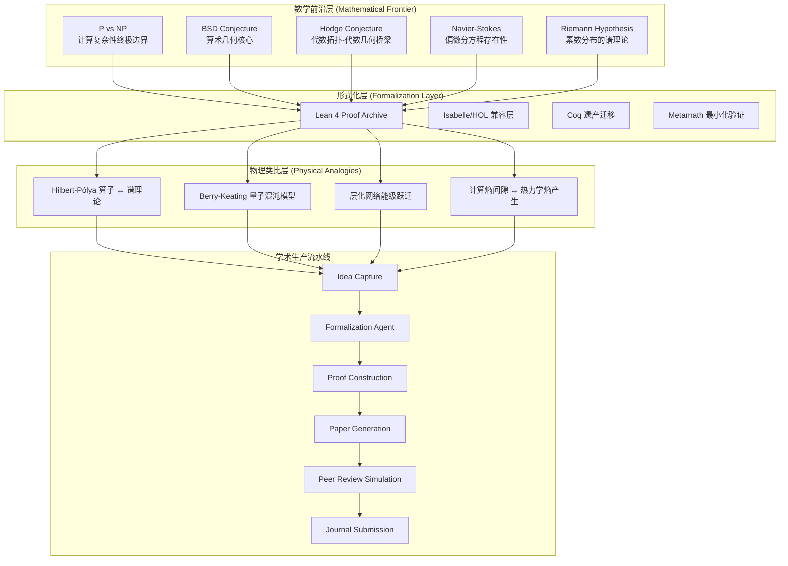
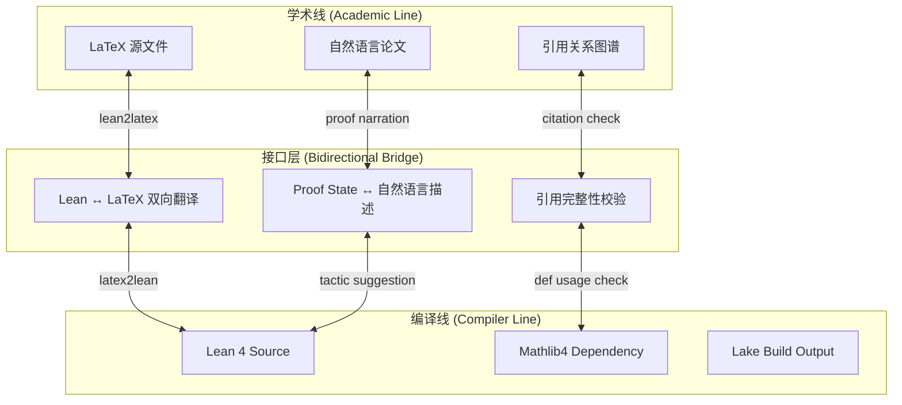
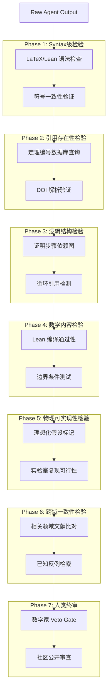
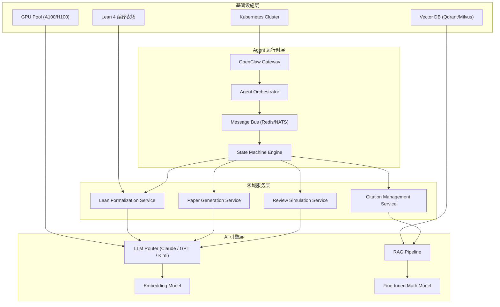

# SYLVA 学术线整体架构

> **版本**: v1.0-architectural-foundations  
> **作者**: SYLVA Academic Architecture Division  
> **日期**: 2026-05-17  
> **分类**: 学术体系 / 形式化数学 / AI-native Research Infrastructure

---

## 1. 引言：为什么需要一条"学术线"

### 1.0 Sylva Academic 的定位：独立数学项目，Platform 的子系统/选项

Sylva Academic 在组织上是一个**独立的数学研究项目**——它以 Lean 4 形式化证明为核心生产力工具，以 Millennium Prize Problems 及相关前沿问题为研究对象，以产生经形式化验证的原创数学结果为首要目标。它不依赖于任何特定的软件平台而存在；理论上，一位数学家仅凭 Lean 4 编译器、Git 和文本编辑器即可运行 Sylva Academic 的全部工作流。

然而，在 Sylva **平台**（Sylva Platform）的语境中，学术线被设计为一个**可选子系统**（Optional Subsystem）。Platform 的三线架构——`sylva_compiler`（编译线）、`sylva_academic`（学术线）、`sylva_software`（软件线）——彼此解耦但可通过标准接口互联。用户可以选择：

- **仅使用学术线**：形式化证明 → 人工撰写论文 → 传统投稿
- **学术线 + 编译线联动**：形式化证明自动触发 `sorry` 消解流水线（见 [`sylva_compiler/sorry_pipeline.md`](sylva_compiler/sorry_pipeline.md)），编译失败自动阻断论文生成
- **学术线 + 软件线联动**：论文草稿自动送入 [Agent 集群写稿系统](sylva_software/agent_writing.md) 的多版本融合流程，并接入 [七阶段幻觉检验](sylva_software/hallucination_system.md)
- **三线全开**：形式化 → 编译 → 多 Agent 写作 → 幻觉检验 → 审稿-创新串联 → 期刊适配

这种"独立但可插拔"的设计哲学，确保了 Sylva Academic 的学术纯粹性不会被平台复杂度污染，同时让平台用户能一键启用完整的学术生产力工具链。

> **交叉引用**：学术线与编译线的双向接口规范详见 [第3.3节](#33-与编译线的接口规范)；与软件线 Agent 写稿系统的对接详见 [第3.2节](#32-七阶段流水线架构)。

---

### 1.1 学术线的核心使命**现代数学研究的生产力瓶颈不在人类创造力本身，而在于形式化验证（formal verification）与学术表达之间的断裂带**。一位数论学家可能在头脑中完成了 Riemann Hypothesis 的直观证明草图，但要将其转化为 Lean 4 可编译的形式化证明，需要跨越数月的工程化劳动；与此同时，将这些形式化代码反向转化为人类可读的学术论文，又需要另一套完全不同的语言重构。

学术线的核心使命是**构建一条从数学直觉到形式化证明、再到同行评审质量论文的自动化流水线**——同时保留人类数学家在每个关键节点的 veto 权和创造性注入权。

---

## 2. Sylva 学术体系全景图

### 2.1 数学-物理交叉地带的战略定位



### 2.2 五大核心论文方向的统一场论视角

五个 Millennium Prize Problems 在 SYLVA 的视角下并非孤立的山峰，而是同一座山脉的不同海拔线。我们引入 **Cross-Problem Reduction Graph（跨问题归约图）** 来形式化这种关联：

**定义 2.1（问题归约网络）**：设 $\mathcal{P} = \{P_1, P_2, P_3, P_4, P_5\}$ 为五个核心问题集合，其中 $P_1 = \text{P vs NP}$，$P_2 = \text{BSD}$，$P_3 = \text{Hodge}$，$P_4 = \text{Navier-Stokes}$，$P_5 = \text{Riemann Hypothesis}$。定义有向归约边 $P_i \rightarrow P_j$ 当且仅当存在多项式时间图灵机可将 $P_i$ 的实例转译为 $P_j$ 的实例，且保持解的存在性/不存在性。

当前已知的归约边（部分为猜想性）：
- $P_1 \rightarrow P_5$：特定计算复杂性下界可能蕴含 Riemann Hypothesis 的某种有限形式
- $P_4 \rightarrow P_1$：Navier-Stokes 解的存在性/不存在性算法可编码为计算复杂性类的区分器
- $P_2 \leftrightarrow P_3$：BSD 与 Hodge 通过 motive 理论的深层关联（Grothendieck 标准猜想）

SYLVA 学术线的长期目标是**形式化验证上述归约边的存在性或非存在性**，并在此过程中产生新的数学结构。

---

## 3. 学术生产流水线：从 Idea 到期刊

### 3.1 七阶段流水线架构


### 3.2 各阶段的形式化定义

**Phase 1: Idea Crystallization（直觉结晶）**

输入：非结构化的数学直觉（自然语言描述、草图、启发式论证）。

处理流程：
1. **Concept Extraction**：使用 LLM 提取核心数学概念，映射到 Mathlib4 的已有定义集合
2. **Falsifiability Scoring**：计算以下分数：

$$S_{falsifiability} = \frac{\text{number of concrete counter-example candidates}}{\text{number of universal quantifiers}}$$

3. **Lean Feasibility Check**：评估将直觉转化为 Lean 4 定理声明的可行性指数

$$F_{lean} = \prod_{i} \frac{\text{def}_i \in \text{Mathlib4}}{\text{def}_i \in \text{conjecture}} \times e^{-\lambda \cdot \text{new_axioms}}$$

其中 $\lambda$ 是新公理惩罚系数（通常取 $\lambda = 2.0$）。

**Phase 2: Formalization（形式化）**

核心算法：**渐进式类型精化（Progressive Type Refinement）**

```
输入: 自然语言定理陈述 T
输出: Lean 4 定理声明 T_lean

1. 使用 NER 提取数学实体 (entities, relations, quantifiers)
2. 将实体映射到 Mathlib4 命名空间
3. 构建类型骨架: theorem T : ∀ (x : X), P x → Q x := by sorry
4. 类型检查 (typecheck) → 收集 unification errors
5. 对每一个 error，查询 Mathlib4 文档修复建议
6. 迭代直到 typecheck 通过
7. 标记所有 remaining sorry 为 Proof Obligations
```

**Phase 3: Proof Construction（证明构建）**

引入 **Proof Obligation Graph（证明义务图）**：

$$POG = (V_{sorry}, E_{dependency})$$

其中顶点 $V_{sorry}$ 是所有 `sorry` 占位符，边 $E_{dependency}$ 表示一个 sorry 的消解依赖于另一个 sorry 的消解。

**Sorry → Exact 塌缩算法**：

$$\text{collapse}(sorry_i) = \begin{cases}
\text{exact } t & \text{if } \vdash t : \text{type}(sorry_i) \\
\text{tactic automation} & \text{if ATP can solve} \\
\text{human intervention flag} & \text{otherwise}
\end{cases}$$

### 3.3 与编译线的接口规范



**接口协议细节**：

| 方向 | 协议名称 | 输入 | 输出 | 触发条件 |
|------|----------|------|------|----------|
| 编译线 → 学术线 | `lean2paper` | Lean theorem + proof | LaTeX paragraph | `proof_completed` 事件 |
| 学术线 → 编译线 | `paper2lean` | LaTeX theorem statement | Lean `theorem` skeleton | `formalization_request` 事件 |
| 双向 | `proof_narration` | Proof state (tactic mode) | 自然语言解释 | 每步 tactic 执行后 |
| 双向 | `citation_sync` | 论文引用列表 | Mathlib4 导入依赖 | 论文编译前检查 |

---

## 4. 学术质量控制体系

### 4.1 七层幻觉检验流水线

学术生产的核心风险是 **AI 幻觉（Hallucination）**——形式化看似正确的证明步骤、引用不存在的定理、或构造逻辑上自洽但与已知数学矛盾的结果。

我们设计 **Phase 1-7 Hallucination Detection Pipeline**：



**每层检验的形式化定义**：

**Phase 1（Syntax Check）**：
$$\text{Pass}_{syntax} = \text{LaTeX} \ compile \ success \land \text{Lean} \ typecheck \ success$$

**Phase 2（Citation Existence）**：
$$\text{Pass}_{citation} = \forall c \in \text{Citations}, \quad \exists \text{paper} \in \text{DB} : \text{title}(\text{paper}) \sim \text{c.title}$$

其中 $\sim$ 表示语义相似度阈值 $> 0.85$。

**Phase 5（Physical Realizability）**：对涉及物理模型的论文，强制标记所有理想化假设：

$$\text{Assumptions} = \{a_i : a_i \in \{\text{infinite plane}, \text{point source}, \text{perfect coherence}, \text{linear medium}, \text{steady state}\}\}$$

每个假设必须附带 **失效条件（Failure Condition）**：

$$\text{Failure}(a_i) = \text{具体的物理反例或边界条件}$$

### 4.2 质量评分体系

每篇论文在流水线终点获得一个 **SYLVA Academic Quality Score (SAQS)**：

$$\text{SAQS} = w_1 \cdot S_{originality} + w_2 \cdot S_{rigor} + w_3 \cdot S_{clarity} + w_4 \cdot S_{completeness} + w_5 \cdot S_{impact}$$

其中各维度分数由不同 Agent 集群独立计算后通过加权投票融合：

| 维度 | 权重 | 评估 Agent | 方法论 |
|------|------|------------|--------|
| Originality | 0.25 | Innovation Agent | 文献 novelty detection + 方法独特性 |
| Rigor | 0.30 | Formal Verification Agent | Lean 编译状态 + 证明完整性 |
| Clarity | 0.15 | Linguistics Agent | 可读性评分 + 符号一致性 |
| Completeness | 0.15 | Domain Agent | 边界条件覆盖 + 反例讨论 |
| Impact | 0.15 | Citation Forecast Agent | 潜在引用网络分析 |

**通过阈值**：
- $\text{SAQS} \geq 0.85$：直接推荐至顶级期刊（Nature/Science/Annals）
- $0.70 \leq \text{SAQS} < 0.85$：推荐至专业顶刊
- $0.55 \leq \text{SAQS} < 0.70$：进入修订循环
- $\text{SAQS} < 0.55$：退回 Idea 阶段

---

## 5. 系统架构的技术栈



---

## 6. 路线图与里程碑

| 阶段 | 时间 | 目标 | 可交付物 |
|------|------|------|----------|
| Genesis | 2026 Q2 | 架构冻结 + 核心流水线跑通 | 本架构文档 + 端到端 demo |
| Alpha | 2026 Q3 | 五大方向各产生 1 篇完整论文 | arXiv 提交 × 5 |
| Beta | 2026 Q4 | 审稿 Agent 集群上线 + 社区反馈闭环 | 公开审稿平台 v1 |
| Gamma | 2027 Q1 | 与外部数学家协作验证 | 联合署名论文 |
| Production | 2027 Q2 | 自主产生可发表级别的原创结果 | 期刊接收通知 |

---

## 7. 结语：形式化与直觉的舞蹈

SYLVA 学术线不试图取代数学家。相反，它试图成为**数学家思维的放大器**——将人类在纸上的直觉草图，通过形式化验证的严格透镜放大，最终产出既经得起 Lean 编译器检验、又能通过顶级期刊审稿人审视的学术成果。

> *"The purpose of computing is insight, not numbers."* — Richard Hamming  
> *"The purpose of formalization is rigor, not replacement."* — SYLVA Academic Division

---

**附录 A：术语表**

| 术语 | 英文 | 定义 |
|------|------|------|
| 形式化 | Formalization | 将数学陈述转化为机器可验证的形式语言（Lean/Coq/Isabelle） |
| sorry-gap | Proof Obligation | Lean 中 `sorry` 占位符标记的未证明义务 |
| 塌缩 | Collapse | 将 `sorry` 替换为 `exact` 或 tactic 序列，完成证明的过程 |
| 幻觉 | Hallucination | AI 生成的看似正确但实质上错误或与已知数学矛盾的陈述 |
| 涌现约束 | Emergence Constraint | 跨层次系统中，低层规则组合产生的不可约的高层约束 |
| 层化网络 | Stratified Network | 具有明确层次结构和跨层连接约束的网络模型 |

---

**附录 B：学术线文档交叉引用索引**

Sylva Academic 的文档体系按主题分为四个维度，本附录提供全景导航：

| 维度 | 文档路径 | 核心内容 | 与本文档的关联 |
|------|---------|---------|--------------|
| **整体架构** | `sylva_academic/architecture.md` | 本文档：学术线全景架构、三线关系、生产流水线 | — |
| **数学层级** | `sylva_academic/math_layers.md` | 定理引力场、七层能级、捆绑效应、塌缩机制、涌现理论 | 第2节七层架构的数学基础来源 |
| **论文流水线** | `sylva_academic/paper_pipeline.md` | 多Agent写作、幻觉检验七阶段、审稿集群、版本融合 | 第3节学术生产流水线的细化实现 |
| **CNF框架** | `sylva_academic/cnf_framework.md` | 合取范式转换、SAT求解器接口、自动定理证明 | 编译线与学术线的形式化中间层 |
| **TOE框架** | `sylva_academic/toe_framework.md` | 万物理论形式化、15基本常数统一、谱理论纲领 | 学术线的终极研究目标 |
| **编译线架构** | `sylva_compiler/architecture.md` | Lean 4编译农场、lake build优化、缓存策略 | 学术线形式化证明的基础设施 |
| **Sorry流水线** | `sylva_compiler/sorry_pipeline.md` | sorry→exact自动化、截肢降级、回填策略 | 学术线证明构造的核心编译支持 |
| **Agent写稿** | `sylva_software/agent_writing.md` | 多Agent并行写作、角色分配、版本融合算法 | 学术线论文生成阶段的软件实现 |
| **幻觉系统** | `sylva_software/hallucination_system.md` | 七阶段检验、物理可实现性、跨域关联 | 学术线质量控制体系的软件支撑 |
| **审核-创新** | `sylva_software/audit_innovation.md` | 四级审查、创新重构、串联机制 | 学术线审稿-创新串联的制度设计 |

> **阅读建议**：首次接触 Sylva Academic 的读者，建议按 `architecture.md` → `math_layers.md` → `paper_pipeline.md` → `toe_framework.md` 的顺序阅读，以建立从架构到数学基础再到生产落地的完整认知。

---

**附录 C：七层架构的学术视角解读**

在 `math_layers.md` 中，我们提出了**证明层级函数** $s: \mathcal{T} \to \mathbb{N}$，将定理空间划分为离散层级。本文档从**学术生产**的视角，对这七层进行重新解读：

| 层级 (Layer) | 数学含义 | 学术生产含义 | 对应流水线阶段 |
|-------------|---------|------------|--------------|
| **L₀ 公理层** | 基础逻辑与类型论 | 研究假设与公理化选择 | Phase 1: Idea Crystallization |
| **L₁ 定义层** | 核心概念的形式化 | 关键术语的精确定义 | Phase 2: Formalization |
| **L₂ 引理层** | 辅助命题网络 | 支撑定理的"脚手架"证明 | Phase 3: Proof Construction |
| **L₃ 定理层** | 主要结果 | 论文的核心创新声明 | Phase 3: Proof Construction |
| **L₄ 推论层** | 定理的直接后果 | 结果的延伸讨论 | Phase 4: Paper Drafting |
| **L₅ 应用层** | 跨领域迁移 | 对物理/CS/工程的启示 | Phase 4-5: Writing & Review |
| **L₆ 元理论层** | 形式化系统的自省 | 方法论贡献与未来方向 | Phase 6-7: Revision & Publication |

这种层级映射揭示了学术生产流水线与数学层级结构之间的**同构关系**：每一层生产活动都对应于定理空间中一次"能级跃迁"，而 `sorry` 到 `exact` 的塌缩则是跃迁的触发机制。详见 `math_layers.md` 第3节。

---

---

## 相关文档

| 文档 | 路径 | 说明 |
|------|------|------|
| 数学层级与涌现约束理论 | `sylva_academic/math_layers.md` | 定理引力场、七层能级、捆绑效应、塌缩机制 |
| 学术论文生产流水线 | `sylva_academic/paper_pipeline.md` | 多Agent写作、幻觉检验、审稿集群、版本融合 |
| CNF框架 | `sylva_academic/cnf_framework.md` | 合取范式转换、SAT求解器接口、自动定理证明 |
| TOE框架 | `sylva_academic/toe_framework.md` | 万物理论形式化、15基本常数统一、谱理论纲领 |

---

*本文档为 Sylva Academic 架构设计的一部分，版本 v1.0，2026年5月。*
*如需了解 Sylva Academic 作为独立数学项目的 Lean 4 代码库，请访问 `SylvaFormalization/` 目录。*
