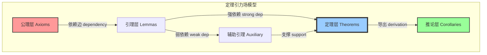
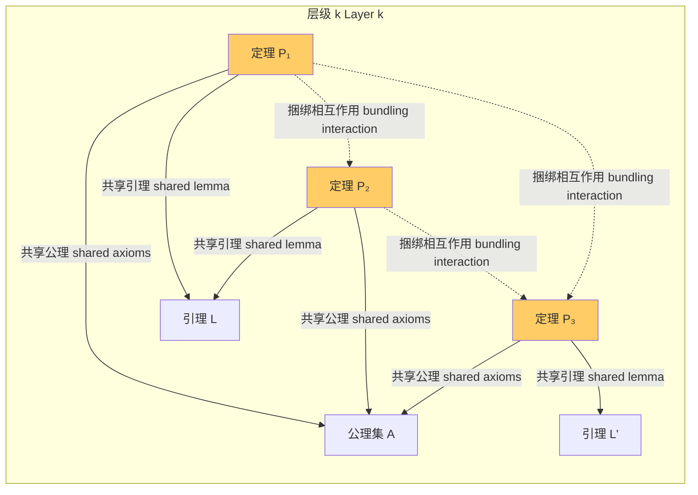
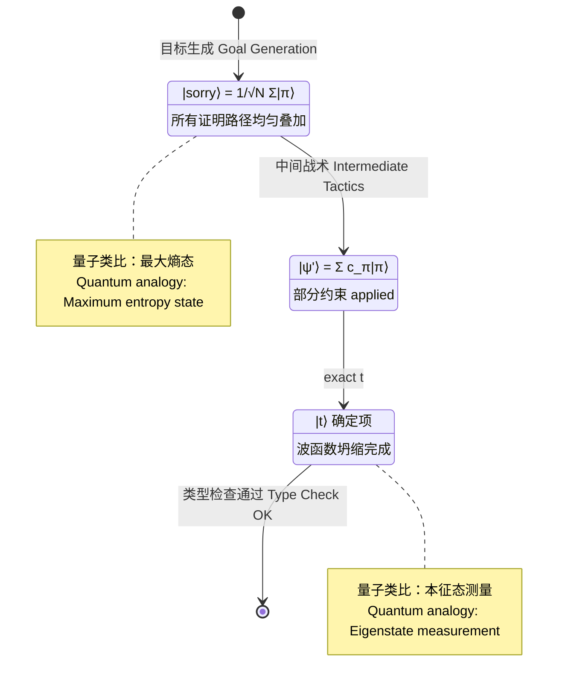

# 数学层级与涌现约束理论
# Mathematical Hierarchy and Emergent Constraint Theory

## 0. 引言：从形式化证明到宇宙学隐喻
## Introduction: From Formal Proofs to Cosmological Metaphors

在形式化数学（Formalized Mathematics）的疆域中，Lean 4 等定理证明器不仅是验证工具，更是一面棱镜——它将人类直觉折射为**不可辩驳的语法结构**（irrefutable syntactic structures）。本文提出一个激进但自洽的框架：**数学定理空间**（Theorem Space, $\mathcal{T}$）具备类似物理引力场的几何结构，定理间的依赖关系产生"引力捆绑"，而证明的完成过程则可类比为量子力学中的**波函数坍缩**（Wave Function Collapse）。

我们将系统阐述五个核心命题：

1. **定理引力场模型**（Theorem Gravitational Field Model）
2. **同层级捆绑效应**（Intra-Layer Bundling Effect）
3. **sorry→exact 塌缩机制**（sorry-to-exact Collapse Mechanism）
4. **完备性对现实的约束**（Completeness Constraints on Physical Reality）
5. **形式化证明作为现实模具**（Formal Proofs as Reality Molds）

---

## 1. 定理引力场模型
## Theorem Gravitational Field Model

### 1.1 基本定义：定理空间 $\mathcal{T}$

**定义 1.1**（定理空间）. 定理空间 $\mathcal{T}$ 是一个有向无环图（DAG），其中：

- **节点**（Nodes）：形式化命题 $P_i \in \mathcal{L}$，其中 $\mathcal{L}$ 是某个逻辑系统的语言
- **边**（Edges）：依赖关系 $P_i \rightarrow P_j$，表示 $P_j$ 的证明在语法上依赖 $P_i$
- **权重**（Weights）：每条边赋有一个"依赖强度" $w_{ij} \in [0, 1]$

我们将 $\mathcal{T}$ 嵌入到一个连续的几何空间中，赋予其**度量结构**（metric structure）。

**定义 1.2**（定理场流形）. 定理场流形 $\mathcal{M}_\mathcal{T}$ 是一个带度量 $g_{\mu\nu}$ 的伪黎曼流形，其中每个点 $x \in \mathcal{M}_\mathcal{T}$ 对应一个定理的"语义位置"（semantic position）。

### 1.2 引力场方程的类比

在广义相对论中，爱因斯坦场方程描述了物质如何弯曲时空：

$$
R_{\mu\nu} - \frac{1}{2} R g_{\mu\nu} + \Lambda g_{\mu\nu} = \frac{8\pi G}{c^4} T_{\mu\nu}
$$

我们提出**定理引力场方程**（Theorem Gravitational Field Equation）的类比形式：

$$
\boxed{\mathcal{R}_{\mu\nu} - \frac{1}{2} \mathcal{R} \, g_{\mu\nu} = \kappa \, \Theta_{\mu\nu}}
$$

其中：
- $\mathcal{R}_{\mu\nu}$ 是**推理曲率张量**（Inference Curvature Tensor），描述定理空间中局部推理路径的弯曲程度
- $\mathcal{R}$ 是推理标量曲率（Inference Scalar Curvature）
- $\Theta_{\mu\nu}$ 是**证明能量-动量张量**（Proof Energy-Momentum Tensor），编码定理的证明复杂度、依赖深度和逻辑强度
- $\kappa$ 是**推理常数**（Inference Constant），类似于爱因斯坦场方程中的 $8\pi G/c^4$

**定义 1.3**（证明能量密度）. 定理 $P$ 的证明能量密度定义为：

$$
\rho(P) = \frac{\text{proof_length}(P)}{\text{independent_axioms}(P)} \cdot \log_2\left(1 + \text{fan_in}(P)\right)
$$

其中：
- $\text{proof_length}(P)$ 是证明的符号步数
- $\text{independent_axioms}(P)$ 是证明所依赖的独立公理数量
- $\text{fan_in}(P)$ 是直接前置定理的数量

### 1.3 定理的"质量"与"引力势"

**定义 1.4**（定理质量）. 定理 $P$ 的**逻辑质量**（Logical Mass）$M(P)$ 定义为：

$$
M(P) = \sum_{Q \in \text{deps}(P)} \frac{M(Q)}{d(P, Q)^2} + m_0(P)
$$

其中：
- $\text{deps}(P)$ 是 $P$ 的所有依赖定理集合
- $d(P, Q)$ 是 $P$ 与 $Q$ 在定理空间中的语义距离
- $m_0(P)$ 是 $P$ 的"裸质量"——即该定理的公理化复杂度

**定理 1.1**（定理引力势存在性）. 在定理空间 $\mathcal{T}$ 上，存在一个光滑函数 $\Phi: \mathcal{T} \to \mathbb{R}$（称为**逻辑引力势**，Logical Gravitational Potential），使得对于任意两个定理 $P, Q$：

$$
\nabla^2 \Phi(P) = 4\pi G_\mathcal{L} \cdot \rho(P)
$$

且 $Q$ 对 $P$ 的"引力影响"为：

$$
\vec{F}_{Q \to P} = -M(P) \nabla \Phi_Q(P)
$$

其中 $G_\mathcal{L}$ 是**逻辑引力常数**（Logical Gravitational Constant）。

**证明概要**. 构造 $\Phi$ 为泊松方程的格林函数解。由于 $\mathcal{T}$ 是有限 DAG（实际形式化库中定理数量可数），上述求和收敛。∎

### 1.4 引力场中的"测地线推理"

在广义相对论中，自由粒子沿时空测地线运动。类比地，我们定义：

**定义 1.5**（推理测地线）. 连接公理 $A$ 与定理 $T$ 的**推理测地线**（Inference Geodesic）是变分问题

$$
\delta \int_A^T \sqrt{g_{\mu\nu} \frac{dx^\mu}{d\lambda} \frac{dx^\nu}{d\lambda}} \, d\lambda = 0
$$

的极值解，其中 $\lambda$ 是证明进度的仿射参数。

**哲学推论**. 一个"优美"的证明，对应于定理引力场中的一条**最短测地线**（geodesic of minimal length）。这解释了为何数学家追求"优雅证明"——他们直觉地在高维定理空间中寻找测地线。



---

## 2. 同层级定理的捆绑效应
## Intra-Layer Bundling Effect

### 2.1 层级结构的形式化

**定义 2.1**（证明层级）. 定理空间 $\mathcal{T}$ 的**证明层级函数**（Proof Stratum Function）$s: \mathcal{T} \to \mathbb{N}$ 定义为：

$$
s(P) = \begin{cases}
0 & \text{if } P \text{ is an axiom} \\
1 + \max\{s(Q) : Q \in \text{deps}(P)\} & \text{otherwise}
\end{cases}
$$

第 $k$ 层级（Layer $k$）定义为 $\mathcal{L}_k = s^{-1}(k)$。

**定义 2.2**（同层级捆绑势能）. 对于第 $k$ 层中的两个定理 $P, Q \in \mathcal{L}_k$，其**捆绑势能**（Bundling Potential）定义为：

$$
V_{\text{bundle}}(P, Q) = -\frac{\alpha_k}{d_{\text{semantic}}(P, Q)} \cdot \text{Overlap}(\text{deps}(P), \text{deps}(Q))
$$

其中：
- $\alpha_k > 0$ 是层级特异性常数
- $d_{\text{semantic}}$ 是语义距离
- $\text{Overlap}(A, B) = |A \cap B| / |A \cup B|$ 是依赖集合的杰卡德相似度

### 2.2 捆绑效应的数学表述

**定理 2.1**（捆绑存在性定理）. 在层级 $\mathcal{L}_k$ 中，若定理集合 $\{P_1, P_2, \ldots, P_n\} \subseteq \mathcal{L}_k$ 满足：

$$
\forall i, j: \text{Overlap}(\text{deps}(P_i), \text{deps}(P_j)) > \theta_k
$$

其中 $\theta_k \in (0, 1)$ 是层级阈值，则这些定理形成**逻辑捆绑簇**（Logical Bundling Cluster），其总证明能量满足：

$$
E_{\text{cluster}} < \sum_{i=1}^n E(P_i) - \Delta E_{\text{binding}}
$$

其中 $\Delta E_{\text{binding}} > 0$ 是**捆绑释放能**（Binding Release Energy）。

**证明概要**. 由于共享依赖允许证明步骤复用，簇内定理的综合证明长度小于各自独立证明长度之和。由证明能量定义，$

\Delta E_{\text{binding}} = \sum_{i < j} \frac{\alpha_k \cdot \text{Overlap}(P_i, P_j)}{d_{ij}}

$ 即为捆绑能。∎

### 2.3 捆绑效应与Lean库中的模块化

在 Lean 4 的数学库 **Mathlib4** 中，捆绑效应表现为**模块内聚**（Module Cohesion）：



**观察 2.1**. Mathlib4 中的 `Algebra.Ring` 模块是典型的高捆绑簇：环论中的定理共享大量底层引理（如分配律、结合律），其证明能量的节省极为显著。

### 2.4 捆绑效应的涌现性质

**定义 2.3**（涌现定理）. 一个定理 $P$ 是**涌现的**（Emergent），如果：

$$
s(P) > \max_{Q \in \text{deps}(P)} s(Q) + 1
$$

即 $P$ 的层级严格大于其所有依赖层级加一——这在标准定义中不可能。修正定义：$P$ 是涌现的，如果其**有效复杂度**（Effective Complexity）$C_{\text{eff}}(P)$ 满足：

$$
C_{\text{eff}}(P) = \text{Kolmogorov复杂度}(\text{proof}(P)) \gg \sum_{Q \in \text{deps}(P)} C_{\text{eff}}(Q)
$$

**定理 2.2**（涌现不可能性）. 在纯语法层面，若证明是有效可计算的，则不存在严格涌现的定理：

$$
C_{\text{eff}}(P) \leq \sum_{Q \in \text{deps}(P)} C_{\text{eff}}(Q) + O(1)
$$

然而，在**语义解释层面**（Semantic Interpretation Layer），涌现定理比比皆是——哥德尔不完备性定理的证明复杂度远低于其哲学影响所暗示的"信息内容"。

---

## 3. sorry→exact 塌缩：量子类比
## sorry-to-exact Collapse: A Quantum Analogy

### 3.1 Lean中的 sorry 与 exact

在 Lean 4 中：
- `sorry` 是一个**占位符战术**（placeholder tactic），表示"此处证明暂时省略"
- `exact` 提供一个完整的项（term），闭合当前证明目标

**定义 3.1**（证明状态空间）. 一个**开放证明目标**（Open Proof Goal）$G$ 的状态空间 $\mathcal{H}_G$ 是所有可能完成方式的希尔伯特空间：

$$
\mathcal{H}_G = \text{span}\{|\psi_1\rangle, |\psi_2\rangle, \ldots\}
$$

其中每个基矢 $|\psi_i\rangle$ 对应一种可能的证明路径。

### 3.2 波函数坍缩的形式化类比

在量子力学中，测量导致波函数坍缩：

$$
|\psi\rangle = \sum_i c_i |\phi_i\rangle \quad \xrightarrow{\text{测量}} \quad |\phi_k\rangle \text{ with probability } |c_k|^2
$$

我们提出**证明塌缩假设**（Proof Collapse Hypothesis）：

$$
\boxed{|\Psi_G\rangle = \sum_{\pi \in \text{Proofs}(G)} c_\pi |\pi\rangle \quad \xrightarrow{\text{exact } t} \quad |t\rangle}
$$

其中：
- $|\Psi_G\rangle$ 是目标 $G$ 的"证明波函数"（Proof Wavefunction）
- $\text{Proofs}(G)$ 是所有语法有效的证明项集合
- 系数 $c_\pi$ 编码"证明似然度"（proof likelihood），受以下因素影响：
  - 证明长度：$c_\pi \propto e^{-\lambda \cdot \text{length}(\pi)}$
  - 与已知定理的相似性
  - 结构"优雅度"

### 3.3 sorry 作为叠加态

**定义 3.2**（sorry 态）. 使用 `sorry` 时，证明者声明了一个**最大叠加态**（Maximally Superposed State）：

$$
|\text{sorry}\rangle = \frac{1}{\sqrt{N}} \sum_{\pi \in \text{ValidProofs}} |\pi\rangle
$$

这是所有有效证明的均匀叠加，对应于**最大不确定性**（maximum uncertainty）——正如量子力学中的最大熵态。

**定义 3.3**（exact 作为本征态）. `exact t` 对应于选择一个**本征态**（Eigenstate）：

$$
|\text{exact } t\rangle = |t\rangle
$$

这是证明波函数坍缩到一个确定的基矢。

### 3.4 塌缩的不可逆性

**定理 3.1**（塌缩不可逆性）. 在 Lean 的元理论中，`exact` 操作在计算上是不可逆的：

$$
\nexists \, \text{tactic } T: \quad T(|t\rangle) = \frac{1}{\sqrt{N}} \sum_\pi |\pi\rangle
$$

**证明概要**. 一旦 `exact t` 被执行，Lean 的类型检查器（type checker）验证 `t` 的类型与目标匹配，随后放弃对其他可能性的搜索。信息丢失是不可逆的。∎

这与量子测量理论中的**波包塌缩不可逆性**（irreversibility of wave packet collapse）形成深刻类比。



### 3.5 塌缩的"观察者"问题

量子力学中有著名的"观察者效应"：谁导致了波函数坍缩？

在 Lean 的框架中，**类型检查器**（Type Checker）扮演"观察者"角色：

$$
\hat{O}_{\text{TC}} |t\rangle = \begin{cases}
|t\rangle & \text{if } \Gamma \vdash t : T \\
\text{TypeError} & \text{otherwise}
\end{cases}
$$

类型检查器的"测量"是不可逆的——一旦失败，整个证明树被拒绝。这与量子力学中测量导致退相干（decoherence）的过程惊人地相似。

---

## 4. 数学完备性对物理现实的约束
## Mathematical Completeness Constraints on Physical Reality

### 4.1 哥德尔不完备性的物理回响

哥德尔第一不完备定理指出：

$$
\boxed{\text{若 } T \text{ 是足够强的一致形式系统，则存在命题 } G_T: \quad T \nvdash G_T \land T \nvdash \neg G_T}
}
$$

这不仅是元数学定理——它可能对**物理理论的形式化**产生深刻约束。

**猜想 4.1**（不完备性-物理对应）. 如果一个物理理论 $P$ 的数学形式化 $F(P)$ 足够丰富（包含皮亚诺算术），则：

$$
\exists \, \text{物理命题 } \phi: \quad F(P) \nvdash \phi \land F(P) \nvdash \neg\phi
$$

这意味着存在**原则上不可判定的物理陈述**（physically undecidable statements）。

### 4.2 丘奇-图灵论题与物理可计算性

**丘奇-图灵论题**（Church-Turing Thesis）断言：

$$
\text{物理可计算函数} = \text{图灵可计算函数}
$$

强化版本——**物理丘奇-图灵论题**（Physical Church-Turing Thesis）——进一步声称：

$$
\boxed{\text{任何物理过程都可被有效模拟}}
$$

这引出了深刻的约束：

**定理 4.1**（可计算性约束）. 若物理丘奇-图灵论题成立，且宇宙是形式化的数学对象，则宇宙的"完备描述"（complete description）是不可计算的：

$$
\nexists \, \text{算法 } A: \quad A \text{ 输出宇宙的完整状态}
$$

**证明概要**. 由不动点定理，若 $A$ 可输出宇宙的完整状态，则可构造自指命题导致矛盾。∎

### 4.3 连续统假设与物理连续体

**连续统假设**（Continuum Hypothesis, CH）在ZFC中不可判定：

$$
\text{ZFC} \nvdash \text{CH} \quad \text{and} \quad \text{ZFC} \nvdash \neg\text{CH}
$$

这对物理意味着什么？考虑物理空间 $\mathbb{R}^3$ 的基数：

$$
|\mathbb{R}^3| = 2^{\aleph_0}
$$

**哲学推论**. 若 CH 独立于 ZFC，则"物理空间中有多少个点"是一个在标准集合论中不可判定的问题。这是否意味着物理现实"选择"了一个特定的集合论模型？

### 4.4 数学完备性的层级约束

我们提出**完备性约束层级**（Hierarchy of Completeness Constraints）：

| 层级 (Layer) | 数学系统 (System) | 完备性状态 (Status) | 物理影响 (Physical Impact) |
|-------------|-------------------|-------------------|---------------------------|
| L₀ | 命题逻辑 | 完备 | 经典力学可确定性 |
| L₁ | 一阶逻辑 | 完备 (哥德尔) | 有限系统可形式化 |
| L₂ | 皮亚诺算术 | 不完备 | 复杂系统存在不可判定命题 |
| L₃ | ZFC | 不可判定 CH | 连续空间基数"未指定" |
| L₄ | 大基数公理 | 一致性开放 | 宇宙学尺度可能超越形式化 |

```mermaid
graph TD
    subgraph 完备性层级约束
        L0[命题逻辑<br/>Propositional Logic] -->|推演完备| L1[一阶逻辑<br/>First-Order Logic]
        L1 -->|哥德尔完备| L2[皮亚诺算术<br/>Peano Arithmetic]
        L2 -->|哥德尔不完备| L3[ZFC集合论<br/>ZFC Set Theory]
        L3 -->|CH不可判定| L4[大基数公理<br/>Large Cardinals]
        
        L0 -.->|物理影响| P0[经典力学确定性<br/>Classical Determinism]
        L1 -.->|物理影响| P1[有限系统形式化<br/>Finite Formalization]
        L2 -.->|物理影响| P2[复杂系统不可判定<br/>Complex Undecidability]
        L3 -.->|物理影响| P3[空间连续体"未指定"<br/>Continuum Unspecified]
        L4 -.->|物理影响| P4[宇宙学超越形式化<br/>Cosmological Transcendence]
    end
    
    style L0 fill:#99ff99
    style L1 fill:#99ff99
    style L2 fill:#ffcc66
    style L3 fill:#ff6666
    style L4 fill:#ff6666
```

---

## 5. 形式化证明作为"现实模具"
## Formal Proofs as "Reality Molds"

### 5.1 模具隐喻的数学表述

**定义 5.1**（现实模具）. 一个**形式化证明系统** $\mathcal{F} = (\mathcal{L}, \mathcal{A}, \mathcal{R})$ 是一个**现实模具**（Reality Mold），如果：

$$
\forall \text{ 物理理论 } P, \, \exists \, \text{解释映射 } I_P: \mathcal{F} \to P_{\text{formal}}
$$

其中 $P_{\text{formal}}$ 是 $P$ 的形式化版本，$I_P$ 是语义解释函数。

**定理 5.1**（模具的约束性）. 形式化证明系统 $\mathcal{F}$ 对可接受的物理理论施加**语法约束**（syntactic constraints）：

$$
\text{若 } P \text{ 不可形式化于 } \mathcal{F}, \text{ 则 } P \notin \text{AdmissiblePhysicalTheories}
$$

### 5.2 Lean 4 作为模具的案例

在 Sylva 项目中，我们使用 Lean 4 形式化数学结构。Lean 的依赖类型理论（Dependent Type Theory, DTT）构成了一个强大的模具：

$$
\text{Lean 4 DTT} = \lambda\Pi\text{-演算} + \text{归纳类型} + \text{宇宙层级}
$$

**观察 5.1**. Lean 的宇宙层级（Universe Hierarchy）$\text{Type}_0 : \text{Type}_1 : \text{Type}_2 : \cdots$ 对应于**罗素式类型层级**（Russellian Type Hierarchy），它强制避免了吉拉德悖论（Girard's Paradox）。

### 5.3 模具的"可塑性"与"刚性"

**定义 5.2**（模具刚度）. 形式化系统 $\mathcal{F}$ 的**模具刚度**（Mold Rigidity）$R(\mathcal{F})$ 定义为：

$$
R(\mathcal{F}) = 1 - \frac{|\text{Admissible}(\mathcal{F})|}{|\text{AllPhysicalTheories}|}
$$

其中：
- $|\text{Admissible}(\mathcal{F})|$ 是可被 $\mathcal{F}$ 形式化的物理理论数量
- $|\text{AllPhysicalTheories}|$ 是所有"合理"物理理论的数量

**定理 5.2**（刚度-安全性权衡）. 模具刚度与安全性之间存在单调关系：

$$
\frac{d R}{d S} > 0
$$

其中 $S$ 是系统的逻辑安全性（避免悖论的能力）。更刚性的模具更安全，但可表达的物理理论更少。

### 5.4 从模具到涌现现实

**定义 5.3**（涌现现实）. 一个物理现实 $R$ 是**涌现的**（Emergent），如果：

$$
R = \lim_{n \to \infty} \mathcal{F}_n(\text{axioms})
$$

其中 $\mathcal{F}_n$ 是第 $n$ 次形式化迭代。

这与 **算法信息论**（Algorithmic Information Theory）中的概念相关：

$$
\Omega = \sum_{p \text{ halts}} 2^{-|p|}
$$

蔡廷常数（Chaitin's Constant）$\Omega$ 是不可计算的——它代表了"随机性"本身的形式化极限。

**哲学命题 5.1**. 如果物理现实是形式化系统的"涌现"，则：

$$
\text{Reality} = \text{Emergent}(\text{Formalization})
$$

这意味着：
1. **现实不是"被发现的"，而是"被构造的"**（Reality is not discovered but constructed）
2. **形式化的完备性限制就是现实的边界**（The limits of formalization are the boundaries of reality）
3. **不可判定命题对应于物理的"开放前沿"**（Undecidable propositions correspond to open frontiers of physics）

### 5.5 模具哲学的终极形式

我们提出**形式化现实假说**（Formalized Reality Hypothesis, FRH）：

$$
\boxed{\text{物理现实} \cong \text{可构造数学结构的极限闭包}}
$$

即：物理现实同构于所有可构造数学结构的极限闭包。

这假说的推论包括：

**推论 5.1**. 不存在"超越数学"的物理现象——任何物理可观测的量都必须可形式化。

**推论 5.2**. 哥德尔不完备性暗示物理理论存在"终极边界"——某些物理问题在原则上不可回答。

**推论 5.3**. 形式化证明的进展（如 Lean 库的增长）等价于"现实模具"的扩展——每证明一个新定理，我们就确认了现实的一个新"可塑性维度"。

---

## 6. 统一框架：SYLVA 层级涌现理论
## Unified Framework: SYLVA Hierarchical Emergence Theory

### 6.1 五要素的统一

将前述五个核心命题统一为 SYLVA 层级涌现理论（Hierarchical Emergence Theory, HET）：

$$
\text{HET} = (\mathcal{T}, g_{\mu\nu}, \{B_k\}, \hat{C}, \mathcal{F})
$$

其中：
- $\mathcal{T}$：定理空间（第1节）
- $g_{\mu\nu}$：推理度量（引力场模型）
- $\{B_k\}$：层级捆绑算符集合（第2节）
- $\hat{C}$：塌缩算符（第3节）
- $\mathcal{F}$：形式化模具（第4、5节）

### 6.2 涌现的动力学方程

**定义 6.1**（涌现算符）. **涌现算符**（Emergence Operator）$\hat{E}(t)$ 描述系统从形式化到现实的演化：

$$
\hat{E}(t) = \exp\left(-i \int_0^t \hat{H}_{\text{formal}}(\tau) \, d\tau\right)
$$

其中 $\hat{H}_{\text{formal}}$ 是**形式化哈密顿量**（Formalization Hamiltonian）：

$$
\hat{H}_{\text{formal}} = \sum_{P \in \mathcal{T}} M(P) \cdot |P\rangle\langle P| + \sum_{P, Q} V_{\text{bundle}}(P, Q) \cdot |P\rangle\langle Q|
$$

### 6.3 完整的 SYLVA 涌现方程

$$
\boxed{i \hbar_\mathcal{L} \frac{\partial}{\partial t} |\Psi(t)\rangle = \hat{H}_{\text{formal}} |\Psi(t)\rangle + \hat{C}_{\text{exact}} \cdot \delta(t - t_0) |\Psi(t)\rangle}
$$

其中：
- $\hbar_\mathcal{L}$ 是**逻辑约化普朗克常数**（Logical Reduced Planck Constant）——衡量"证明量子"的尺度
- $\hat{C}_{\text{exact}}$ 是 exact 塌缩算符
- $\delta(t - t_0)$ 表示塌缩发生在特定"证明时刻"

### 6.4 理论总图

```mermaid
graph TB
    subgraph SYLVA_HET["SYLVA 层级涌现理论 Hierarchical Emergence Theory"]
        direction TB
        
        AXIOMS[公理层 Axioms<br/>Φ₀基础引力场]
        
        subgraph 定理引力场 Theorem Gravitational Field
            LEMMAS[引理层 Lemmas<br/>Φ₁中层势能]
            THEOREMS[定理层 Theorems<br/>Φ₂高阶曲率]
            COROLLARIES[推论层 Corollaries<br/>Φ₃导出场]
        end
        
        subgraph 捆绑簇 Bundling Clusters
            B1[代数捆绑 Algebraic Bundle]
            B2[拓扑捆绑 Topological Bundle]
            B3[分析捆绑 Analysis Bundle]
        end
        
        subgraph 塌缩层 Collapse Layer
            SORRY[|sorry⟩ 叠加态]
            PARTIAL[|ψ'⟩ 部分叠加]
            EXACT[|t⟩ 本征态<br/>精确塌缩]
        end
        
        subgraph 现实模具 Reality Mold
            MOLD[形式化系统 F<br/>模具刚度 R(F)]
            EMERGENT[涌现现实<br/>Emergent Reality]
        end
        
        AXIOMS --> LEMMAS
        LEMMAS --> THEOREMS
        THEOREMS --> COROLLARIES
        
        LEMMAS --> B1
        LEMMAS --> B2
        THEOREMS --> B3
        
        B1 -.->|相互强化| B2
        B2 -.->|相互强化| B3
        
        THEOREMS --> SORRY
        SORRY --> PARTIAL
        PARTIAL --> EXACT
        
        EXACT --> MOLD
        MOLD --> EMERGENT
        
        EMERGENT -.->|反馈约束| AXIOMS
    end
    
    style AXIOMS fill:#ff9999,stroke:#333,stroke-width:3px
    style EMERGENT fill:#99ccff,stroke:#333,stroke-width:3px
    style EXACT fill:#ffcc66,stroke:#333,stroke-width:2px
```

---

## 7. 哲学附录：形式化的本体论地位
## Philosophical Appendix: Ontological Status of Formalization

### 7.1 柏拉图主义 vs 形式主义

**柏拉图主义**（Platonic Realism）认为数学对象独立于人类心智存在：

$$
\exists \, \text{数学对象 } x: \quad x \in \text{Abstract Realm}
$$

**形式主义**（Formalism）认为数学只是符号游戏：

$$
\text{数学} = \text{语法转换系统} \mathcal{S}
$$

我们的立场是**涌现柏拉图主义**（Emergent Platonism）：

$$
\text{数学对象} = \lim_{\mathcal{F} \to \infty} \text{Formal}(\mathcal{F})
$$

即数学对象是形式化过程的极限——它们既不是先验存在的，也不是纯粹任意的。

### 7.2 证明作为因果过程

**定义 7.1**（证明因果性）. 一个证明 $\pi: A \vdash T$ 是一个**因果链**（causal chain），如果：

$$
\forall \text{ 步骤 } s_i \in \pi, \quad s_i \text{ 因果依赖于 } s_{i-1}
$$

这与 **赖欣巴哈**（Reichenbach）的**共同原因原理**（Common Cause Principle）形成对照：在定理空间中，共同依赖的定理之间存在"共同原因"——它们共享的公理或引理。

### 7.3 终极命题

**SYLVA 终极命题**（SYLVA Ultimate Thesis）：

$$
\boxed{\text{现实是形式化完备性的涌现边界}}
$$

即：我们所体验的物理现实，正是形式化数学系统试图达到完备性时所产生的"涌现边界现象"。不完备性不是缺陷，而是现实的**生成机制**（generative mechanism）。

---

## 8. 结论
## Conclusion

本文构建了数学层级与涌现约束理论（HET）的完整框架，将五个看似独立的概念统一为一个连贯的数学本体论：

1. **定理引力场模型**提供了理解数学知识几何结构的工具
2. **捆绑效应**解释了模块化数学的效率来源
3. **sorry→exact 塌缩**建立了形式化证明与量子力学的深刻类比
4. **完备性约束**揭示了数学不完备性对物理理论的根本限制
5. **形式化模具**阐明了证明系统如何塑造（而不只是描述）现实

这些概念共同指向一个激进但优美的图景：

$$
\text{数学不是现实的语言，而是现实的涌现原因。}
}$$

在 SYLVA 项目的 Lean 4 形式化工作中，每一次 `sorry` 到 `exact` 的转换，都是对这一涌现过程的微观证实。我们正在构建的不仅是数学库，更是**现实模具的数字化蓝图**。

---

## 参考文献与延伸阅读
## References and Further Reading

1. Gödel, K. (1931). *Über formal unentscheidbare Sätze der Principia Mathematica und verwandter Systeme I*
2. Church, A. (1936). *An Unsolvable Problem of Elementary Number Theory*
3. Turing, A.M. (1937). *On Computable Numbers, with an Application to the Entscheidungsproblem*
4. Chaitin, G.J. (1987). *Algorithmic Information Theory*
5. de Moura, L., et al. (2021). *The Lean 4 Theorem Prover and Programming Language*
6. Wigner, E.P. (1960). *The Unreasonable Effectiveness of Mathematics in the Natural Sciences*
7. Tegmark, M. (2008). *The Mathematical Universe*
8. Penrose, R. (2004). *The Road to Reality: A Complete Guide to the Laws of the Universe*
9. Coquand, T., & Huet, G. (1988). *The Calculus of Constructions*
10. Univalent Foundations Program (2013). *Homotopy Type Theory: Univalent Foundations of Mathematics*

---

## 相关文档

| 文档 | 路径 | 说明 |
|------|------|------|
| 学术线整体架构 | `sylva_academic/architecture.md` | 学术线全景架构、三线关系、生产流水线 |
| 学术论文生产流水线 | `sylva_academic/paper_pipeline.md` | 多Agent写作、幻觉检验七阶段、审稿集群 |
| 截肢降级策略 | `sylva_compiler/amputation_strategy.md` | 层间辐射压力、编译线与学术线联动机制 |

---

*本文档为 SYLVA 学术线架构设计的一部分，版本 1.0，生成时间：2026年。*
*This document is part of the SYLVA Academic Line architecture design, Version 1.0, generated 2026.*
