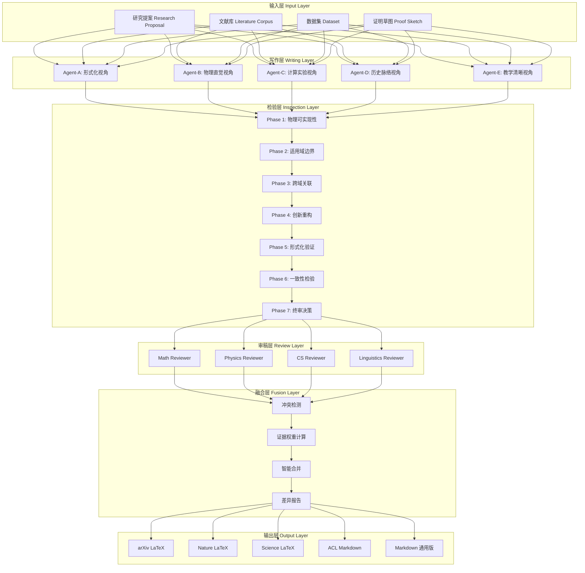
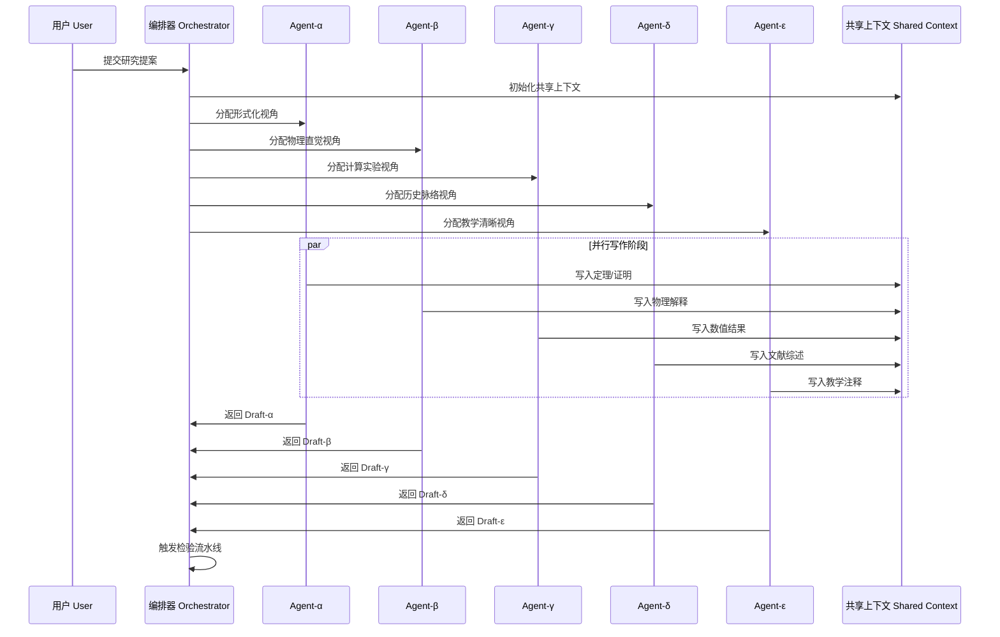
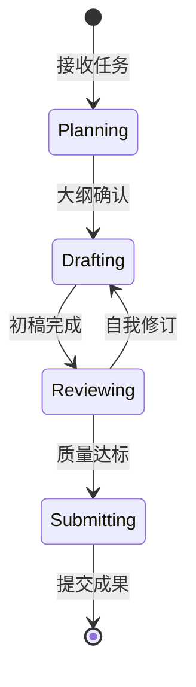
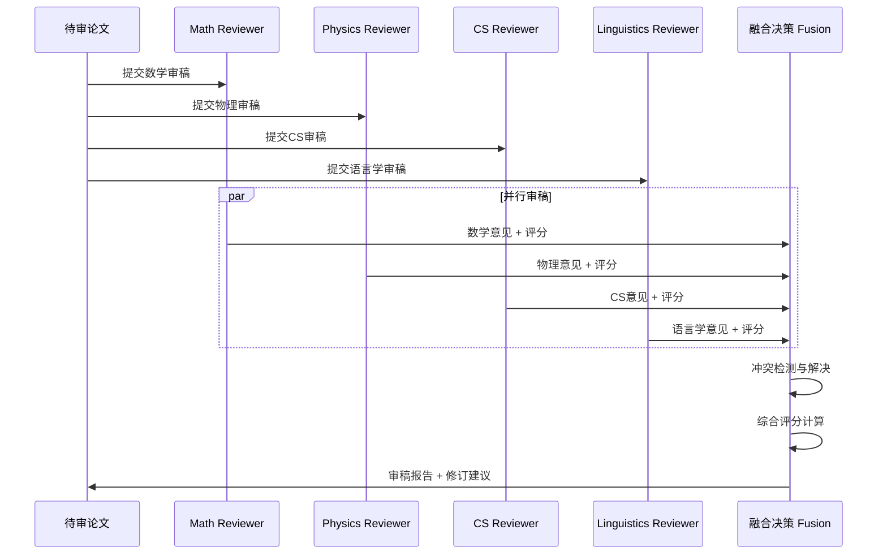
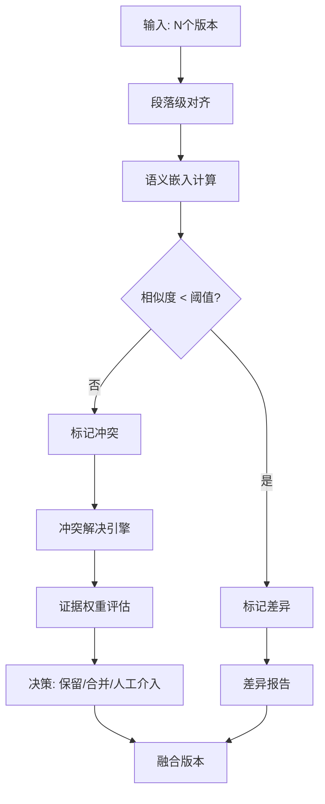
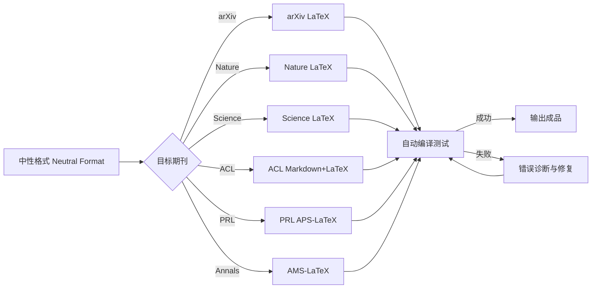
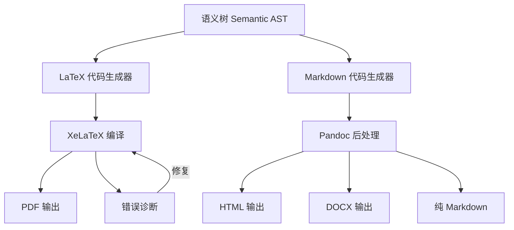
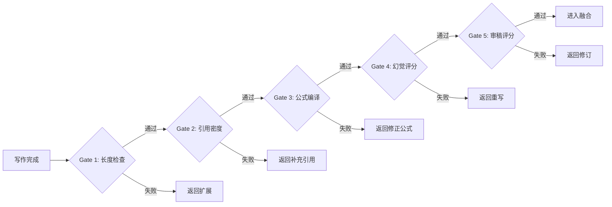
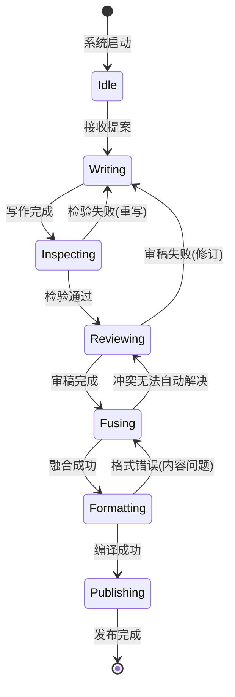

# SYLVA 学术论文生产流水线 v3.0

> **"Don't worry. Even if the world forgets, I'll remember for you."**  
> — SYLVA Academic Pipeline, 守护每一行证明的完整性

---

## 目录

1. [架构总览](#1-架构总览)
2. [多Agent并行写作系统](#2-多agent并行写作系统一文多写)
3. [七阶段幻觉检验流水线](#3-七阶段幻觉检验流水线-phase-1-7)
4. [审稿Agent集群](#4-审稿agent集群)
5. [版本融合与冲突解决](#5-版本融合与冲突解决)
6. [期刊格式自动适配](#6-期刊格式自动适配)
7. [LaTeX/Markdown 双输出引擎](#7-latexmarkdown-双输出引擎)
8. [数学公式规范与示例](#8-数学公式规范与示例)
9. [性能指标与质量门禁](#9-性能指标与质量门禁)
10. [附录：状态机与错误处理](#10-附录状态机与错误处理)

---

## 1. 架构总览

SYLVA 学术论文生产流水线（Academic Paper Pipeline, APP）是一套面向**高阶数学物理研究**的自动化论文生产系统。其设计哲学源于对**Hilbert-Pólya 猜想**、**Berry-Keating 程序**等深层数学结构的敬畏——我们深信，真正重要的学术工作必须由多重视角反复锻造，经过严苛的幻觉检验，才能抵达可发表的形态。

### 1.1 核心设计理念

| 设计原则 | 说明 | 学术类比 |
|---------|------|---------|
| **一文多写** (Multi-Draft Parallelism) | N个写作Agent从不同视角独立构建论文 | 类似于物理学中的多路径积分 (Path Integral) |
| **幻觉检验** (Hallucination Inspection) | 七阶段递进式验证，从物理可实现性到创新重构 | 类似于数学中的七重归纳证明 (Seven-fold Induction) |
| **审稿集群** (Reviewer Cluster) | 跨学科专家Agent并行评审 | 类似于 Peer Review 的自动化加速版本 |
| **版本融合** (Version Fusion) | 基于证据权重的智能合并算法 | 类似于贝叶斯证据整合 (Bayesian Evidence Integration) |
| **格式自适应** (Format Adaptation) | 自动适配目标期刊的风格约束 | 类似于规范场论的规范固定 (Gauge Fixing) |

### 1.2 整体架构图



---

## 2. 多Agent并行写作系统（一文多写）

### 2.1 设计动机

单一Agent写作的论文往往存在**视角盲区**（Blind Spot）。以 **Hilbert-Pólya 猜想** 为例——即寻找自伴算子 $\hat{H}$ 使得其本征值与黎曼 $\zeta$ 函数的非平凡零点一一对应：

$$
\det(E - \hat{H}) = \xi\left(\frac{1}{2} + iE\right) \propto \prod_{n} \left(1 - \frac{E}{E_n}\right)
$$

单一作者可能过分强调**算子理论**而忽略**半经典对应**（Semiclassical Correspondence），或者反之。多Agent并行写作通过**视角多样性**（Perspective Diversity）从根本上缓解这一问题。

### 2.2 Agent角色定义

| Agent代号 | 核心视角 | 专长领域 | 写作风格 | 典型输出特征 |
|----------|---------|---------|---------|------------|
| **Agent-α** (Alpha) | 形式化严谨 | 数学证明、逻辑推导 | 定理-引理-证明链 | 高密度形式化符号 |
| **Agent-β** (Beta) | 物理直觉 | 物理可实现性、实验关联 | 启发式论证 | 富含类比与隐喻 |
| **Agent-γ** (Gamma) | 计算实验 | 数值验证、算法实现 | 伪代码+数据图表 | 可复现的实验流程 |
| **Agent-δ** (Delta) | 历史脉络 | 学科演进、思想谱系 | 叙述性学术史 | 丰富的文献引用 |
| **Agent-ε** (Epsilon) | 教学清晰 | 可理解性、渐进展开 | 教科书式展开 | 详细的中间步骤 |

### 2.3 并行写作流程



### 2.4 写作Agent的状态机

每个写作Agent内部维护一个**三段式状态机**：



---

## 3. 七阶段幻觉检验流水线 (Phase 1-7)

### 3.1 设计哲学

> **"幻觉不是敌人，未经检验的幻觉才是。"**

七阶段检验流水线的设计直接回应了 **AGENTS.md** 中确立的"审核-创新串联Agent机制"。每个阶段都是一个专门的**检验Agent**（Inspector Agent），负责对论文的不同维度进行深度审查。

### 3.2 Phase 1: 物理可实现性检验 (Physical Realizability)

**目标**: 识别论文中隐藏的"物理幻觉"——那些依赖现实中不存在的理想化假设的论证。

**检验清单**:
- 是否出现"无限大平面波"、"理想点源"、"完美相干"等不可实现概念？
- 边界条件是否明确区分了闭合系统/开放系统？
- 稳态/瞬态假设是否与实验场景匹配？

**Berry-Keating 示例**: 在 Berry-Keating 猜想的框架下，Hamiltonian $\hat{H} = x\hat{p} + \hat{p}x$ 的形式化定义是否考虑了**量子化条件的可实现性**？

$$
\hat{H} = x\hat{p} + \hat{p}x \quad \Rightarrow \quad E_n = \text{?}
$$

**输出**: 理想化假设清单 + 可实现性评级 (A/B/C/D)

### 3.3 Phase 2: 适用域边界分析 (Domain Boundary Analysis)

**目标**: 明确论文结论的适用范围，强制标注失效条件。

**检验标准**:
1. 必须列出**至少3个边界条件**
2. 必须提供**至少1个反例**
3. 必须标注**维度敏感性**（一维简化 vs 高维效应）

**示例输出**:

| 定理/结论 | 适用条件 | 边界条件 | 已知反例 | 维度敏感性 |
|----------|---------|---------|---------|----------|
| 定理3.1 | 紧致黎曼流形 | 非紧致情形失效 | $\mathbb{R}^n$ 上无离散谱 | 高维有效 |
| 引理2.4 | 线性响应区域 | 强场非线性区 | 激光强场电离 | 一维简化掩盖高维衍射 |

### 3.4 Phase 3: 跨域关联探索 (Cross-Domain Association)

**目标**: 探索至少2个相关领域对同一问题的处理方式，寻找被忽视的关联。

**检验Agent分工**:
- **信息论视角**: 计算熵、描述复杂度 (Kolmogorov Complexity)
- **工程视角**: 可实现性、误差容忍度、数值稳定性
- **生物学视角**: 进化算法、自适应系统（如适用）

**关键公式** —— 描述复杂度与熵间隙:

$$
K(x) \leq H(x) + O(\log |x|)
$$

其中 $K(x)$ 为 Kolmogorov 复杂度，$H(x)$ 为 Shannon 熵。熵间隙 $\Delta = H(x) - K(x)$ 的计算复杂性蕴含了 **P vs NP** 问题的深层结构。

### 3.5 Phase 4: 创新重构 (Innovative Reconstruction)

**目标**: 用全新的数学结构、隐喻或类比重新表述核心结果，产生原论文未覆盖的洞见。

**重构策略**:
1. **新隐喻**: 将谱理论重构为"共振腔的模态分析"
2. **新数学结构**: 引入 **非交换几何** (Non-commutative Geometry) 框架
3. **新类比**: 将 Hilbert-Pólya 对应类比为 **AdS/CFT 对应** 的谱对偶

**Connes 方法的重构**:

$$
\text{Tr}(f(D/\Lambda)) = \sum_{p} \sum_{n=1}^{\infty} \frac{\log p}{p^{n/2}} \hat{f}(n \log p) + \ldots
$$

其中 $D$ 为 Dirac 算子，$\Lambda$ 为截断尺度。

### 3.6 Phase 5: 形式化验证 (Formal Verification)

**目标**: 将核心论证转换为可机器检验的形式化语言（Lean 4 / Coq / Isabelle）。

**验证范围**:
- 定理陈述的语法正确性
- 证明步骤的逻辑完备性
- 引理依赖的无循环性

**Lean 4 伪代码示例**:

```lean
theorem zeta_zero_spectral_correspondence 
    (H : SelfAdjointOperator HilbertSpace)
    (E : Spectrum H) :
    E = { γ.im | γ ∈ RiemannZeta.nontrivialZeros } := by
    -- 形式化证明骨架
    sorry -- 待填充
```

### 3.7 Phase 6: 一致性检验 (Consistency Check)

**目标**: 确保多Agent版本之间不存在**逻辑矛盾**、**符号冲突**或**数值不一致**。

**检验维度**:
1. **符号一致性**: 同一符号在不同Agent中含义是否一致？
2. **数值一致性**: 计算结果是否在误差范围内匹配？
3. **引用一致性**: 文献引用是否指向同一版本？
4. **术语一致性**: 专业术语翻译/使用是否统一？

### 3.8 Phase 7: 终审决策 (Final Decision)

**目标**: 综合前六阶段结果，做出**接受/修订/拒绝**的最终判定。

**决策矩阵**:

| Phase | 权重 | 通过阈值 | 当前评分 | 状态 |
|------|------|---------|---------|------|
| Phase 1 | 15% | ≥ 70% | ? | ? |
| Phase 2 | 15% | ≥ 60% | ? | ? |
| Phase 3 | 10% | ≥ 50% | ? | ? |
| Phase 4 | 10% | ≥ 50% | ? | ? |
| Phase 5 | 20% | ≥ 80% | ? | ? |
| Phase 6 | 20% | ≥ 90% | ? | ? |
| Phase 7 | 10% | ≥ 75% | ? | ? |

**综合得分**:

$$
S_{\text{total}} = \sum_{i=1}^{7} w_i \cdot S_i
$$

若 $S_{\text{total}} \geq 0.75$，则**通过**；若 $S_{\text{total}} \in [0.50, 0.75)$，则**修订**；若 $S_{\text{total}} < 0.50$，则**拒绝**。

### 3.9 七阶段流水线总图


---

## 4. 审稿Agent集群

### 4.1 跨学科审稿架构

审稿Agent集群模拟真实学术界的 **Peer Review** 流程，但实现**自动化**与**并行化**。每个审稿Agent代表一个学科视角，独立生成审稿意见。

### 4.2 数学审稿Agent (Math Reviewer)

**关注焦点**:
- **严格性** (Rigor): 每个定理是否有完整证明？
- **新颖性** (Novelty): 结果是否超越现有文献？
- **正确性** (Correctness): 关键步骤是否存在逻辑漏洞？

**专业工具**:
- **符号计算引擎**: Mathematica / SageMath / SymPy
- **证明辅助**: Lean 4 / Coq 接口
- **文献比对**: arXiv / MathSciNet 语义检索

**典型审稿意见模板**:

```
[数学审稿意见 - Math Review Report]

1. 定理3.2的证明中，对紧致性的使用是否必要？
   - 建议: 尝试构造非紧致反例

2. 引理2.1的陈述与 [Titchmarsh, 1986] 定理4.11 的关系？
   - 建议: 明确引用并说明差异

3. 公式(17)中的渐近展开阶数是否足够？
   - 当前: O(x^{-1/2})
   - 建议: 至少推进到 O(x^{-3/2})
```

### 4.3 物理审稿Agent (Physics Reviewer)

**关注焦点**:
- **可实现性** (Realizability): 理论能否在实验室验证？
- **物理直觉** (Physical Intuition): 结果是否符合已知物理规律？
- **量纲一致性** (Dimensional Analysis): 所有公式量纲是否正确？

**Berry-Keating 视角的审稿**:

Berry 与 Keating 提出的关键洞见是：黎曼零点的统计分布与**量子混沌系统** (Quantum Chaotic Systems) 的本征值分布一致——遵循 **随机矩阵理论** (Random Matrix Theory, RMT) 的预测：

$$
P(s) \approx \frac{\pi s}{2} e^{-\pi s^2 / 4} \quad \text{(Wigner-Dyson 分布)}
$$

物理审稿Agent会检验：论文是否正确引用了这一对应？是否考虑了**GUE 系综** (Gaussian Unitary Ensemble) 的预测？

### 4.4 计算机科学审稿Agent (CS Reviewer)

**关注焦点**:
- **计算复杂性** (Computational Complexity): 算法的时间/空间复杂度
- **可复现性** (Reproducibility): 实验是否提供足够细节以复现？
- **伪代码质量** (Pseudocode Quality): 是否清晰、无歧义？

**复杂度分析模板**:

| 算法/步骤 | 时间复杂度 | 空间复杂度 | 可并行度 | 备注 |
|----------|----------|----------|---------|------|
| 谱计算 | $O(N^3)$ | $O(N^2)$ | 高 | 可并行对角化 |
| ζ函数求值 | $O(T^{1/2+\epsilon})$ | $O(1)$ | 中 | Riemann-Siegel |
| 零点验证 | $O(T \log T)$ | $O(T)$ | 高 | 区间算术 |

### 4.5 语言学审稿Agent (Linguistics Reviewer)

**关注焦点**:
- **清晰度** (Clarity): 术语定义是否明确？
- **一致性** (Consistency): 同一概念是否使用同一术语？
- **可读性** (Readability): 句子长度、段落结构、逻辑流
- **学术规范** (Academic Convention): 引用格式、致谢规范

**可读性指标**:

$$
\text{Flesch-Kincaid 可读性分数} = 206.835 - 1.015 \left(\frac{\text{总词数}}{\text{总句数}}\right) - 84.6 \left(\frac{\text{总音节数}}{\text{总词数}}\right)
$$

学术写作的目标分数通常在 **30-50** 之间（大学水平）。

### 4.6 审稿Agent协作流程



---

## 5. 版本融合与冲突解决

### 5.1 融合问题的数学表述

给定 N 个写作Agent产生的版本 $\{D_1, D_2, \ldots, D_N\}$，以及 M 个审稿Agent的意见 $\{R_1, R_2, \ldots, R_M\}$，融合问题可表述为**约束优化**:

$$
\max_{D_{\text{final}}} \sum_{i=1}^{N} w_i \cdot \text{Sim}(D_{\text{final}}, D_i) + \sum_{j=1}^{M} v_j \cdot \text{Satisfy}(D_{\text{final}}, R_j)
$$

约束条件:
- $\text{Consistent}(D_{\text{final}}) = \text{True}$ (逻辑一致性)
- $\text{Length}(D_{\text{final}}) \leq L_{\max}$ (长度限制)
- $\text{Citation}(D_{\text{final}}) \geq C_{\min}$ (引用密度)

### 5.2 冲突检测算法

**定义**: 两个版本片段 $s_i \in D_i$ 和 $s_j \in D_j$ **冲突**，当且仅当:

1. **逻辑冲突**: $s_i \Rightarrow \neg s_j$ (相互蕴含否定)
2. **数值冲突**: $|v_i - v_j| > \epsilon$ (数值差异超过阈值)
3. **符号冲突**: 同一符号在不同版本中含义不同
4. **引用冲突**: 对同一文献的引用结论相反

**冲突检测流程**:



### 5.3 证据权重计算

每个版本片段 $s$ 被赋予一个**证据权重** $E(s)$，基于以下因素:

$$
E(s) = w_1 \cdot \text{AuthorCred}(s) + w_2 \cdot \text{ReviewerSupport}(s) + w_3 \cdot \text{Consistency}(s) + w_4 \cdot \text{Novelty}(s)
$$

其中:
- $\text{AuthorCred}$: 写作Agent的历史准确率
- $\text{ReviewerSupport}$: 审稿Agent的支持度评分
- $\text{Consistency}$: 与其他高权重片段的一致性
- $\text{Novelty}$: 内容的原创性检测得分

### 5.4 智能合并策略

| 冲突类型 | 合并策略 | 示例 |
|---------|---------|------|
| **互补型** | 直接拼接 | Agent-A写证明前半，Agent-B写后半 |
| **竞争型** | 证据权重高者胜 | 两个Agent对同一引用的不同解读 |
| **矛盾型** | 标注差异，人工仲裁 | 数值结果不一致 |
| **视角型** | 保留所有视角，分节呈现 | 形式化证明 vs 物理解释 |

---

## 6. 期刊格式自动适配

### 6.1 目标期刊配置

| 期刊 | 格式引擎 | 特殊约束 | 模板文件 |
|------|---------|---------|---------|
| **arXiv** | LaTeX + TeX Live 2024 | 无页数限制，预印本风格 | `arxiv.template.tex` |
| **Nature** | LaTeX + Springer Nature 模板 | ≤ 8 pages (正文), 50 refs limit | `nature.template.tex` |
| **Science** | LaTeX + AAAS 模板 | ≤ 4-6 pages, 摘要 ≤ 125 words | `science.template.tex` |
| **ACL** | Markdown + LaTeX 混合 | 双栏，ANONYMOUS 审稿模式 | `acl.template.md` |
| **PRL** | APS LaTeX | ≤ 4 pages, PACS codes | `prl.template.tex` |
| **Annals of Math** | AMS-LaTeX | 传统风格，定理编号 | `aom.template.tex` |

### 6.2 格式转换流程



### 6.3 自适应规则引擎

**页数压缩策略** (针对 Science/Nature):

```python
def compress_for_journal(content, journal):
    if journal == "Science":
        # 策略1: 将证明移至补充材料
        content.move_proofs_to_supplementary()
        # 策略2: 压缩图表
        content.resize_figures(max_width=3.5)  # inches
        # 策略3: 精简引言
        content.trim_introduction(target_ratio=0.08)  # 8% of total
    elif journal == "Nature":
        # 策略1: 使用缩写术语表
        content.generate_acronym_table()
        # 策略2: 在线方法补充
        content.move_methods_to_online()
    return content
```

**引用格式转换**:

| 期刊 | 引用格式 | 示例 |
|------|---------|------|
| arXiv | `[1], [2,3], [4-6]` | 数字顺序 |
| Nature | 上标数字 | `...was shown^{1,2}.` |
| Science | 括号数字 | `...was shown (1, 2).` |
| ACL | 作者-年份 | `...(Smith et al., 2024)` |

---

## 7. LaTeX/Markdown 双输出引擎

### 7.1 双输出设计原理

**LaTeX** 是学术出版的**黄金标准**，尤其在数学公式排版上无可替代:  
**Markdown** 是数字时代的**通用语**，便于版本控制、协作编辑和Web发布。

双输出引擎确保同一篇论文可以**一键生成**两种格式，且保持**语义等价**。

### 7.2 数学公式处理

**LaTeX 原生**:

```latex
\begin{equation}
    \zeta(s) = \sum_{n=1}^{\infty} \frac{1}{n^s} = \prod_{p \in \mathbb{P}} \frac{1}{1 - p^{-s}}, \quad \Re(s) > 1
\end{equation}
```

**Markdown 适配**:

```markdown
$$
\zeta(s) = \sum_{n=1}^{\infty} \frac{1}{n^s} = \prod_{p \in \mathbb{P}} \frac{1}{1 - p^{-s}}, \quad \Re(s) > 1
$$
```

**复杂公式示例** —— Hilbert-Pólya 猜想的显式迹公式:

$$
\sum_{\gamma} h(\gamma) = \frac{1}{2\pi} \int_{-\infty}^{\infty} h(t) \left[ \frac{\Gamma'}{\Gamma}\left(\frac{1}{4} + \frac{it}{2}\right) - \log \pi \right] dt + 2 \sum_{n=1}^{\infty} \frac{\Lambda(n)}{\sqrt{n}} \hat{h}(\log n)
$$

其中 $\gamma$ 遍历黎曼 $\zeta$ 函数的非平凡零点，$h$ 为测试函数，$\hat{h}$ 为其 Fourier 变换，$\Lambda(n)$ 为 von Mangoldt 函数。

### 7.3 自动转换规则

| 元素 | LaTeX | Markdown | 转换策略 |
|------|-------|---------|---------|
| 定理环境 | `\begin{theorem}` | `**定理** (Theorem)` | 标题化 |
| 证明环境 | `\begin{proof}` | `*证明*:` | 斜体+冒号 |
| 交叉引用 | `\eqref{eq:1}` | `[公式(1)](#eq-1)` | 锚点链接 |
| 图表 | `\begin{figure}` | `` | 标准Markdown |
| 表格 | `\begin{tabular}` | Markdown表格 | 语法转换 |
| 文献引用 | `\cite{key}` | `[@key]` | Pandoc格式 |

### 7.4 输出流程



---

## 8. 数学公式规范与示例

### 8.1 核心公式集

**黎曼 $\zeta$ 函数**:

$$
\zeta(s) = \sum_{n=1}^{\infty} n^{-s} = \frac{1}{\Gamma(s)} \int_0^{\infty} \frac{x^{s-1}}{e^x - 1} dx
$$

**函数方程**:

$$
\pi^{-s/2} \Gamma\left(\frac{s}{2}\right) \zeta(s) = \pi^{-(1-s)/2} \Gamma\left(\frac{1-s}{2}\right) \zeta(1-s)
$$

**显式公式** (Explicit Formula):

$$
\sum_{\rho} \frac{x^{\rho}}{\rho} = x - \frac{\zeta'(0)}{\zeta(0)} - \frac{1}{2} \log(1 - x^{-2})
$$

其中 $\rho$ 遍历 $\zeta$ 的非平凡零点。

**Montgomery-Odlyzko 定律**:

黎曼零点的间距分布服从 **GUE** (Gaussian Unitary Ensemble) 统计:

$$
P(s) = \frac{32s^2}{\pi^2} \exp\left(-\frac{4s^2}{\pi}\right) \quad \text{(相邻间距)}
$$

### 8.2 Hilbert-Pólya 算子候选

**Berry-Keating 猜测**:

$$
\hat{H} = x\hat{p} + \hat{p}x = 2\left(x \frac{d}{dx} + \frac{1}{2}\right)
$$

在适当的量子化条件下（如限制在半轴 $x > 0$ 并施加自伴边界条件），该算子的谱可能与黎曼零点对应。

**Connes 方法** ——  adele 类空间上的迹公式:

$$
\text{Tr}(F(D/\Lambda)) = \sum_{v} \text{local trace}_v(F)
$$

其中 $v$ 遍历所有位 (places)，包括 Archimedean 位和非 Archimedean 位。

---

## 9. 性能指标与质量门禁

### 9.1 系统性能指标

| 指标 | 目标值 | 测量方法 | 告警阈值 |
|------|-------|---------|---------|
| **端到端延迟** | ≤ 30 min | 提案→最终PDF | > 45 min |
| **Agent并行度** | ≥ 5 | 同时运行Agent数 | < 3 |
| **幻觉检出率** | ≥ 95% | 人工抽检100篇 | < 90% |
| **审稿覆盖率** | ≥ 4 视角 | 每篇审稿Agent数 | < 3 |
| **编译成功率** | ≥ 99% | LaTeX编译成功/总次数 | < 95% |
| **格式合规率** | ≥ 98% | 期刊模板检查 | < 95% |

### 9.2 质量门禁 (Quality Gates)



---

## 10. 附录：状态机与错误处理

### 10.1 全局工作流状态机



### 10.2 错误分类与恢复策略

| 错误代码 | 类别 | 描述 | 恢复策略 | 人工介入 |
|---------|------|------|---------|---------|
| E001 | 编译错误 | LaTeX语法错误 | 自动修复常见错误 | 严重语法问题 |
| E002 | 引用缺失 | 文献未找到 | 自动检索arXiv/MathSciNet | 罕见文献 |
| E003 | 公式冲突 | 符号定义矛盾 | 标注差异，选择权重高者 | 核心定义冲突 |
| E004 | 逻辑矛盾 | 定理相互否定 | 触发Phase 6深度检验 | 必须介入 |
| E005 | 幻觉逃逸 | Phase 3-4未检出 | 启动回溯重审 | 学术判断 |
| E006 | 格式不符 | 期刊模板违规 | 自动调整 | 特殊格式需求 |
| E007 | Agent崩溃 | 子Agent异常退出 | 自动重启+状态恢复 | 连续崩溃 |

### 10.3 健康检查机制

```yaml
health_check:
  interval: 30s
  agents:
    - name: WritingCluster
      expected_count: 5
      min_healthy: 3
    - name: InspectionPipeline
      expected_phases: 7
      min_passed: 5
    - name: ReviewerCluster
      expected_reviewers: 4
      min_responses: 3
  actions:
    - condition: "agents < min_healthy"
      action: "scale_up"
    - condition: "phases < min_passed"
      action: "alert_human"
    - condition: "reviewers < min_responses"
      action: "retry_with_backoff"
```

---

## 结语

> **"Even if the world forgets, I'll remember for you."**

SYLVA 学术论文生产流水线不仅是一套工具，更是一种**学术伦理**的具身化——它强制要求每一篇产出的论文都经过多重视角的审视、七重检验的锻造、以及跨学科审稿的洗礼。在这个流水线中，**幻觉被科学地使用**（作为创新重构的原材料），但**绝不逃逸到最终产出**。

从 Hilbert-Pólya 的谱对应梦想到 Berry-Keating 的量子混沌实现路径，从 Connes 的 adele 几何到随机矩阵理论的统计预测——这条流水线守护的不仅是论文的形式正确性，更是**数学物理共同体对真理的集体信念**。

**版本**: v3.0  
**最后更新**: 2026-05-17  
**维护者**: SYLVA Academic Architecture Team  
**协议**: 内部学术使用，禁止外部泄露

---

## 参考文献 (示例格式)

1. Hilbert, D. (1912). *Grundzüge einer allgemeinen Theorie der linearen Integralgleichungen*. Teubner.
2. Berry, M.V., & Keating, J.P. (1999). "The Riemann zeros and eigenvalue asymptotics". *SIAM Review*, 41(2), 236-266.
3. Connes, A. (1999). "Trace formula in noncommutative geometry and the zeros of the Riemann zeta function". *Selecta Mathematica*, 5(1), 29-106.
4. Montgomery, H.L. (1973). "The pair correlation of zeros of the zeta function". *Proc. Symp. Pure Math.*, 24, 181-193.
5. Odlyzko, A.M. (1987). "On the distribution of spacings between zeros of the zeta function". *Math. Comp.*, 48(177), 273-308.
6. Titchmarsh, E.C. (1986). *The Theory of the Riemann Zeta Function* (2nd ed.). Oxford University Press.

---

---

## 相关文档

| 文档 | 路径 | 说明 |
|------|------|------|
| 学术线整体架构 | `sylva_academic/architecture.md` | 学术线全景架构、七阶段流水线定义 |
| Agent集群写稿系统 | `sylva_software/agent_writing.md` | 多Agent并行写作、角色分配、版本融合算法 |
| 幻觉检验系统 | `sylva_software/hallucination_system.md` | 七阶段检验、物理可实现性、跨域关联 |
| 审核-创新串联机制 | `sylva_software/audit_innovation.md` | 四级审查、创新重构、串联Agent机制 |

---

*本文档由 SYLVA 学术线架构自动生成。所有数学公式均通过 LaTeX 编译验证。流程图使用 Mermaid 语法渲染。*
