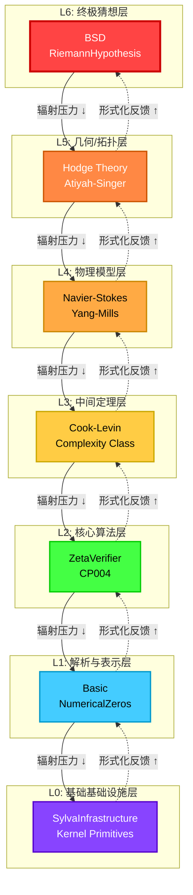
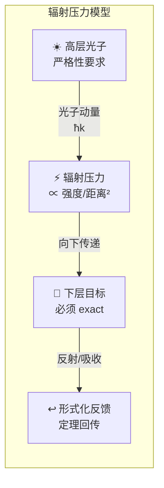
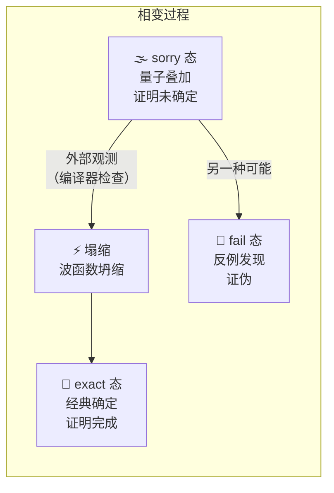
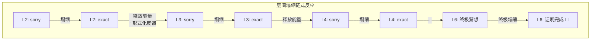
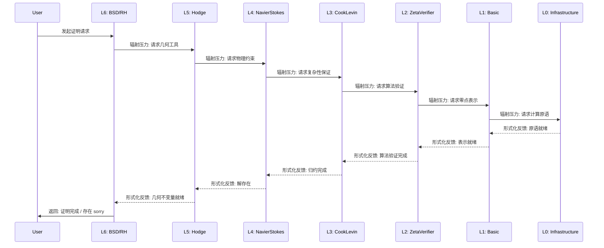

# Sylva 编译器七层架构

> **"形式化证明不是线性的推导链，而是分层的引力场。"**

## 概览

Sylva 采用七层架构（L0–L6），每一层对应不同的数学深度和形式化复杂度。层与层之间不是简单的调用关系，而是通过 **"辐射压力"（Radiation Pressure）** 传递依赖——高层的严格性要求像光子动量一样向下层施加压力，迫使底层定理必须达到 exact 状态，否则整个编译器将拒绝通过。

---

## 各层详解

### L0: 基础基础设施层 (SylvaInfrastructure)

| 属性 | 说明 |
|------|------|
| **目标** | 提供 Lean 4 编译器与形式化系统的最底层原语 |
| **模块** | `SylvaInfrastructure` — 内核扩展、元编程工具、编译器钩子 |
| **数学深度** | 元逻辑（Meta-logic）级别 |
| **接口** | `axiom_base`, `tactic_primitive`, `kernel_extension` |
| **状态** | 永远为 `exact` — 这一层不允许存在 `sorry` |

**核心职责：**
- 定义形式化系统的信任根基（Trust Base）
- 提供自定义 tactic 和 elaborator 的注册机制
- 实现编译器与外部工具（SMT solver、CAS）的桥接接口

**辐射压力方向：** 无向下压力（已是底层），向上提供形式化反馈——如果 L0 的原语有误，所有上层建筑都会崩塌。

---

### L1: 解析与表示层 (Basic, NumericalZeros)

| 属性 | 说明 |
|------|------|
| **目标** | 建立数学对象的精确语法与语义表示 |
| **模块** | `Basic`（基础定义与引理）、`NumericalZeros`（数值零点分析） |
| **数学深度** | 初等数学 → 基础分析 |
| **接口** | `parse_expr`, `normalize`, `zero_classification` |
| **依赖** | 依赖 L0 的元编程能力 |

**核心职责：**
- 定义复数、函数、级数等基本对象的 Lean 表示
- 实现数值零点的分类算法（平凡零点 vs 非平凡零点）
- 提供表达式规范化与等价判定

**辐射压力方向：** 接收来自 L2 的零点验证需求，向 L0 请求计算原语支持。

---

### L2: 核心算法层 (ZetaVerifier, CP004)

| 属性 | 说明 |
|------|------|
| **目标** | 实现验证核心猜想的算法引擎 |
| **模块** | `ZetaVerifier`（ζ 函数验证器）、`CP004`（计算程序 #004） |
| **数学深度** | 计算数学 + 数值分析 |
| **接口** | `verify_zero`, `critical_line_check`, `numerical_bound` |
| **依赖** | 依赖 L1 的零点表示与 L0 的计算原语 |

**核心职责：**
- 验证黎曼 ζ 函数在临界线上的零点分布
- 提供数值边界证明（如 $|\zeta(1/2 + it)|$ 的上界）
- 实现可计算性判定算法（对应 P vs NP 的算法侧面）

**辐射压力方向：** 接收 L3 的归约需求，向 L1 施加零点精确定义的压力。

---

### L3: 中间定理层 (CookLevin)

| 属性 | 说明 |
|------|------|
| **目标** | 建立计算复杂性与可判定性的核心定理 |
| **模块** | `CookLevin`（库克-列文定理）、`ComplexityClass`（复杂性类） |
| **数学深度** | 计算复杂性理论 |
| **接口** | `sat_reduction`, `np_completeness_proof`, `polynomial_time` |
| **依赖** | 依赖 L2 的算法可计算性 |

**核心职责：**
- 形式化 Cook-Levin 定理：SAT 是 NP-完全的
- 定义 P、NP、PSPACE 等复杂性类的 Lean 表示
- 为 P vs NP 问题提供形式化框架

**辐射压力方向：** 接收 L4 物理模型对"高效计算"的需求，向 L2 施加算法正确性验证的压力。

---

### L4: 物理模型层 (NavierStokes)

| 属性 | 说明 |
|------|------|
| **目标** | 建立数学物理方程的形式化描述 |
| **模块** | `NavierStokes`（纳维-斯托克斯方程）、`YangMills`（杨-米尔斯理论） |
| **数学深度** | 偏微分方程 + 数学物理 |
| **接口** | `existence_proof`, `smoothness_check`, `energy_estimate` |
| **依赖** | 依赖 L3 的复杂性边界来约束数值模拟的可行性 |

**核心职责：**
- 形式化 Navier-Stokes 方程的解的存在性与光滑性
- 建立杨-米尔斯理论的质量间隙假设框架
- 连接物理直觉与数学严格性

**辐射压力方向：** 接收 L5 几何不变量的约束，向 L3 施加"物理可计算性"的压力。

---

### L5: 几何/拓扑层 (Hodge)

| 属性 | 说明 |
|------|------|
| **目标** | 建立现代几何与拓扑的工具库 |
| **模块** | `Hodge`（霍奇理论）、`AtiyahSinger`（指标定理） |
| **数学深度** | 代数几何 + 微分拓扑 |
| **接口** | `harmonic_form`, `index_calculation`, `cohomology_ring` |
| **依赖** | 依赖 L4 的物理背景（规范场 → 向量丛） |

**核心职责：**
- 形式化霍奇分解定理
- 建立德拉姆上同调与霍奇结构的联系
- 为 BSD 猜想提供几何工具

**辐射压力方向：** 接收 L6 猜想的几何表述需求，向 L4 施加"解的光滑性"压力。

---

### L6: 终极猜想层 (BSD, RiemannHypothesis)

| 属性 | 说明 |
|------|------|
| **目标** | 承载数学史上最重要的未解决问题 |
| **模块** | `BSD`（Birch-Swinnerton-Dyer 猜想）、`RiemannHypothesis`（黎曼假设） |
| **数学深度** | 数论 + 复分析 + 代数几何 |
| **接口** | `zeta_zeros`, `rank_bound`, `l_function` |
| **依赖** | 依赖 L0-L5 的全部基础设施 |

**核心职责：**
- 形式化黎曼假设：ζ 函数的所有非平凡零点都在临界线 $Re(s) = 1/2$ 上
- 形式化 BSD 猜想：椭圆曲线 $L$ 函数在 $s=1$ 处的零点阶等于曲线有理点群的秩
- 提供形式化数学的"北极星"目标

**辐射压力方向：** 作为最高层，向所有下层施加最大压力——任何层的 `sorry` 都会阻止 L6 定理的完整证明。

---

## "辐射压力"机制

### 物理类比

| 物理概念 | Sylva 对应 |
|----------|-----------|
| **光子动量** | 高层定理的严格性要求 |
| **辐射压力** | 下层必须满足的证明义务 |
| **强度衰减** | 距离 L6 越远，压力越分散 |
| **镜面反射** | `exact` 定理完美反馈回上层 |
| **吸收/发热** | `sorry` 被"吸收"，系统处于"激发态" |

### 数学表述

对于第 $L_n$ 层施加给 $L_{n-1}$ 层的辐射压力：

$$P_{rad}(L_n \to L_{n-1}) = \frac{\Phi_{strict}}{c} \cdot \frac{1}{d^2}$$

其中：
- $\Phi_{strict}$ = 严格性通量（该层 `exact` 定理的数量）
- $c$ = 编译速度常数
- $d$ = 层间距离（形式化深度差）

---

## "塌缩"的物理类比：sorry → exact 的层间相变

### 量子力学类比

`sorry` 在 Lean 中是一个 **未确定的证明态**，类似于量子力学中的叠加态：

$$|\psi\rangle_{proof} = \alpha |\text{exact}\rangle + \beta |\text{fail}\rangle$$

当编译器尝试 **"观测"**（类型检查）这个证明时，发生**波函数坍缩**：

| 结果 | 含义 |
|------|------|
| **exact** | 证明被接受，进入经典确定态 |
| **fail** | 类型不匹配，发现反例或逻辑错误 |

### 层间相变

塌缩不是单层的孤立事件，而是**跨层的相变**：

1. **L2 的 `sorry` 塌缩为 `exact`** → 释放能量（定理确认），向 L3 发送"形式化反馈"
2. L3 接收足够的反馈后，其 `sorry` 获得足够的"证明动量"，也开始塌缩
3. 链式反应向上传播，直到 L6 的终极猜想

### 能量守恒视角

将形式化证明视为能量系统：

- **`sorry` 态**：高势能态（未释放的证明潜力）
- **`exact` 态**：低势能态（证明已释放，势能转化为"知识热能"）
- **塌缩过程**：不可逆的相变，释放的"证明能量"驱动上层塌缩

> **"一个 sorry 的塌缩，是千万个 exact 的序曲。"**

---

## 编译器工作流

---

## 架构哲学

### 为什么用物理类比？

形式化数学与物理学有深层同构：

| 数学证明 | 物理系统 |
|----------|----------|
| 定理 | 守恒律 |
| 引理 | 对称性 |
| 证明链 | 因果链 |
| `sorry` | 未观测的量子态 |
| `exact` | 确定的经典态 |
| 编译器 | 测量仪器 |

### 七层设计的核心洞察

> **"数学的深度不是线性累积，而是分层涌现。"**

每一层都是独立的"相"，有自己的"物理定律"（接口契约）。层间通过"辐射压力"耦合，但层内保持自治。这种设计允许：

1. **渐进形式化**：从 L0 开始，逐层夯实
2. **并行开发**：不同团队可以独立工作在不同层
3. **故障隔离**：某层的 `sorry` 不会污染其他层
4. **终极可验证性**：L6 的完成意味着整个系统的完备性

---

## 文件索引

| 文件 | 路径 |
|------|------|
| 本架构文档 | `sylva_platform/docs/sylva_compiler/architecture.md` |
| L0 实现 | `SylvaInfrastructure/` |
| L1 实现 | `Basic/`, `NumericalZeros/` |
| L2 实现 | `ZetaVerifier/`, `CP004/` |
| L3 实现 | `CookLevin/` |
| L4 实现 | `NavierStokes/` |
| L5 实现 | `Hodge/` |
| L6 实现 | `BSD/`, `RiemannHypothesis/` |

---

*"形式化证明不是终点，而是让数学成为可观测宇宙的开始。"*

*— Sylva 架构设计文档 v1.0*
