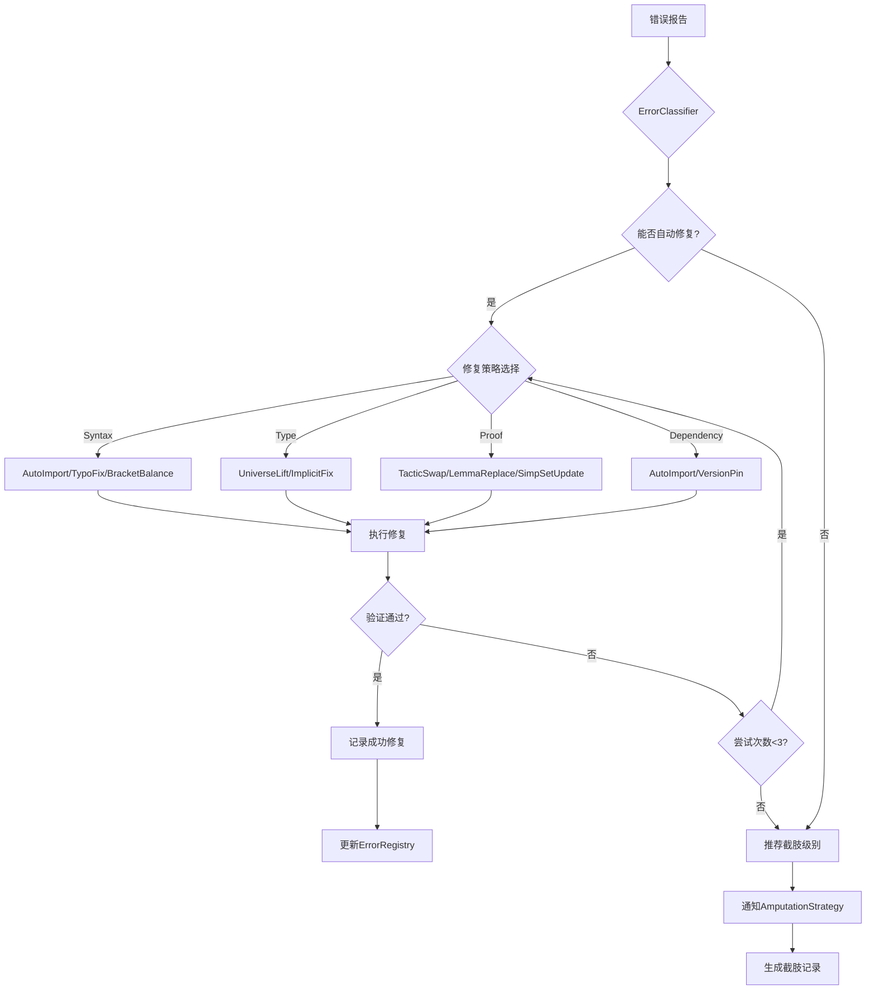
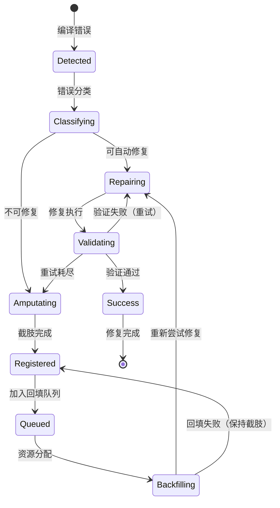

# SYLVA 自动修复集群（Auto Repair Cluster）

> **核心原则**：自动化地检测、分类、修复形式化证明中的编译错误和证明缺口，与四级截肢策略形成互补——能修则修，不能修则截肢。
>
> **文档定位**：本文档属于 [SYLVA Compiler 架构](./architecture.md) 的**自动修复子系统**，与 [Sorry Pipeline](./sorry_pipeline.md) 和 [Amputation Strategy](./amputation_strategy.md) 构成完整的三层编译保障体系。

---

## 1. 架构概述

### 1.1 设计目标

自动修复集群（Auto Repair Cluster）是一个**多Agent协作系统**，旨在：

1. **自动检测**编译错误和证明失败
2. **智能分类**错误类型和影响范围
3. **策略选择**最合适的修复方案
4. **执行修复**并验证结果
5. **监控回填**被截肢的部分

### 1.2 核心组件

```
Auto Repair Cluster
├── Error Classifier（错误分类器）
│   ├── 语法错误识别器
│   ├── 类型错误识别器
│   ├── 证明失败识别器
│   └── 依赖缺失识别器
├── Strategy Selector（修复策略选择器）
│   ├── 直接修复策略库
│   ├── 替换策略库
│   ├── 绕行策略库
│   └── 截肢推荐器
├── Validator（验证器）
│   ├── 编译验证
│   ├── 类型验证
│   ├── 证明验证
│   └── 回归测试
├── Rollback Guardian（回滚守护）
│   ├── 变更快照
│   ├── 渐进式回滚
│   ├── 依赖影响分析
│   └── 安全阈值检查
└── Backfill Scheduler（回填调度器）
    ├── 优先级队列
    ├── 资源分配
    ├── 进度追踪
    └── 效果度量
```

---

## 2. Error Classifier（错误分类器）

### 2.1 错误分类体系

| 错误类别 | 子类别 | 示例 | 自动修复可能性 |
|---------|--------|------|---------------|
| **SyntaxError** | MissingImport | `unknown identifier 'Real'` | 高 |
| | Typo | `nlinarith` 写成 `nlinarich` | 高 |
| | MismatchedBrackets | 括号不匹配 | 高 |
| **TypeError** | UniverseMismatch | `Type 1` vs `Type 2` | 中 |
| | ImplicitArgMismatch | 隐式参数推断失败 | 中 |
| | CustomTypeError | 自定义类型不匹配 | 低 |
| **ProofFailure** | TacticFailed | `simp` 无法化简 | 中 |
| | Timeout | 证明搜索超时 | 低 |
| | UnknownGoal | 目标状态意外 | 低 |
| **DependencyError** | MissingLibrary | 库未导入 | 高 |
| | VersionConflict | 库版本冲突 | 低 |
| | CircularDependency | 循环依赖 | 低 |

### 2.2 分类算法

```python
class ErrorClassifier:
    def classify(self, error_message: str, source_file: str, line: int) -> ErrorClass:
        # 1. 模式匹配阶段
        for pattern, category in self.patterns:
            if pattern.match(error_message):
                return category
        
        # 2. 上下文分析阶段
        context = self.extract_context(source_file, line)
        if context.is_proof_section:
            return ErrorClass.ProofFailure
        elif context.is_import_section:
            return ErrorClass.DependencyError
        
        # 3. 机器学习分类阶段（兜底）
        return self.ml_classifier.predict(error_message)
```

### 2.3 错误标签系统

```json
{
  "error_tag": {
    "id": "ERR-2026-0418-089",
    "category": "ProofFailure",
    "subcategory": "TacticFailed",
    "severity": "blocking",
    "file": "Hodge.lean",
    "line": 89,
    "column": 12,
    "message": "simp made no progress",
    "tactic": "simp",
    "context": {
      "goal": "∃ α β γ, ω = d α + δ β + γ ∧ Closed γ",
      "hypotheses": ["M : Manifold", "ω : DifferentialForm M"]
    },
    "auto_repair_suggestion": {
      "strategy": "try_alternative_tactics",
      "alternatives": ["nlinarith", "ring", "field_simp"],
      "confidence": 0.65
    }
  }
}
```

---

## 3. Strategy Selector（修复策略选择器）

### 3.1 修复策略库

#### 3.1.1 直接修复策略

| 策略名称 | 适用场景 | 执行方式 | 成功率 |
|---------|---------|---------|--------|
| **AutoImport** | 未知标识符 | 自动搜索并添加 import | 85% |
| **TypoFix** | 拼写错误 | Levenshtein 距离匹配 | 90% |
| **BracketBalance** | 括号不匹配 | 自动补全/删除括号 | 95% |
| **UniverseLift** | Universe 层级错误 | 自动添加 `Type*` / `Sort*` | 70% |

#### 3.1.2 替换策略

| 策略名称 | 适用场景 | 执行方式 | 成功率 |
|---------|---------|---------|--------|
| **TacticSwap** | 战术失败 | 尝试替代战术列表 | 60% |
| **LemmaReplace** | 引理不可用 | 搜索等效引理 | 55% |
| **SimpSetUpdate** | simp 集合过时 | 更新 simp 集合 | 65% |

#### 3.1.3 绕行策略

| 策略名称 | 适用场景 | 执行方式 | 成功率 |
|---------|---------|---------|--------|
| **ProofByContradiction** | 直接证明困难 | 自动构造反证法框架 | 45% |
| **InductionFallback** | 递归结构 | 自动构造归纳框架 | 50% |
| **SufficesReduction** | 目标复杂 | 自动分解子目标 | 55% |

#### 3.1.4 截肢推荐策略

当所有修复策略失败时，推荐截肢级别：

```python
def recommend_amputation(error: ErrorClass, context: Context) -> AmputationLevel:
    if error.category == "SyntaxError" and context.is_local:
        return AmputationLevel.L1
    elif error.category == "ProofFailure" and context.theorem_declared:
        return AmputationLevel.L2
    elif error.category == "DependencyError" and context.is_module_level:
        return AmputationLevel.L3
    elif error.category == "ArchitectureConflict":
        return AmputationLevel.L4
    else:
        return AmputationLevel.NONE  # 继续尝试其他策略
```

### 3.2 修复优先级算法

```
修复优先级排序（从高到低）：

1. 编译错误（Compilation Error）
   └── 阻塞整个项目编译，必须立即处理
   
2. 类型错误（Type Error）
   └── 影响类型安全性，高优先级
   
3. 证明失败（Proof Failure）
   └── 影响定理完整性，中优先级
   
4. 警告（Warning）
   └── 代码质量问题，低优先级
   
5. 优化建议（Optimization）
   └── 性能改进，最低优先级
```

### 3.3 策略选择决策树



---

## 4. Validator（验证器）

### 4.1 四层验证

| 验证层 | 检查内容 | 工具 | 通过标准 |
|--------|---------|------|---------|
| **L1 编译验证** | 代码能否编译 | `lake build` | 0 错误 |
| **L2 类型验证** | 类型系统一致性 | `lean --typecheck` | 0 类型错误 |
| **L3 证明验证** | 证明完整性 | `lean --check-proofs` | 0 sorry（或已登记） |
| **L4 回归测试** | 已有功能不受影响 | 自定义测试套件 | 100% 通过 |

### 4.2 渐进式验证流程

```
修复执行
    ↓
L1 编译验证
    ↓
├─ 通过 → L2 类型验证
│         ↓
│         ├─ 通过 → L3 证明验证
│         │         ↓
│         │         ├─ 通过 → L4 回归测试
│         │         │         ↓
│         │         │         ├─ 通过 → ✅ 修复成功
│         │         │         └─ 失败 → 回滚修复
│         │         └─ 失败 → 回滚修复
│         └─ 失败 → 回滚修复
└─ 失败 → 回滚修复
```

### 4.3 验证缓存

```json
{
  "validation_cache": {
    "file_hash": "sha256:abc123...",
    "last_validated": "2026-04-18T14:30:00Z",
    "validation_results": {
      "compilation": "passed",
      "typecheck": "passed",
      "proof_check": "passed_with_sorries",
      "regression": "passed"
    },
    "dependencies_changed": false
  }
}
```

---

## 5. Rollback Guardian（回滚守护）

### 5.1 变更快照

每次修复前自动创建快照：

```
snapshots/
├── 2026-0418-143000/
│   ├── Hodge.lean.bak          # 原文件备份
│   ├── Hodge.lean.diff         # 变更差异
│   ├── metadata.json           # 变更元数据
│   └── rollback.sh             # 一键回滚脚本
```

### 5.2 渐进式回滚

| 回滚级别 | 场景 | 操作 |
|---------|------|------|
| **L1 文件回滚** | 单个文件修复失败 | 恢复该文件备份 |
| **L2 模块回滚** | 模块级修复影响 | 恢复整个模块 |
| **L3 提交回滚** | 批量修复失败 | `git reset --soft HEAD~1` |
| **L4 状态回滚** | 系统级灾难 | 恢复到上次稳定快照 |

### 5.3 安全阈值

```json
{
  "safety_thresholds": {
    "max_auto_fixes_per_hour": 10,
    "max_amputations_per_day": 3,
    "max_rollback_rate": 0.2,
    "min_validation_pass_rate": 0.8,
    "max_sorry_increase": 5
  }
}
```

---

## 6. Backfill Scheduler（回填调度器）

### 6.1 回填队列

```
回填优先级队列（按优先级排序）：

P0 ────────────────────────────────────── 立即回填
├── 阻塞核心编译的L1截肢
├── 被关键路径依赖的L2截肢
└── 影响层间辐射的L3截肢

P1 ────────────────────────────────────── 本周回填
├── 核心功能L1截肢
├── 重要定理L2截肢
└── 当前迭代目标相关的L3截肢

P2 ────────────────────────────────────── 本月回填
├── 辅助功能L1截肢
├── 一般定理L2截肢
└── 非核心模块L3截肢

P3 ────────────────────────────────────── 长期回填
├── 优化/增强L1截肢
├── 独立定理L2截肢
├── 归档模块L3截肢
└── 愿景级L4截肢
```

### 6.2 资源分配算法

```python
def allocate_backfill_resources(amputations: List[Amputation], available_hours: int) -> Schedule:
    schedule = Schedule()
    
    # 1. 按优先级分组
    p0 = [a for a in amputations if a.priority == "P0"]
    p1 = [a for a in amputations if a.priority == "P1"]
    p2 = [a for a in amputations if a.priority == "P2"]
    p3 = [a for a in amputations if a.priority == "P3"]
    
    # 2. 分配时间（P0优先，剩余时间按顺序分配）
    hours = available_hours
    for group in [p0, p1, p2, p3]:
        for amp in group:
            if hours <= 0:
                break
            allocated = min(hours, amp.estimated_hours)
            schedule.add(amp, allocated)
            hours -= allocated
    
    return schedule
```

### 6.3 进度追踪

```json
{
  "backfill_progress": {
    "total_amputations": 24,
    "backfilled": 15,
    "in_progress": 4,
    "queued": 5,
    "weekly_velocity": 3.5,
    "estimated_completion": "2026-06-15",
    "trend": "improving"
  }
}
```

---

## 7. 与 Amputation Strategy 的交互

### 7.1 协作流程

```
编译失败
    ↓
Auto Repair Cluster
    ├── 尝试直接修复（ErrorClassifier + StrategySelector）
    │   ├── 成功 → 修复完成
    │   └── 失败 → 进入截肢评估
    │
    └── 截肢评估（与AmputationStrategy交互）
        ├── 推荐截肢级别（L1/L2/L3/L4）
        ├── 生成截肢记录
        └── 通知BackfillScheduler

回填阶段
    ↓
BackfillScheduler
    ├── 定期扫描amputation_registry
    ├── 评估回填可行性
    ├── 分配资源
    └── 触发AutoRepair重新尝试
```

### 7.2 状态机



### 7.3 数据共享

```json
{
  "shared_data": {
    "amputation_registry": {
      "source": "AmputationStrategy",
      "consumed_by": ["BackfillScheduler", "StrategySelector"],
      "update_frequency": "realtime"
    },
    "error_registry": {
      "source": "ErrorClassifier",
      "consumed_by": ["StrategySelector", "AmputationStrategy"],
      "update_frequency": "realtime"
    },
    "fix_history": {
      "source": "Validator",
      "consumed_by": ["StrategySelector"],
      "update_frequency": "per_batch"
    }
  }
}
```

---

## 8. 伪代码实现

### 8.1 主循环

```python
class AutoRepairCluster:
    def __init__(self):
        self.classifier = ErrorClassifier()
        self.strategy_selector = StrategySelector()
        self.validator = Validator()
        self.rollback_guardian = RollbackGuardian()
        self.backfill_scheduler = BackfillScheduler()
    
    def run(self, error_stream: Stream[Error]) -> RepairReport:
        report = RepairReport()
        
        for error in error_stream:
            # 1. 分类
            error_class = self.classifier.classify(error)
            
            # 2. 策略选择
            strategy = self.strategy_selector.select(error_class, error)
            
            if strategy.type == "amputation":
                # 3a. 推荐截肢
                self.notify_amputation_strategy(error, strategy.level)
                report.add_amputation(error, strategy.level)
            else:
                # 3b. 执行修复
                snapshot = self.rollback_guardian.create_snapshot(error.file)
                
                try:
                    fix_result = strategy.execute(error)
                    
                    # 4. 验证
                    if self.validator.validate(fix_result):
                        report.add_success(error, fix_result)
                    else:
                        # 回滚
                        self.rollback_guardian.rollback(snapshot)
                        
                        # 重试或截肢
                        if error.retry_count < 3:
                            error.retry_count += 1
                            error_stream.requeue(error)
                        else:
                            self.notify_amputation_strategy(error, "L2")
                            report.add_failure_then_amputation(error)
                
                except Exception as e:
                    self.rollback_guardian.rollback(snapshot)
                    report.add_exception(error, e)
        
        # 5. 回填调度
        self.backfill_scheduler.schedule()
        
        return report
```

### 8.2 错误分类器

```python
class ErrorClassifier:
    PATTERNS = {
        r"unknown identifier '(.+)'": ("SyntaxError", "MissingImport"),
        r"unknown constant '(.+)'": ("SyntaxError", "MissingImport"),
        r"simp made no progress": ("ProofFailure", "TacticFailed"),
        r"timeout": ("ProofFailure", "Timeout"),
        r"type mismatch": ("TypeError", "CustomTypeError"),
        r"failed to synthesize": ("TypeError", "ImplicitArgMismatch"),
    }
    
    def classify(self, error: Error) -> ErrorClass:
        for pattern, (category, subcategory) in self.PATTERNS.items():
            if re.search(pattern, error.message):
                return ErrorClass(category, subcategory, error)
        
        # 兜底：基于上下文
        if "tactic" in error.message.lower():
            return ErrorClass("ProofFailure", "UnknownGoal", error)
        
        return ErrorClass("Unknown", "Unknown", error)
```

### 8.3 策略选择器

```python
class StrategySelector:
    STRATEGIES = {
        ("SyntaxError", "MissingImport"): [AutoImportStrategy(), TypoFixStrategy()],
        ("SyntaxError", "Typo"): [TypoFixStrategy()],
        ("ProofFailure", "TacticFailed"): [TacticSwapStrategy(), LemmaReplaceStrategy()],
        ("ProofFailure", "Timeout"): [ProofSimplificationStrategy(), TimeoutIncreaseStrategy()],
        ("TypeError", "UniverseMismatch"): [UniverseLiftStrategy()],
    }
    
    def select(self, error_class: ErrorClass, error: Error) -> RepairStrategy:
        key = (error_class.category, error_class.subcategory)
        
        if key in self.STRATEGIES:
            for strategy in self.STRATEGIES[key]:
                if strategy.can_apply(error):
                    return strategy
        
        # 所有策略失败 → 推荐截肢
        level = self.recommend_amputation(error_class, error)
        return AmputationStrategy(level)
    
    def recommend_amputation(self, error_class: ErrorClass, error: Error) -> str:
        # 见第3.1.4节
        if error_class.category == "ProofFailure":
            return "L2"
        elif error_class.category == "DependencyError":
            return "L3"
        else:
            return "L1"
```

### 8.4 验证器

```python
class Validator:
    def validate(self, fix_result: FixResult) -> bool:
        # L1: 编译验证
        if not self.check_compilation(fix_result.file):
            return False
        
        # L2: 类型验证
        if not self.check_types(fix_result.file):
            return False
        
        # L3: 证明验证
        sorry_count = self.count_sorries(fix_result.file)
        if sorry_count > self.max_allowed_sorries:
            return False
        
        # L4: 回归测试
        if not self.run_regression_tests():
            return False
        
        return True
```

---

## 9. 性能与监控

### 9.1 性能指标

| 指标 | 目标 | 测量方式 |
|------|------|---------|
| 平均修复时间 | < 5分钟 | 从错误报告到修复完成 |
| 自动修复成功率 | > 70% | 成功修复数 / 总错误数 |
| 误修复率 | < 5% | 需要回滚的修复数 / 总修复数 |
| 截肢推荐准确率 | > 90% | 正确截肢级别 / 总截肢推荐 |
| 回填完成率 | > 20%/月 | 月回填数 / 总截肢数 |

### 9.2 监控仪表板

```
┌─────────────────────────────────────────────────┐
│ Auto Repair Cluster 实时监控                     │
├─────────────────────────────────────────────────┤
│ 当前运行：2个修复Agent + 1个验证Agent              │
│ 队列长度：5个待处理错误                           │
│ 今日修复：23个成功 / 3个失败 / 2个截肢            │
├─────────────────────────────────────────────────┤
│ 最近错误：                                         │
│ [14:32] Hodge.lean:89 → L2截肢（微分几何）        │
│ [14:15] ZetaVerifier.lean:42 → L1修复成功（AutoImport）│
│ [13:58] NumericalZeros.lean → 跳过（已知L3）      │
└─────────────────────────────────────────────────┘
```

---

## 10. 与其他SYLVA组件的集成

### 10.1 与Sorry Pipeline的集成

```
Sorry Pipeline 输出
    ↓
ErrorClassifier 接收
    ↓
├─ 可自动修复 → Auto Repair Cluster 处理
└─ 需截肢 → AmputationStrategy 处理
```

### 10.2 与Mega Coordinator的集成

```
Mega Coordinator
    ↓
修复完成事件频道
    ↓
{                                     
  "type": "auto_repair_complete",    
  "error_id": "ERR-2026-0418-089",  
  "strategy": "TacticSwap",         
  "from_tactic": "simp",            
  "to_tactic": "nlinarith",         
  "validation": "passed",           
  "time_spent": "3m12s"            
}                                     
```

### 10.3 与Sylva Platform Backend的集成

- 后端 `/api/health` 端点暴露 Auto Repair Cluster 的健康状态
- 后端 `/api/agents` 端点管理修复Agent的启停
- WebSocket 实时推送修复进度到前端

---

## 11. 扩展与演进

### 11.1 未来方向

1. **ML增强分类器**：训练基于历史错误数据的分类模型
2. **强化学习修复**：使用 `lean-gym` 训练修复策略
3. **社区知识库**：整合 Mathlib 社区的修复经验
4. **跨项目学习**：在多个 Lean 项目间迁移修复策略

### 11.2 版本演进

| 版本 | 功能 | 时间 |
|------|------|------|
| v0.1 | 基础错误分类 + L1修复 | 2026-04 |
| v0.5 | 策略库扩充 + L2修复 | 2026-05 |
| v1.0 | 完整四级修复 + 截肢推荐 | 2026-06 |
| v1.5 | ML增强 + 强化学习 | 2026-08 |
| v2.0 | 跨项目学习 + 社区集成 | 2026-10 |

---

## 相关文档

- [[sorry_pipeline.md]] — sorry 处理流水线
- [[amputation_strategy.md]] — 四级截肢策略
- [[architecture.md]] — 编译器架构总览
- [[../sylva_software/agent_writing.md]] — Agent集群写稿系统（修复Agent设计参考）

---

## 版本记录

| 版本 | 日期 | 变更 |
|------|------|------|
| v1.0 | 2026-05-19 | 初始版本，定义Auto Repair Cluster完整架构 |

---

## 关键词

#自动修复 #错误分类 #修复策略 #验证器 #回滚守护 #回填调度 #Agent集群 #编译保障 #Lean4 #形式化数学 #渐进修复 #智能截肢推荐