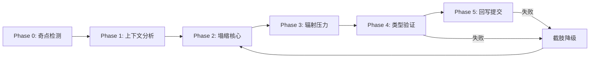
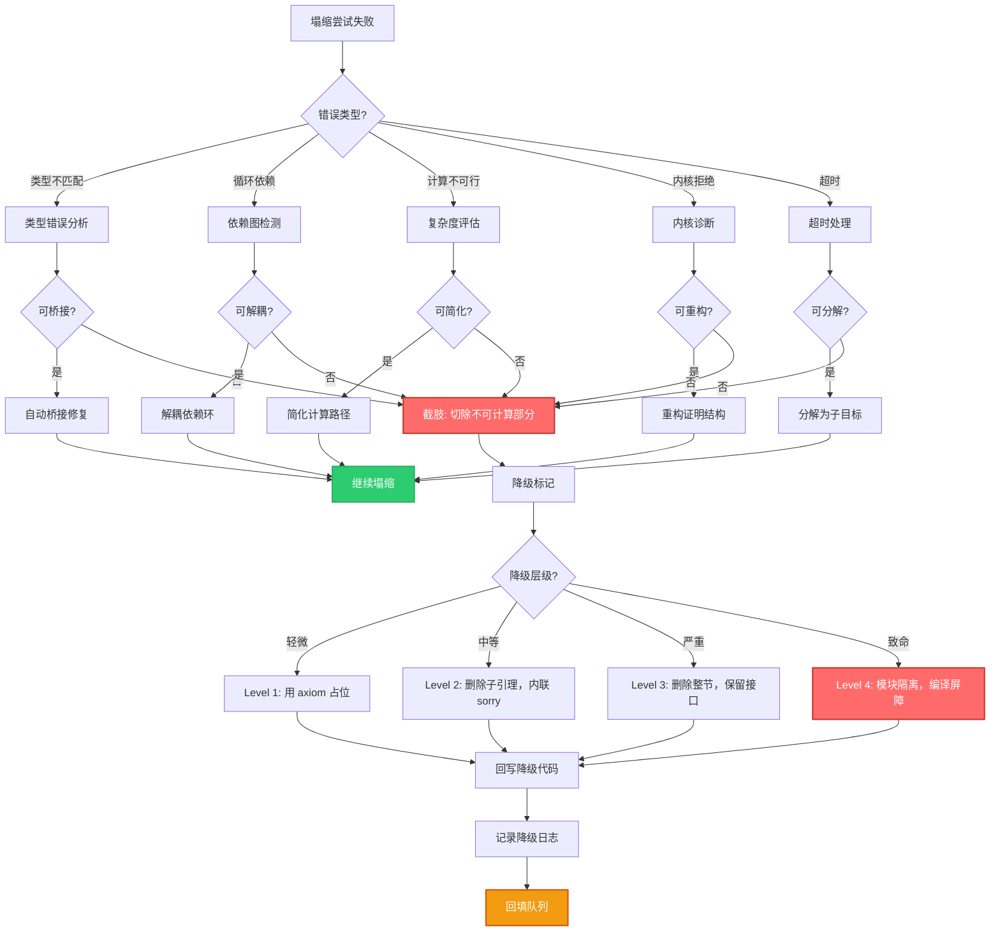
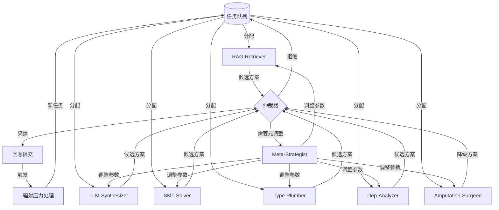

# Sylva Compiler — Sorry → Exact 塌缩流水线

> **塌缩奇点**存在于 Lean 代码的每一句 `sorry` 之中。从 `sorry` 到 `exact`，不是简单的文本替换，而是一场跨越证明宇宙层的相变。

---

## 1. 核心概念

### 1.1 sorry — 塌缩奇点

在 Lean 类型论中，`sorry` 是一个特殊的占位符（placeholder），它具备以下性质：

- **类型任意性**：`sorry` 可以被赋予任何类型，它是 Universe 中的黑洞——任何命题都可以坠入其中而不引发类型错误。
- **证明真空**：它不携带任何证明信息，是一个信息熵为零的点。
- **引力场**：`sorry` 会吸引周围的依赖关系向其汇聚，形成局部的高耦合区域。

```lean
-- 一个典型的塌缩奇点
lemma critical_step (h : a < b) : ∃ c, a < c ∧ c < b := by
  sorry  -- ← 塌缩奇点在此处
```

### 1.2 exact — 塌缩视界

`exact` 是证明终结符，它将一个具体的项（term）注入到目标类型中，完成匹配：

- **类型精确匹配**：`exact e` 要求 `e` 的类型与当前目标完全一致。
- **信息熵饱和**：`exact` 携带完整的证明信息，使该点的信息熵达到最大值。
- **视界闭合**：一旦 `exact` 成功，该证明节点即被封闭，不再接受外部扰动。

```lean
lemma critical_step (h : a < b) : ∃ c, a < c ∧ c < b := by
  exact ⟨a + (b - a) / 2, by linarith, by linarith⟩
```

### 1.3 塌缩（Collapse）— 相变定义

**塌缩**是从 `sorry`（信息熵=0，类型任意）到 `exact`（信息熵=Max，类型精确）的不可逆相变过程。在 Sylva 编译器中，塌缩被形式化为一个五阶段流水线。

> 类比：塌缩如同恒星坍缩为中子星——奇点（sorry）在压力下释放大量辐射（辐射压力），最终稳定为致密天体（exact）。

---

## 2. 塌缩的完整生命周期



### Phase 0: 奇点检测（Singularity Scanning）

编译器遍历整个 Lean 项目的 AST，识别所有 `sorry` 的位置并建立索引：

| 属性 | 说明 |
|------|------|
| `location` | 文件路径 + 行列号 |
| `depth` | 在证明树中的嵌套深度 |
| `type_signature` | 被 `sorry` 填充的目标类型 |
| `dependencies` | 直接依赖的假设/已证引理 |
| `entropy_score` | 上下文信息量的量化评分 |
| `blockers` | 阻碍塌缩的未解析符号 |

**算法：递归扫描 + 依赖图构建**

```
function scanSorries(file):
    sorries = []
    ast = parse(file)
    for node in ast.walk(tactic_mode):
        if node.tactic == "sorry":
            s = {
                location: node.span,
                depth: node.proof_depth,
                type_signature: inferType(node.goal),
                dependencies: extractDependencies(node.context),
                entropy_score: computeEntropy(node.context),
                blockers: findUnresolvedSymbols(node)
            }
            sorries.append(s)
    return sorries
```

### Phase 1: 上下文分析（Context Analysis）

对每个奇点进行微观解剖，提取塌缩所需的一切信息：

1. **局部上下文收集**：当前 proof state 中的所有假设（hypotheses）、局部变量、已引入的实例。
2. **全局引理检索**：在 Mathlib 和项目自定义库中搜索可能与该目标类型匹配的定理。
3. **证明模式识别**：基于历史塌缩记录，匹配最可能成功的证明策略模板。
4. **难度评估**：根据依赖深度、类型复杂度、blocker 数量，给出一个 `collapse_difficulty` 评分（0.0 ~ 1.0）。

**难度评分公式：**

$$
D = \alpha \cdot \frac{|blockers|}{|dependencies|} + \beta \cdot typeDepth + \gamma \cdot entropyScore
$$

其中 $\alpha=0.5$, $\beta=0.3$, $\gamma=0.2$ 为经验权重。

### Phase 2: 塌缩核心（Collapse Core）

这是塌缩流水线的主引擎。输入是一个 `sorry`，输出是一个候选 `exact`（或 `by` 块）：

**子阶段 2.1: 策略生成（Tactic Synthesis）**

- 基于检索增强生成（RAG）：从 Mathlib 中检索相似证明，提取策略模式。
- 基于 LLM 的零样本生成：当无相似先例时，由大模型生成证明策略。
- 基于 SMT/自动证明器：对可判定片段（如线性算术、等式理论）调用自动化工具。

**子阶段 2.2: 类型匹配（Type Matching）**

- 生成候选证明项 `candidate`。
- 调用 Lean 的类型检查器：`check(candidate : targetType)`。
- 若类型不匹配，进入 **反压调整（Backpressure Tuning）**：
  - 尝试 `convert` 或 `rw` 进行类型对齐。
  - 尝试引入辅助引理桥接类型间隙。
  - 若无法桥接，标记为 **不可塌缩**。

**子阶段 2.3: 塌缩尝试（Collapse Attempt）**

- 将候选证明注入到 `sorry` 位置。
- 运行局部编译（增量编译，仅重新检查受影响模块）。
- 记录编译结果：成功 / 类型错误 / 超时 / 依赖缺失。

### Phase 3: 辐射压力（Radiation Pressure）

塌缩不是孤立事件。当一个 `sorry` 被替换为 `exact` 时，其类型从任意态坍缩为精确态，这会向相邻证明层施加 **辐射压力**。详见第 3 节。

### Phase 4: 类型验证（Type Verification）

- **局部验证**：重新编译包含该塌缩的文件，确保无类型错误。
- **全局验证**：触发增量依赖链编译，验证所有下游模块未受损。
- **一致性检查**：确认塌缩后的证明与原证明在逻辑上等价（ Lean 的 `defeq` 检查）。

### Phase 5: 回写提交（Commit）

- 将塌缩后的代码回写到源文件。
- 更新奇点索引，将该 `sorry` 标记为已塌缩。
- 触发辐射压力的后续处理队列。
- 记录塌缩日志到 `SORRY_LOG`。

---

## 3. 辐射压力的具体机制

辐射压力是塌缩流水线的核心物理隐喻。当一个奇点塌缩时，它不再是黑洞——信息开始向外辐射，影响整个证明宇宙的拓扑结构。

### 3.1 依赖关系的相变（Dependency Phase Transition）

#### 直接依赖（Direct Dependents）

假设引理 `A` 依赖引理 `B`，而 `B` 中包含一个 `sorry`：

```lean
lemma B : P → Q := by sorry        -- 奇点
lemma A : P → R := by
  intro h
  have hQ := B h  -- 直接依赖 B
  sorry
```

当 `B` 从 `sorry` 塌缩为 `exact` 后，`A` 中的 `have hQ := B h` 获得了实际的计算内容。这产生两种压力：

1. **结构压力**：如果 `B` 的实现方式改变了（例如返回了一个具体的构造子而非通用的存在量词），`A` 中对 `hQ` 的使用可能需要调整模式匹配。
2. **证明压力**：`A` 可能原本因为 `B` 是 `sorry` 而无法继续，现在 `B` 可用了，`A` 的后续 `sorry` 获得了新的证明上下文，塌缩条件发生变化。

#### 间接依赖（Transitive Dependents）

通过依赖图传播，辐射压力呈指数衰减：

$$
Pressure(node) = \sum_{d \in directDeps(node)} \frac{Pressure(d)}{1 + distance(node, d)}
$$

#### 反向依赖（Reverse Dependencies / 被依赖方）

塌缩后的 `exact` 可能引入新的假设需求。如果 `B` 的实现现在要求一个额外的 `[DecidableEq α]` 实例，所有依赖 `B` 的引理必须在它们的上下文中也提供这个实例，否则编译失败。

### 3.2 接口契约的张力（Interface Contract Tension）

每个 `sorry` 都隐式地维护着一层 **接口契约**——即该位置的类型签名对外部世界做出的承诺。

| 塌缩前（sorry） | 塌缩后（exact） | 契约变化 |
|---|---|---|
| 类型任意，无计算内容 | 类型精确，有计算内容 | 计算语义从虚到实 |
| 不暴露实现细节 | 暴露实现细节 | 信息隐藏被破坏 |
| 可透明地嵌入任何上下文 | 可能引入新的类型类约束 | 上下文兼容性改变 |

**契约张力公式：**

当一个奇点塌缩时，其接口契约的变化量定义为：

$$
\Delta Contract = |NewConstraints| - |OldConstraints| + \delta(TypeComplexity)
$$

- 若 $\Delta Contract > 0$：契约变紧，对外部施加**收缩压力**（调用方需要提供更多信息）。
- 若 $\Delta Contract < 0$：契约变松，对外部施加**膨胀压力**（调用方可以简化假设）。
- 若 $\Delta Contract = 0$：契约守恒，无辐射压力。

### 3.3 信息熵流（Information Entropy Flow）

塌缩过程伴随着信息熵的剧烈流动。

#### 熵流方向

```
塌缩前（sorry）          塌缩过程          塌缩后（exact）
信息熵 = 0    ←—— 熵被注入 ——→    信息熵 = Max
黑洞吸收一切              辐射释放              确定态
```

#### 熵流的三条通道

**通道 1: 证明信息注入（Proof Injection）**
- 外部知识（Mathlib、LLM、自动证明器）向奇点注入证明信息。
- 这是熵增的主要来源。

**通道 2: 依赖约束渗出（Constraint Seepage）**
- 塌缩后的精确类型向依赖方渗出新的约束（类型类、前提条件）。
- 这是辐射压力的本质——约束像热量一样从高温区（已塌缩）流向低温区（未塌缩）。

**通道 3: 失败熵回流（Failure Entropy Backflow）**
- 如果塌缩尝试失败，错误信息会回流到调度器，影响后续的塌缩策略选择。
- 这是负反馈调节机制，防止系统在不可塌缩的区域浪费算力。

#### 熵平衡方程

对于整个项目，定义全局熵平衡：

$$
\frac{dS_{total}}{dt} = \sum_{c \in Collapses} S_{injected}(c) - \sum_{r \in Radiation} S_{dissipated}(r) - \sum_{f \in Failures} S_{lost}(f)
$$

其中：
- $S_{injected}$：成功塌缩注入的证明信息熵
- $S_{dissipated}$：辐射压力传递到相邻层后耗散的熵
- $S_{lost}$：塌缩失败丢失的探索熵

**项目完成条件**：$S_{total} \rightarrow S_{max}$，即所有 `sorry` 的信息熵都被填充至饱和。

---

## 4. 截肢降级策略（Amputation Fallback）

当塌缩遇到一个不可计算的区块（类型错误、循环依赖、计算不可行、或 Lean 内核拒绝接受），流水线不会硬崩溃，而是执行 **截肢降级**：切除不可计算部分，确保编译通过，记录切除位置，待后续回填。

> 类比：外科手术——先止血保命（编译通过），再择期修复（回填证明）。

### 4.1 决策流程图



### 4.2 降级层级的定义

| 层级 | 名称 | 操作 | 编译影响 | 回填难度 |
|---|---|---|---|---|
| **Level 0** | 完整保留 | 无操作，继续尝试其他塌缩策略 | 无 | — |
| **Level 1** | Axiom 占位 | 用 `axiom` 声明替代 `sorry`，赋予无证明的类型 | 无 | 低 |
| **Level 2** | 子引理截肢 | 删除内部子引理，将 `sorry` 内联到上层 | 轻微（可能有重复） | 中 |
| **Level 3** | 整节删除 | 删除整个证明节，仅保留类型签名接口 | 中等（调用点需适配） | 高 |
| **Level 4** | 模块隔离 | 将整个模块放入 `noncomputable` 或编译屏障后 | 严重（隔离区外不可用） | 极高 |

**降级决策公式：**

$$
FallbackLevel = \min\left(4, \left\lfloor \frac{Severity \times Impact}{Tolerance} \right\rfloor\right)
$$

其中：
- $Severity$：错误严重程度（1~10）
- $Impact$：影响范围（依赖该区块的引理数）
- $Tolerance$：当前项目的编译容错阈值（可配置，默认=5）

### 4.3 回填证明的路线图

截肢不是终结，而是延迟。所有降级操作都被记录到 **回填队列（Backfill Queue）**：

```
BackfillQueueEntry:
  - source_location: 原始 sorry 位置
  - amputation_level: 降级层级
  - amputation_timestamp: 降级时间
  - original_goal: 原始目标类型
  - priority_score: 回填优先级
  - estimated_difficulty: 估计回填难度
  - dependencies: 回填前必须先完成的其他条目
  - assigned_agent: 分配给哪个 agent
```

**回填优先级算法：**

$$
Priority = \frac{Importance}{AmputationLevel \times DaysSinceAmputation \times EstimatedDifficulty}
$$

- 重要性越高、降级层级越低、截肢时间越短、估计难度越低 → 优先级越高。
- 每天由调度器重新计算所有条目的优先级，并分配给可用的塌缩 agent。

---

## 5. 自动修复集群（Auto-Fix Cluster）

Sylva 编译器维护一个由 **7 个并行 Agent** 组成的自动修复集群，它们竞争式地处理塌缩任务和截肢回填任务。

### 5.1 7 个并行 Agent 的分工

| Agent ID | 代号 | 专长领域 | 处理策略 | 优先级 |
|---|---|---|---|---|
| **A0** | RAG-Retriever | 检索增强生成 | 从 Mathlib/项目库中检索相似证明，基于先例塌缩 | P0 |
| **A1** | LLM-Synthesizer | 大模型生成 | 零样本/少样本证明生成，处理无先例的新奇点 | P1 |
| **A2** | SMT-Solver | 自动定理证明 | 调用 Z3/CVC5/Lean 的 `auto` 策略处理可判定片段 | P0 |
| **A3** | Type-Plumber | 类型桥接 | 处理类型不匹配、类型类实例推导、 universe 层级问题 | P1 |
| **A4** | Dep-Analyzer | 依赖分析 | 处理循环依赖、反向依赖约束、接口契约张力 | P2 |
| **A5** | Amputation-Surgeon | 截肢降级 | 执行截肢降级决策流程，确保编译通过 | P3 |
| **A6** | Meta-Strategist | 元策略 | 监控全局塌缩进度，动态调整其他 agent 的策略参数 | P0 |

### 5.2 竞争与协作模型



**竞争规则：**

1. **先到先审**：第一个返回有效候选方案的 agent 获得仲裁权。
2. **质量优先**：若多个 agent 几乎同时返回，选择 `collapse_difficulty` 评分最低的方案（最简单优先）。
3. **降级兜底**：如果所有非降级 agent 都失败，A5（Amputation-Surgeon）的方案自动被采纳。
4. **超时机制**：单个 agent 处理一个奇点的超时时间为 5 分钟（可配置），超时后强制降级。

### 5.3 收敛条件

整个塌缩流水线在以下任一条件满足时停止：

1. **全局塌缩完成**：项目中不存在任何 `sorry`（包括回填队列清空）。
2. **熵平衡收敛**：连续 10 轮迭代中，全局信息熵增量 $\Delta S_{total} < \epsilon$（默认 $\epsilon = 0.01$），且回填队列无进展。
3. **资源上限**：达到预设的计算资源上限（时间/ token / API 调用次数）。
4. **人工干预**：用户手动暂停或修改塌缩策略。

**未塌缩奇点的最终处置：**

若流水线在条件 2 或 3 下停止，所有剩余的 `sorry` 将被：
- 如果是 Level 1 降级 → 保留为 `axiom`，标记为 **待人工验证**。
- 如果是 Level 2+ 降级 → 保留截肢后的代码，生成 **截肢报告（Amputation Report）** 供人工审查。
- 未处理的原始 `sorry` → 保留，标记为 **超出自动塌缩能力**。

---

## 6. 监控与度量

### 6.1 塌缩仪表盘指标

| 指标 | 说明 | 健康阈值 |
|---|---|---|
| `sorries_total` | 项目总奇点数 | 趋向 0 |
| `collapse_rate` | 塌缩速率（个/小时） | > 10 |
| `amputation_rate` | 截肢率（截肢数/总尝试数） | < 0.3 |
| `radiation_pressure_avg` | 平均辐射压力 | < 5 |
| `entropy_fill_ratio` | 信息熵填充比 | > 0.8 |
| `agent_utilization` | Agent 集群利用率 | > 0.7 |
| `backfill_queue_size` | 回填队列长度 | 趋向 0 |
| `mean_ttc` | 平均塌缩时间（Time-To-Collapse） | < 2 min |

### 6.2 日志格式

```json
{
  "timestamp": "2026-05-18T02:11:00+08:00",
  "event": "COLLAPSE_SUCCESS",
  "agent": "A1-LLM-Synthesizer",
  "target": {
    "file": "NavierStokes/BoundaryConditions.lean",
    "line": 147,
    "goal": "∃ u, Continuous u ∧ u = f on boundary"
  },
  "strategy": "constructor + continuity + exact",
  "radiation_pressure": 3,
  "affected_dependents": ["A.lean:89", "B.lean:203"],
  "entropy_delta": 12.5,
  "time_ms": 8432
}
```

---

## 附录 A: 术语对照表

| 术语 | Lean 概念 | 物理隐喻 |
|---|---|---|
| 奇点 | `sorry` | 黑洞奇点 |
| 视界 | `exact` | 事件视界 |
| 塌缩 | sorry → exact | 恒星坍缩 |
| 辐射压力 | 依赖传播效应 | 黑洞辐射 |
| 截肢 | 降级/删除不可计算部分 | 外科手术 |
| 回填 | 后续证明恢复 | 组织再生 |
| 熵 | 信息量/证明复杂度 | 热力学熵 |
| 相变 | 类型状态突变 | 物态相变 |

## 附录 B: 配置参考

```yaml
# sylva_compiler_config.yaml
sorry_pipeline:
  collapse:
    timeout_ms: 300000
    max_attempts_per_sorry: 5
    difficulty_threshold: 0.7
  
  radiation:
    propagation_depth: 3
    pressure_dampening: 0.5
    contract_tolerance: 5
  
  amputation:
    enabled: true
    default_level: 1
    max_level: 4
    tolerance_factor: 5
  
  cluster:
    agents:
      - id: A0
        enabled: true
        model: rag-retriever-v2
      - id: A1
        enabled: true
        model: kimi-coding/k2.6
        temperature: 0.2
      - id: A2
        enabled: true
        solver: z4
      - id: A3
        enabled: true
      - id: A4
        enabled: true
      - id: A5
        enabled: true
        fallback_only: false
      - id: A6
        enabled: true
        interval_ms: 60000
  
  backfill:
    enabled: true
    schedule: "0 */6 * * *"
    priority_decay: 0.9
  
  logging:
    level: INFO
    format: json
    destination: "logs/sorry_pipeline.jsonl"
```

---

> *"每一个 `sorry` 都是一颗等待点燃的暗星。塌缩流水线不是消灭未知，而是将未知转化为精确的已知——一次一个 exact，一层一层辐射，直到整个证明宇宙亮起来。"*
