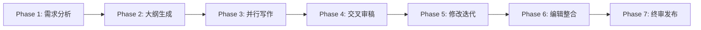
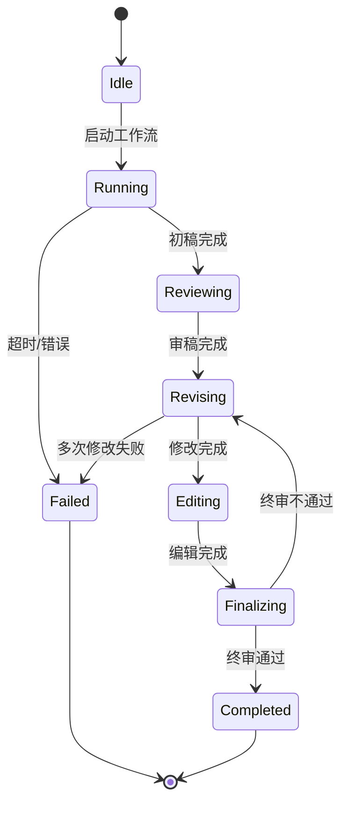

# Agent 集群写稿系统

> 版本: v2.0 | 汇总版 | 基于已有 11 份设计文档整合
> 涵盖：架构设计、代码框架、通信协议、配置部署、API 示例、协作机制

---

## 1. 系统概述

Agent 集群写稿系统（Agent Writing System, AWS）是一个基于多 Agent 协作的学术论文自动化生产平台。系统模拟真实学术界的协作流程，通过多种专业 Agent 的并行工作与迭代优化，实现高质量学术论文的自动化生成。

### 1.1 核心设计原则

| 原则 | 说明 |
|------|------|
| **并行多样性** | 多写 Agent 并行产出不同角度的初稿，最大化创意空间 |
| **角色专业化** | 每个 Agent 具有明确的专业角色和评估标准 |
| **迭代优化** | 审稿-修改的闭环机制确保质量持续提升 |
| **状态可追踪** | 全流程状态机管理，支持断点恢复和过程审计 |
| **冲突可解决** | 内置冲突检测与裁决机制，避免死锁 |

### 1.2 系统边界

```
┌─────────────────────────────────────────────────────────────┐
│                    Agent 集群写稿系统                        │
│  ┌──────────┐  ┌──────────┐  ┌──────────┐  ┌──────────┐     │
│  │ 写作 Agent│  │ 编辑 Agent│  │ 专家 Agent│  │ 审稿 Agent│     │
│  └──────────┘  └──────────┘  └──────────┘  └──────────┘     │
│  ┌──────────┐  ┌──────────┐                                  │
│  │ 主编 Agent│  │ 协调 Agent│                                  │
│  └──────────┘  └──────────┘                                  │
└─────────────────────────────────────────────────────────────┘
         ↑                              ↓
    用户输入(主题/要求)           最终论文输出
```

---

## 2. 核心组件

### 2.1 多写 Agent 集群（Writing Agent Cluster）

负责论文初稿的并行创作，每个 Agent 从独特视角切入，产出多样化的初稿版本。

**角色配置**:
- **理论派 Writer**: 侧重数学严谨性，关注定义、定理、证明
- **实验派 Writer**: 侧重实验设计、数据分析、结果呈现
- **综述派 Writer**: 侧重文献综述、相关工作、历史脉络
- **应用派 Writer**: 侧重实际应用、工程实现、案例分析
- **批判派 Writer**: 侧重质疑现有方法、提出改进方向

### 2.2 审稿 Agent 集群（Review Agent Cluster）

模拟真实学术审稿流程，对初稿进行多维度评估。

**审稿维度**:
- 创新性（Novelty）: 是否提出新见解或新方法
- 严谨性（Rigor）: 论证是否严密，数据是否充分
- 可读性（Clarity）: 结构是否清晰，表达是否流畅
- 完整性（Completeness）: 是否覆盖必要内容

### 2.3 编辑 Agent（Editor Agent）

整合多版本初稿，解决冲突，产出统一终稿。

**核心功能**:
- 多版本融合算法（Multi-Draft Fusion）
- 冲突检测与解决（Conflict Detection & Resolution）
- 质量评分系统（Quality Scoring）

### 2.4 协调 Agent（Coordinator Agent）

管理工作流状态，调度各 Agent 的执行顺序和依赖关系。

---

## 3. 七阶段工作流



| 阶段 | 输入 | 输出 | 触发条件 |
|------|------|------|---------|
| 1. 需求分析 | 用户主题/要求 | 需求规格书 | 用户提交主题 |
| 2. 大纲生成 | 需求规格书 | 论文大纲 | 需求分析完成 |
| 3. 并行写作 | 论文大纲 | N 份初稿 | 大纲确认 |
| 4. 交叉审稿 | N 份初稿 | 审稿意见 | 所有初稿完成 |
| 5. 修改迭代 | 审稿意见 | 修改后稿件 | 审稿完成 |
| 6. 编辑整合 | 修改后稿件 | 统一终稿 | 修改完成 |
| 7. 终审发布 | 统一终稿 | 最终论文 | 编辑确认 |

---

## 4. 通信协议与状态机

### 4.1 消息格式（JSON Schema）

```json
{
  "header": {
    "message_id": "uuid",
    "sender_id": "agent_id",
    "receiver_id": "agent_id",
    "message_type": "REQUEST_REVIEW|SUBMIT_DRAFT|PROVIDE_FEEDBACK|...",
    "timestamp": "ISO8601",
    "correlation_id": "uuid"
  },
  "payload": {
    "type": "string",
    "data": {}
  }
}
```

### 4.2 消息类型

| 类型 | 说明 | 方向 |
|------|------|------|
| `REQUEST_REVIEW` | 请求审稿 | Writer → Reviewer |
| `SUBMIT_DRAFT` | 提交初稿 | Writer → Coordinator |
| `PROVIDE_FEEDBACK` | 提供反馈 | Reviewer → Writer |
| `REQUEST_CLARIFICATION` | 请求澄清 | Reviewer → Writer |
| `CONFLICT_REPORT` | 冲突报告 | Editor → Coordinator |
| `STATUS_UPDATE` | 状态更新 | Agent → Coordinator |

### 4.3 状态机



---

## 5. 质量评估体系

### 5.1 多维度评分

| 维度 | 权重 | 评分标准 |
|------|------|---------|
| 创新性 | 30% | 0-100，≥70 为优秀 |
| 严谨性 | 25% | 0-100，≥75 为优秀 |
| 可读性 | 20% | 0-100，≥70 为优秀 |
| 完整性 | 15% | 0-100，≥80 为优秀 |
| 时效性 | 10% | 0-100，≥60 为合格 |

### 5.2 阈值设定

- **Acceptance Threshold**: 综合评分 ≥ 85，所有维度 ≥ 60
- **Revision Threshold**: 综合评分 70-84，或任一维度 < 60
- **Rejection Threshold**: 综合评分 < 70

---

## 6. 代码框架

### 6.1 核心类结构

```python
class BaseAgent:
    def __init__(self, agent_id: str, role: str):
        self.id = agent_id
        self.role = role
        self.status = AgentStatus.IDLE
    
    async def process(self, message: AgentMessage) -> AgentMessage:
        raise NotImplementedError
    
    async def send_message(self, target: str, payload: dict) -> None:
        await message_bus.send(self.id, target, payload)

class WriterAgent(BaseAgent):
    async def write_draft(self, outline: Outline) -> Draft:
        # 根据大纲生成初稿
        pass
    
    async def revise(self, feedback: ReviewFeedback) -> Draft:
        # 根据审稿意见修改
        pass

class ReviewerAgent(BaseAgent):
    async def review(self, draft: Draft) -> ReviewFeedback:
        # 多维度评估
        scores = self.score_dimensions(draft)
        comments = self.generate_comments(draft)
        return ReviewFeedback(scores=scores, comments=comments)

class EditorAgent(BaseAgent):
    async def merge_drafts(self, drafts: List[Draft]) -> Draft:
        # 多版本融合
        pass
    
    async def resolve_conflicts(self, drafts: List[Draft]) -> Draft:
        # 冲突解决
        pass
```

### 6.2 工作流引擎

```python
class WorkflowEngine:
    def __init__(self, config: WorkflowConfig):
        self.config = config
        self.state = WorkflowState.IDLE
        self.agents: Dict[str, BaseAgent] = {}
    
    async def start(self, topic: str) -> str:
        workflow_id = generate_uuid()
        self.state = WorkflowState.RUNNING
        # 初始化各阶段 Agent
        await self._phase_1_analyze(topic)
        await self._phase_2_outline()
        await self._phase_3_write()
        await self._phase_4_review()
        await self._phase_5_revise()
        await self._phase_6_edit()
        await self._phase_7_finalize()
        return workflow_id
    
    async def get_status(self, workflow_id: str) -> WorkflowStatus:
        return self.state
```

---

## 7. 配置与部署

### 7.1 配置模板（config.yaml）

```yaml
system:
  name: "AgentWritingSystem"
  version: "1.0.0"
  environment: "production"
  log_level: "INFO"

output:
  directory: "./outputs"
  format: "markdown"
  save_intermediate: true
  save_history: true

performance:
  max_concurrent_workflows: 10
  max_agents_per_workflow: 15
  default_timeout: 3600

agents:
  writers:
    count: 5
    models: ["gpt-4", "claude-3.5", "kimi-k2.6"]
  reviewers:
    count: 3
    models: ["gpt-4", "claude-3.5"]
  editors:
    count: 1
    model: "gpt-4"
```

### 7.2 部署方案

| 方案 | 适用场景 | 资源需求 |
|------|---------|---------|
| 单机部署 | 个人开发/小规模 | 8GB RAM, 4 CPU |
| Docker 容器化 | 团队协作 | Docker Compose |
| 分布式部署 | 大规模生产 | Kubernetes |

---

## 8. API 与使用示例

### 8.1 CLI 命令

```bash
# 创建并启动工作流
aws workflow create \
  --topic "量子计算中的纠错码理论" \
  --config config.yaml \
  --output ./outputs/paper_001

# 查看状态
aws workflow status --workflow-id wf_abc123

# 列出工作流
aws workflow list --status running --limit 10
```

### 8.2 Python SDK

```python
from agent_writing_system import WorkflowEngine

engine = WorkflowEngine.from_config("config.yaml")
workflow_id = await engine.start(
    topic="基于描述复杂度的计算熵间隙与 P≠NP 等价性",
    requirements={"format": "markdown", "length": "8000-12000"}
)
status = await engine.get_status(workflow_id)
```

### 8.3 RESTful API

```bash
POST /api/v1/workflows
Content-Type: application/json

{
  "topic": "论文主题",
  "requirements": {"format": "markdown", "style": "academic"},
  "agent_config": {"writers": 5, "reviewers": 3}
}

GET /api/v1/workflows/{workflow_id}/status
GET /api/v1/workflows/{workflow_id}/output
```

---

## 9. 论文模板系统

支持多种输出格式：

| 类型 | 格式 | 样式 |
|------|------|------|
| 数学论文 | Markdown / LaTeX | arXiv 标准 |
| 物理论文 | Markdown / LaTeX | APS 标准 |
| 计算机论文 | Markdown | ACL / IEEE |
| 生物论文 | Markdown | Nature / Science |

---

## 10. 与幻觉检验系统的集成

Agent 集群写稿系统的 Phase 3-7 与七阶段幻觉检验流水线深度集成：

| 写稿阶段 | 对应幻觉检验阶段 |
|---------|----------------|
| Phase 3: 并行写作 | Phase 1: 生成 |
| Phase 4: 交叉审稿 | Phase 2-3: 物理可实现性 + 适用域边界 |
| Phase 5: 修改迭代 | Phase 4-5: 跨域关联 + 创新重构 |
| Phase 6: 编辑整合 | Phase 6: 整合决策 |
| Phase 7: 终审发布 | Phase 7: 终审发布 |

四层审查（L1-L4）在审稿阶段自动触发，确保论文内容的物理可实现性和数学严谨性。

---

## 相关文档

- [[topic:agent_systems]] — Agent 系统全貌
- [[topic:agent_collaboration]] — Agent 开会、可打断机制、接力、动态重组
- [[memory:2026-04-16]] — Agent 集群写稿系统原始设计（5 份独立文档）
- 关键词: #Agent集群 #论文撰写 #幻觉检验 #七阶段流水线 #审核-创新
