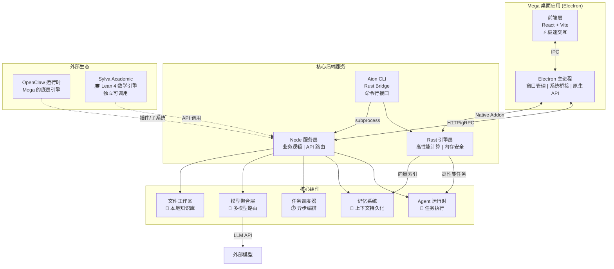
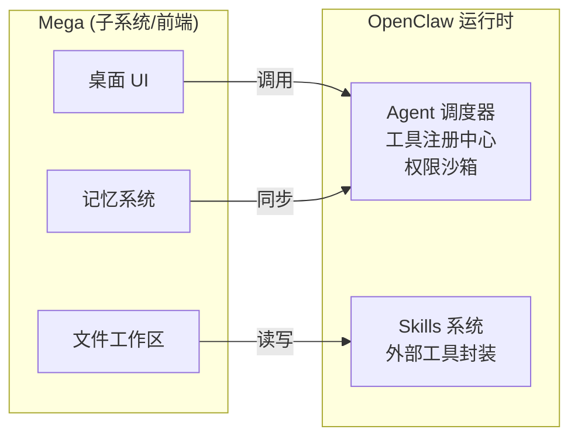
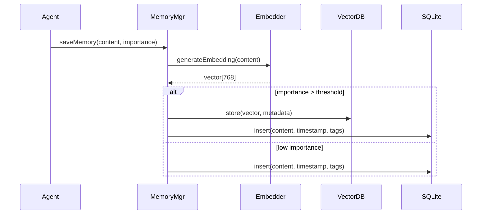
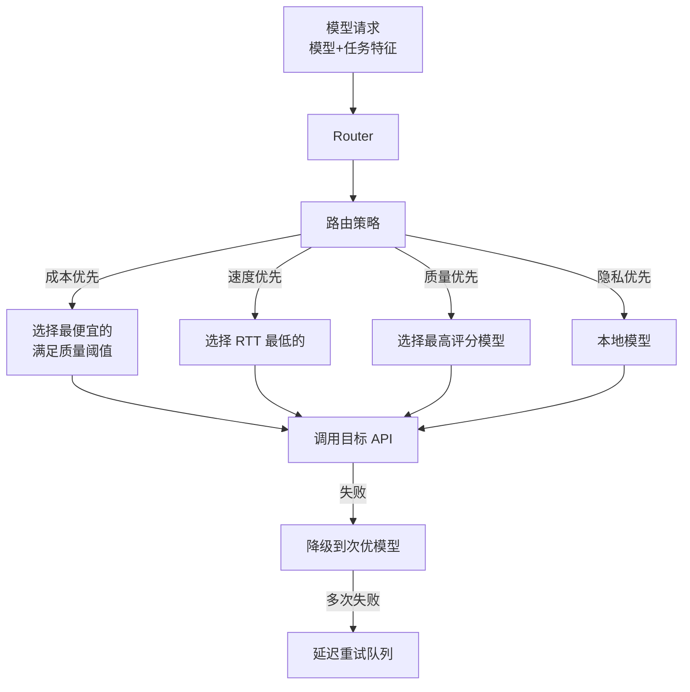
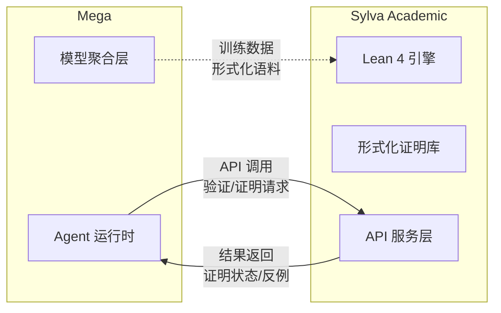
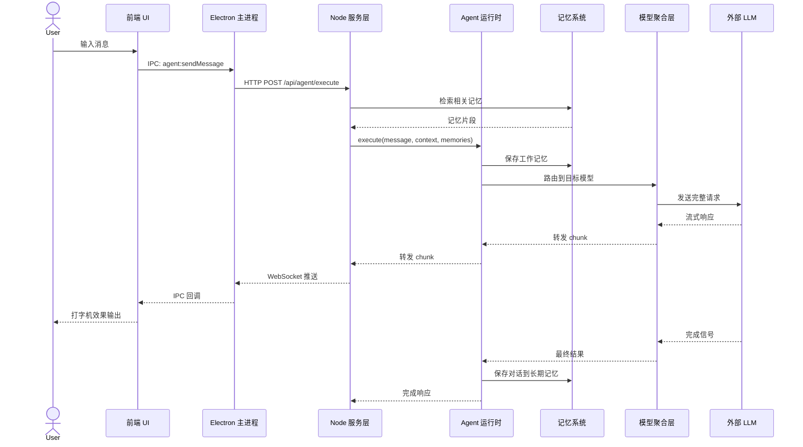
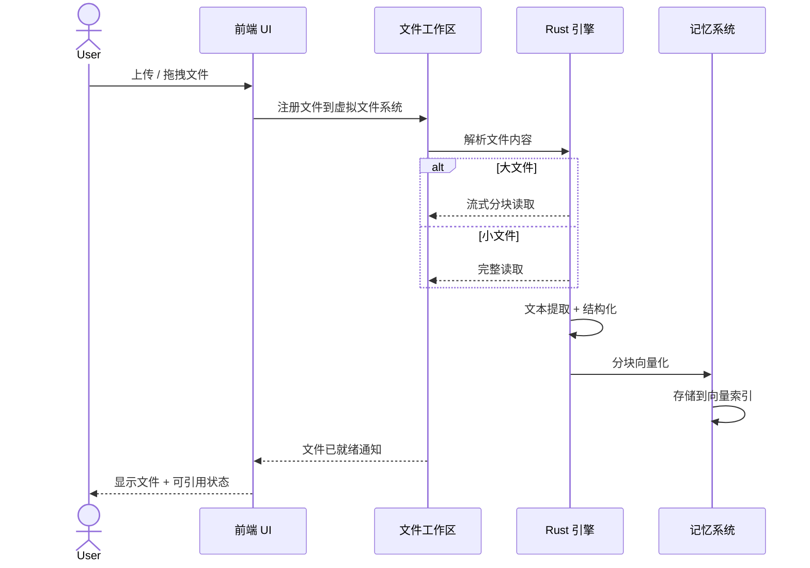

# Sylva Software (Mega) 整体架构文档

> **项目代号**: Mega  
> **定位**: Sylva 生态的软件核心，本地 AI 生产力平台  
> **文档版本**: 1.0  
> **最后更新**: 2026-05-18

---

## 1. 架构概览

Mega 是 Sylva 生态的**主导软件项目**，定位为一款**本地优先**的 AI 生产力平台。它以 Electron 为桌面封装，将现代前端（React + Vite）、高性能后端（Rust + Node）、Agent 运行时、记忆系统和多模型聚合层整合为一个完整的本地软件体验。



---

## 2. 分层架构详解

### 2.1 表现层：前端 (React + Vite)

| 属性 | 说明 |
|------|------|
| **技术栈** | React 18 + TypeScript + Vite |
| **样式系统** | Tailwind CSS + 自定义 Design Token |
| **状态管理** | Zustand (轻量) + React Query (服务端状态) |
| **编辑器** | Monaco Editor (代码) + TipTap (富文本) |
| **打包** | Vite (ESM + HMR，开发体验优先) |

**核心职责：**
- **对话界面**：与 Agent 的交互式对话 UI
- **工作区视图**：文件树、知识库管理、项目浏览
- **记忆浏览器**：可视化检索和编辑 Agent 记忆
- **任务面板**：查看、暂停、重试异步任务
- **模型配置**：管理多模型 API Key 和偏好设置

**与 Electron 通信：**
```typescript
// 前端通过 IPC 调用主进程能力
window.electronAPI.invoke('agent:sendMessage', {
  agentId: 'sylva-main',
  message: '分析这篇论文',
  context: { fileIds: ['paper_001.pdf'] }
});
```

---

### 2.2 封装层：Electron 主进程

| 属性 | 说明 |
|------|------|
| **运行时** | Electron (Chromium + Node.js) |
| **窗口管理** | 多窗口/标签页、浮动面板、系统托盘 |
| **原生能力** | 文件系统访问、全局快捷键、通知推送 |
| **安全策略** | Context Isolation + CSP + 权限沙箱 |

**核心职责：**
- **窗口生命周期**：创建、销毁、焦点管理
- **IPC 网关**：前端与后端的安全通信枢纽
- **系统集成**：自动启动、协议处理 (`sylva://`)、文件关联
- **更新机制**：后台下载 + 增量更新
- **崩溃恢复**：进程崩溃时的优雅降级

---

### 2.3 服务层：Node 后端

| 属性 | 说明 |
|------|------|
| **运行时** | Node.js (LTS) |
| **框架** | Fastify (高性能 HTTP) |
| **数据库** | SQLite (主) + 可选 PostgreSQL |
| **消息队列** | BullMQ (Redis-backed) |

**核心职责：**
- **RESTful / gRPC API**：暴露所有业务能力接口
- **业务编排**：协调多个核心组件完成复杂任务
- **WebSocket 推送**：实时状态更新、Agent 流式输出
- **插件系统**：支持第三方扩展加载
- **OpenClaw 集成**：作为 OpenClaw 运行时的一个子系统/前端

**与 OpenClaw 的关系：**
> Mega 并非 OpenClaw 的替代品，而是其**上层子系统/前端封装**。OpenClaw 提供底层的 Agent 调度、工具调用、安全沙箱等运行时能力；Mega 在其之上构建了完整的桌面应用体验，包括 UI、工作区、记忆可视化等增值功能。



---

### 2.4 引擎层：Rust 核心

| 属性 | 说明 |
|------|------|
| **用途** | 性能敏感任务、内存密集型计算 |
| **暴露方式** | N-API / WebAssembly |
| **关键库** | Tokio (异步) + ndarray (数值) + faiss-rs (向量) |

**核心职责：**
- **向量索引**：记忆系统的高维向量相似性搜索 (HNSW/IVF)
- **文本解析**：大文件流式解析、PDF/Word 结构化提取
- **加密工具**：本地数据加密、密钥派生
- **CLI 桥接**：Aion CLI 的底层实现

**Aion CLI (Rust Bridge)：**
```bash
# 命令行直接调用 Mega 核心能力
$ aion agent run --agent sylva-main --input "分析论文"
$ aion memory search --query "量子计算" --top 10
$ aion task list --status running
$ aion model list
```

---

## 3. 核心组件

### 3.1 Agent 运行时 🤖

**职责：** 执行 Agent 任务，管理 Agent 生命周期

| 模块 | 说明 |
|------|------|
| **Agent Registry** | 注册、发现、加载可用 Agent |
| **Execution Engine** | 解释执行 Agent 行为链 (ReAct / Plan-and-Execute) |
| **Context Builder** | 构建对话上下文，注入系统提示、工具描述、记忆 |
| **Tool Executor** | 安全沙箱中执行外部工具调用 |
| **Streaming Handler** | 流式输出管理，支持打字机效果 |

**接口：**
```typescript
interface AgentRuntime {
  execute(params: AgentExecuteParams): Promise<AgentResult>;
  stream(params: AgentExecuteParams): AsyncIterable<Chunk>;
  interrupt(agentId: string): Promise<void>;
  registerAgent(def: AgentDefinition): Promise<void>;
}

interface AgentExecuteParams {
  agentId: string;
  message: string;
  context: ContextSnapshot;
  tools: string[];
  model: string; // 使用模型聚合层路由
}
```

---

### 3.2 记忆系统 🧠

**职责：** 持久化 Agent 的短期和长期记忆

| 层级 | 存储 | 检索 | TTL |
|------|------|------|-----|
| **工作记忆** | 内存 (Redis) | 精确匹配 | 会话级 |
| **短期记忆** | SQLite | 关键词 + 时间衰减 | 7-30 天 |
| **长期记忆** | SQLite + 向量库 (Rust) | 语义相似度 (HNSW) | 永久 |
| **事实记忆** | 结构化 SQLite | 图查询 | 永久 |

**记忆写入流程：**


---

### 3.3 任务调度器 ⏱️

**职责：** 管理异步、长时间运行或周期性任务

| 特性 | 实现 |
|------|------|
| **队列类型** | 优先队列 (FIFO + 优先级权重) |
| **并发控制** | Agent 级别并发上限 |
| **重试策略** | 指数退避 + 最大重试次数 |
| **超时管理** | 任务级 + 步骤级超时 |
| **依赖链** | DAG 任务依赖图 |

```typescript
interface TaskScheduler {
  enqueue(task: TaskDefinition, options?: QueueOptions): Promise<TaskId>;
  cancel(taskId: TaskId): Promise<void>;
  pause(taskId: TaskId): Promise<void>;
  resume(taskId: TaskId): Promise<void>;
  getStatus(taskId: TaskId): Promise<TaskStatus>;
  subscribe(taskId: TaskId, handler: StatusHandler): Unsubscribe;
}
```

---

### 3.4 模型 API 聚合层 🔌

**职责：** 统一接口调用多个 LLM 提供商，支持路由和降级

**支持的提供商：**

| 提供商 | 优先级 | 用途 |
|--------|--------|------|
| OpenAI (GPT-4) | 1 | 复杂推理首选 |
| Anthropic (Claude) | 2 | 长文本处理 |
| Moonshot (Kimi) | 3 | 中文任务首选 |
| 本地模型 (Ollama) | 4 | 隐私敏感 / 离线 |

**路由策略：**


---

### 3.5 文件工作区 📁

**职责：** 管理用户本地文件和知识库

| 功能 | 说明 |
|------|------|
| **虚拟文件系统** | 统一抽象本地文件、远程同步、加密存储 |
| **自动索引** | 文件变更监听 + 增量向量化 |
| **格式支持** | PDF, DOCX, Markdown, 代码文件, 图片 (OCR) |
| **项目空间** | 按项目隔离文件和记忆 |
| **版本历史** | 文件级快照，支持回溯 |

---

## 4. 与 Sylva Academic 的关系

> **Sylva Academic** 是 Sylva 生态中**独立的数学形式化项目**，基于 Lean 4 构建。



**集成方式：**
- **独立部署**：Sylva Academic 可独立运行，不依赖 Mega
- **API 调用**：Mega 通过 HTTP API 调用 Sylva Academic 的验证服务
- **Agent 工具**：Agent 可通过 `lean_verify` 工具调用形式化验证
- **双向数据流**：Mega 为 Academic 提供自然语言请求；Academic 返回验证结果

**典型使用场景：**
1. 用户在 Mega 中提出数学命题
2. Agent 将命题转译为 Lean 4 语法
3. 调用 Sylva Academic 验证
4. 将验证结果（证明成功/反例/超时）呈现给用户

---

## 5. 数据流

### 5.1 用户消息处理流



### 5.2 文件处理流



---

## 6. 部署架构

### 6.1 开发模式

```
┌─────────────────────────────────────┐
│           开发者机器                 │
│  ┌─────────┐    ┌───────────────┐   │
│  │ Vite    │───▶│ Electron      │   │
│  │ (React) │◀───│ (Node + Rust) │   │
│  └─────────┘    └───────────────┘   │
│        │            │               │
│        └────────────┘               │
│              HMR                    │
└─────────────────────────────────────┘
```

### 6.2 生产模式

```
┌─────────────────────────────────────────────┐
│              用户本地机器                    │
│  ┌─────────────────────────────────────┐   │
│  │        Electron 打包应用             │   │
│  │  ┌─────────┐   ┌─────────────────┐  │   │
│  │  │ 前端    │◀─▶│ Node + Rust     │  │   │
│  │  │ (打包)  │IPC│ (打包为二进制)   │  │   │
│  │  └─────────┘   └─────────────────┘  │   │
│  └─────────────────────────────────────┘   │
│  ┌─────────────────────────────────────┐   │
│  │ 本地 SQLite 数据库 + 向量索引文件     │   │
│  └─────────────────────────────────────┘   │
│  ┌─────────────────────────────────────┐   │
│  │         OpenClaw 运行时              │   │
│  │    (可选，作为插件或独立进程)         │   │
│  └─────────────────────────────────────┘   │
└─────────────────────────────────────────────┘
              │
              ▼
    ┌─────────────────┐
    │  外部 LLM API   │
    │ (OpenAI / etc)  │
    └─────────────────┘
```

---

## 7. 模块接口汇总

| 模块 | 暴露接口 | 消费接口 |
|------|---------|---------|
| **前端** | UI 事件、用户操作 | IPC 调用 |
| **Electron** | IPC 处理器、原生 API | Node API、系统 API |
| **Node 服务** | REST/gRPC API | Rust Addon、数据库、外部 API |
| **Rust 引擎** | N-API 函数 | 本地文件系统 |
| **Agent 运行时** | 任务执行接口 | 记忆系统、模型层、工具集 |
| **记忆系统** | CRUD + 语义检索 | Rust 向量索引 |
| **任务调度器** | 任务提交/管理 | BullMQ + Redis |
| **模型聚合层** | 统一 LLM 调用 | 外部提供商 API |
| **文件工作区** | 文件 CRUD + 检索 | Rust 解析器 |
| **Aion CLI** | 命令行接口 | Rust + Node 内部接口 |

---

## 8. 技术决策记录

| 决策 | 选择 | 理由 |
|------|------|------|
| 桌面框架 | Electron | 跨平台、成熟生态、前端技术栈复用 |
| 前端构建 | Vite | 极速 HMR，优于 CRA/Webpack |
| 后端语言 | Node + Rust | Node 快速迭代，Rust 处理性能敏感任务 |
| 数据库 | SQLite + 向量扩展 | 零配置、单文件、适合本地应用 |
| Agent 框架 | 自研 (OpenClaw 兼容) | 灵活可控，深度集成记忆和工作区 |
| CLI 实现 | Rust | 启动速度、独立二进制分发 |

---

## 9. 后续演进方向

1. **插件市场**：允许第三方扩展 Agent、工具、UI 组件
2. **协作模式**：本地 + 云端混合，支持多设备同步
3. **Sylva Academic 深度集成**：自然语言到 Lean 4 的自动转译
4. **多模态**：图片、音频、视频的统一处理和索引
5. **本地模型托管**：内置 Ollama 集成，一键部署本地 LLM

---

*本文档由 Sylva 架构团队维护。如有变更，请同步更新并通知相关模块负责人。*
