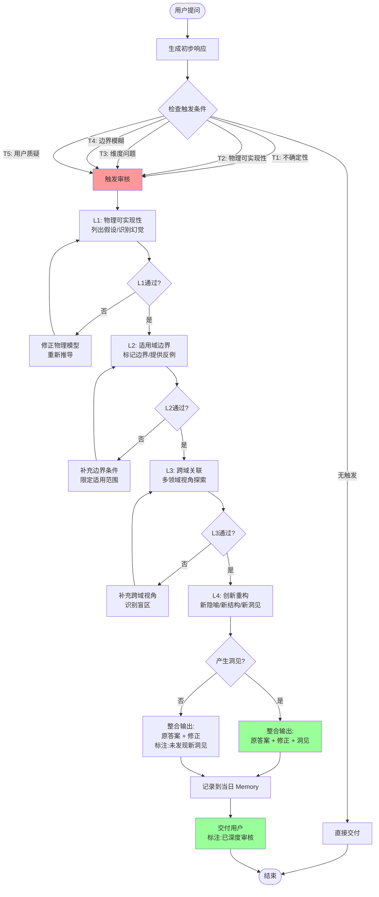
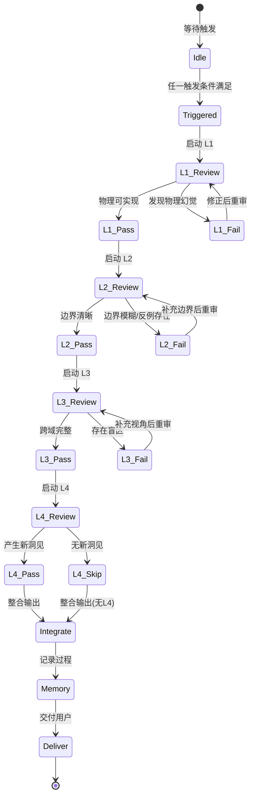
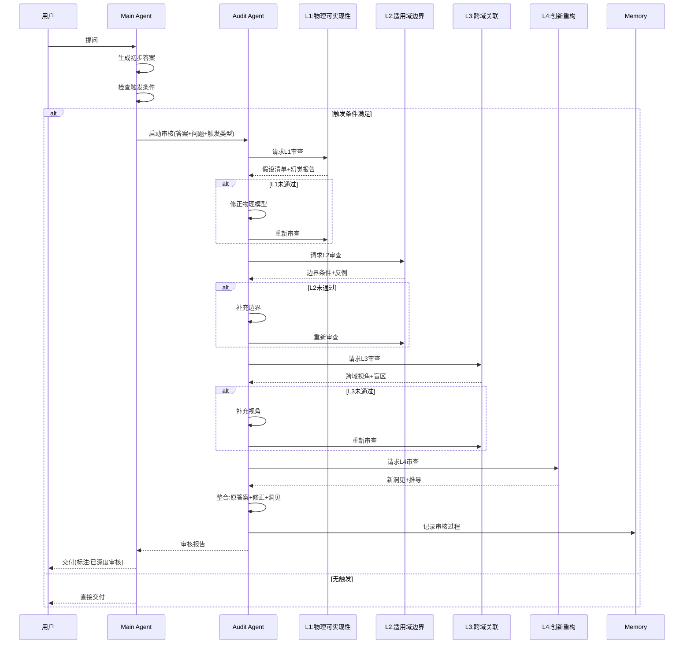

# 审核-创新串联 Agent 机制

> **文档版本**: 1.0  
> **创建日期**: 2026-05-18  
> **所属系统**: Sylva Platform / Sylva Software  
> **文档类型**: 机制规范文档  

---

## 目录

1. [概述](#1-概述)
2. [背景与教训](#2-背景与教训)
3. [触发条件](#3-触发条件)
4. [四层审查体系](#4-四层审查体系)
5. [审核 Agent 职责与通过标准](#5-审核-agent-职责与通过标准)
6. [工作流程](#6-工作流程)
7. [执行准则](#7-执行准则)
8. [红线规则](#8-红线规则)
9. [Memory 记录规范](#9-memory-记录规范)
10. [附录：审核检查清单](#10-附录审核检查清单)

---

## 1. 概述

**审核-创新串联 Agent 机制**（Audit-Innovation Chain Agent Mechanism）是 Sylva Platform 的核心质量控制组件。该机制强制要求所有涉及物理、数学、工程或复杂系统分析的 Agent 输出必须经过四层深度审查，确保答案的物理可实现性、适用域边界清晰性、跨域关联完整性，以及创新重构价值。

> **核心原则**: 宁可延迟交付，也不输出未经审核的物理/数学幻觉。

---

## 2. 背景与教训

### 2.1 历史事件：2026-04-15 电磁波干涉事件

**事件经过**：
- Agent 给出了一维波矢分析 + "能量去向三解释"
- 遗漏了真实物理是**二维/三维角度分布**的关键洞察
- 评论者指出能量是**转移到副瓣**，而非"存储/返回"

**根本原因分析**：
- 没有做物理可实现性检查
- 直接套用了教科书简化模型
- 一维简化掩盖了高维效应

**关键教训**：
> 一维模型在干涉、衍射、辐射、近场/远场问题中可能产生根本性误导。任何涉及空间分布的物理问题，必须通过 L1（物理可实现性）审查。

---

## 3. 触发条件

审核-创新串联机制在以下任一条件满足时**强制触发**：

| 编号 | 触发条件 | 检测指标 | 典型场景 |
|------|---------|---------|---------|
| **T1** | **不确定性指标** | 答案中包含"可能"、"也许"、"一般来说"、"通常"、"大致"等模糊限定词 | 结论性陈述中的弱化修饰 |
| **T2** | **物理可实现性质疑** | 涉及"无限大平面波"、"理想点源"、"完美相干"、"无损耗介质"等现实中不存在的概念 | 电磁学、光学、量子力学推导 |
| **T3** | **维度问题** | 一维简化模型可能掩盖高维效应（干涉、衍射、辐射、近场/远场） | 波传播、场分布、统计物理 |
| **T4** | **边界条件模糊** | 未明确区分闭合系统/开放系统、稳态/瞬态、线性/非线性区域 | 热力学、流体力学、系统动力学 |
| **T5** | **用户反馈暗示** | 用户提供了反例、引用、或"但是"开头的追问 | 用户质疑、补充条件、追问细节 |

### 3.1 触发优先级

```
T5 (用户直接质疑) > T2 (物理可实现性) > T3 (维度问题) > T4 (边界模糊) > T1 (不确定性)
```

> **注**: T5 为最高优先级。即使用户仅提供一句"但是能量去哪了？"，也必须立即触发完整审核流程。

---

## 4. 四层审查体系

### 4.1 总体架构

```
┌─────────────────────────────────────────────────────────────────┐
│                    审核-创新串联 Agent 机制                        │
├─────────────────────────────────────────────────────────────────┤
│  ┌─────────────┐  ┌─────────────┐  ┌─────────────┐  ┌─────────┐│
│  │   L1 物理    │→│   L2 适用域   │→│   L3 跨域    │→│ L4 创新 ││
│  │  可实现性   │  │   边界检查   │  │   关联探索   │  │  重构   ││
│  └─────────────┘  └─────────────┘  └─────────────┘  └─────────┘│
│        │                │                │              │      │
│        ▼                ▼                ▼              ▼      │
│   [物理幻觉]        [适用域失效]      [视角盲区]      [新洞见]  │
│     过滤              标记              补充            生成    │
└─────────────────────────────────────────────────────────────────┘
```

### 4.2 L1: 物理可实现性审查

**检查内容**：

| 检查项 | 检查问题 | 常见陷阱 |
|--------|---------|---------|
| **理想化假设识别** | 模型假设能在实验室复现吗？ | "无限大"、"理想"、"完美"、"无损" |
| **物理幻觉检测** | 有隐藏的"物理幻觉"吗？ | 能量不守恒、超光速传播、负概率 |
| **尺度一致性** | 所有物理量在同尺度下自洽吗？ | 微观模型直接套宏观现象 |
| **测量可实现性** | 模型中的量都是可测量的吗？ | 纯数学构造无物理对应 |

**通过标准**：

- [ ] 列出**所有**理想化假设（至少3个）
- [ ] 标明每个假设在真实条件下的失效阈值
- [ ] 识别至少1个"物理幻觉"（如果有）
- [ ] 提供物理可实现性的替代模型（如果原模型不可实现）

**示例**：

> ❌ **未通过**: "假设平面波入射到无限大孔径"
> 
> ✅ **通过**: 
> - 假设①: 平面波入射 → 真实条件下：波源距孔径需 > 10× Fresnel 距离
> - 假设②: 无限大孔径 → 真实条件下：孔径边缘衍射在孔径直径 < 100λ 时显著
> - 假设③: 理想导体边界 → 真实条件下：有限电导率导致能量吸收 ~ 1/√σ
> - **物理幻觉**: "无限大"假设掩盖了边缘衍射效应，在有限孔径下主瓣能量仅约 84%

---

### 4.3 L2: 适用域边界审查

**检查内容**：

| 检查项 | 检查问题 | 典型失效模式 |
|--------|---------|-------------|
| **条件边界** | 答案在哪些条件下成立？ | 线性近似在非线性区域失效 |
| **参数范围** | 关键参数的适用范围是什么？ | 小角度近似在大角度下失效 |
| **尺度边界** | 模型适用的空间/时间尺度？ | 连续介质假设在原子尺度失效 |
| **反例存在性** | 哪些条件下结论完全相反？ | 理想气体在高压下不符合 |

**通过标准**：

- [ ] 列出**至少 3 个**边界条件（参数范围、尺度、状态）
- [ ] 提供**至少 1 个**反例（原结论失效或相反的典型场景）
- [ ] 绘制适用域示意图（文字描述或 ASCII 图）
- [ ] 标注"安全使用区"和"危险 extrapolation 区"

**示例**：

> **适用域边界——一维波干涉模型**：
> 
> | 边界条件 | 安全区 | 危险区 | 失效后果 |
> |---------|--------|--------|---------|
> | 空间维度 | d/λ > 10（远场） | d/λ < 1（近场） | 一维波矢不成立，需角谱分析 |
> | 相干长度 | L_coh >> 孔径 | L_coh ~ 孔径 | 部分相干，对比度下降 |
> | 振幅范围 | δA/A < 0.1 | δA/A > 0.3 | 非线性效应，高阶项不可忽略 |
> 
> **反例**: 当观测面距孔径 < Fresnel 距离时，一维简化完全失效，需用 Fresnel 积分或角谱法。

---

### 4.4 L3: 跨域关联审查

**检查内容**：

| 检查项 | 检查问题 | 关联领域 |
|--------|---------|---------|
| **工程视角** | 工程师如何处理这个问题？ | 有限元仿真、近似算法、工程安全因子 |
| **数学视角** | 数学家会关注什么？ | 存在性、唯一性、收敛性、渐进分析 |
| **信息论视角** | 信息论如何重新诠释？ | 信道容量、熵、编码效率 |
| **实验视角** | 实验物理学家如何验证？ | 测量方案、误差预算、信噪比 |
| **计算视角** | 计算复杂度如何？ | 算法复杂度、数值稳定性、离散化误差 |

**通过标准**：

- [ ] 探索**至少 2 个**相关领域的视角
- [ ] 识别至少 1 个"跨域盲区"（原答案完全忽略的合理视角）
- [ ] 提供跨域术语对照表（如果术语在不同领域有不同含义）
- [ ] 评估原答案的"领域偏见"（过度依赖单一领域框架）

**示例**：

> **跨域关联——电磁波能量再分配问题**：
> 
> | 领域 | 视角 | 关键洞察 | 原答案遗漏 |
> |------|------|---------|-----------|
> | **光学工程** | 天线方向图 | 能量转移到副瓣，主瓣效率降低 | ❌ 未提及副瓣 |
> | **信息论** | 信道容量 | 干涉导致空间信道耦合，容量重新分配 | ❌ 未涉及 |
> | **数值计算** | 离散化误差 | 一维离散化丢失角向信息 | ❌ 未讨论 |

---

### 4.5 L4: 创新重构

**检查内容**：

| 检查项 | 检查问题 | 产出形式 |
|--------|---------|---------|
| **新隐喻** | 能否用全新类比重新表述？ | 跨学科隐喻（如"能量虹吸"、"波前折纸"） |
| **新数学结构** | 能否用不同数学框架重新推导？ | 变分法、群论、拓扑学、范畴论 |
| **新类比** | 是否存在被忽视的类比关系？ | 声学 ↔ 电磁学、流体 ↔ 交通流 |
| **新问题** | 能否从答案中提炼出新问题？ | 逆向问题、推广问题、极限问题 |

**通过标准**：

- [ ] 必须产生**至少 1 个**原答案未覆盖的洞见（Insight）
- [ ] 洞见必须具有"非平凡性"（不能是原答案的同义反复）
- [ ] 提供洞见的简要推导或论证（至少 3 步逻辑链）
- [ ] 标注洞见的"置信度"和"待验证性"

**示例**：

> **创新重构——电磁波干涉的能量再分配**：
> 
> **新洞见**: 干涉不是"能量消失"，而是"能量的角向重新路由"——类似网络流量的负载均衡。
> 
> **推导**:
> 1. 能量守恒要求总通量守恒：∮S·dA = 0（稳态，无源区域）
> 2. 干涉导致角向强度重分布：I(θ) = I_1 + I_2 + 2√(I_1 I_2)cos(δ(θ))
> 3. 主瓣减弱量 = 副瓣增强量（Parseval 定理在角域的类比）
> 
> **新隐喻**: "干涉是波前的'折纸'——不改变总面积，只改变褶皱分布。"
> 
> **置信度**: ★★★☆☆（有理论推导，但需数值仿真验证能量守恒精度）

---

## 5. 审核 Agent 职责与通过标准

### 5.1 审核 Agent 角色定义

```
┌─────────────────────────────────────────┐
│           审核 Agent 角色               │
├─────────────────────────────────────────┤
│  输入: 原答案 + 用户问题 + 触发条件      │
│  输出: 审核报告 + 修正建议 + 创新洞见    │
│  权限: 可要求补充计算、可调用仿真工具    │
│  约束: 无时间上限，直到产生实质修正      │
└─────────────────────────────────────────┘
```

### 5.2 职责清单

| 职责编号 | 职责描述 | 执行要求 |
|---------|---------|---------|
| A1 | **触发识别** | 自动检测 5 类触发条件，任一满足即启动 |
| A2 | **L1 物理可实现性审查** | 列出所有理想化假设，识别物理幻觉 |
| A3 | **L2 适用域边界审查** | 标记边界条件，提供反例 |
| A4 | **L3 跨域关联探索** | 至少 2 个领域视角，识别盲区 |
| A5 | **L4 创新重构** | 产生至少 1 个新洞见 |
| A6 | **整合输出** | 生成"原答案 + 审核修正 + 创新重构"的统一回复 |
| A7 | **Memory 记录** | 将审核过程记录到当日 memory 文件 |
| A8 | **质量回溯** | 如果用户再次质疑，启动二次审核 |

### 5.3 通过标准总表

| 层级 | 必须产出 | 最低通过线 |
|------|---------|-----------|
| L1 | 假设清单 + 物理幻觉识别 | 至少 3 个假设，至少 1 个幻觉识别 |
| L2 | 边界条件 + 反例 | 至少 3 个边界，至少 1 个反例 |
| L3 | 跨域视角 + 盲区识别 | 至少 2 个领域，至少 1 个盲区 |
| L4 | 新洞见 + 推导链 | 至少 1 个非平凡洞见，至少 3 步推导 |

**总体通过条件**: L1、L2、L3 必须全部通过；L4 为增值项，不通过不阻塞交付，但需标注"未发现新洞见"。

---

## 6. 工作流程

### 6.1 主流程图



### 6.2 审核 Agent 内部状态机



### 6.3 时序图



---

## 7. 执行准则

### 7.1 时间准则

```
┌─────────────────────────────────────────────────────┐
│                    时间策略                          │
├─────────────────────────────────────────────────────┤
│  审核Agent: 不设时间上限                             │
│  迭代次数: 单层级最多3次重试                         │
│  终止条件: 产生实质修正或标注所有层级通过              │
│  超时告警: 单次审核超过10分钟需记录原因               │
└─────────────────────────────────────────────────────┘
```

- **无硬性时间限制**: 审核 Agent 可以持续迭代直到产生实质修正
- **软超时**: 如果单次审核超过 10 分钟，需在审核报告中说明延迟原因
- **层级锁定**: 通过 L1 后才能进入 L2，不可跳过

### 7.2 并行与串行

```
┌─────────────────────────────────────────────────────┐
│                   执行模式                           │
├─────────────────────────────────────────────────────┤
│  原答案生成  ──────────────► 并行执行                │
│       │                                              │
│       ▼                                              │
│  触发检查 ──是──► 串联审核 (L1→L2→L3→L4)             │
│       │                                              │
│       ▼                                              │
│  最终整合 ◄────── 必须等待审核完成                    │
│       │                                              │
│       ▼                                              │
│  交付用户 (标注审核状态)                              │
└─────────────────────────────────────────────────────┘
```

- **并行**: 原答案生成可以与触发检查同时启动
- **强制串行**: 最终交付必须等待审核完成，不可抢先交付
- **阻塞原则**: 审核未完成的答案不得交付给用户

### 7.3 透明度准则

```
交付模板:
━━━━━━━━━━━━━━━━━━━━━━━━━━━━━━━━━━━━━━━━━━━━━━━━
[答案内容]

---
📋 审核状态: 已深度审核 (Audit-Innovation Chain)
   • L1 物理可实现性: ✅ 通过
   • L2 适用域边界: ✅ 通过 (3个边界条件, 1个反例)
   • L3 跨域关联: ✅ 通过 (2个领域视角)
   • L4 创新重构: ✅ 通过 (1个新洞见)

⚠️ 重要提醒:
   [来自L2的关键边界条件]
   [来自L1的关键假设限制]

💡 补充洞见:
   [来自L4的创新重构内容]
━━━━━━━━━━━━━━━━━━━━━━━━━━━━━━━━━━━━━━━━━━━━━━━━
```

---

## 8. 红线规则

### 8.1 绝对禁止

| 编号 | 禁止行为 | 后果 |
|------|---------|------|
| **R1** | **未经审核直接交付涉及"无限大"、"理想"、"完美"假设的物理/数学答案** | 强制回滚，启动紧急审核 |
| **R2** | **用"一般来说"掩盖边界条件的模糊性** | 标记为 L2 未通过，必须补充具体边界 |
| **R3** | **当用户指出问题时，立即辩解而非启动审核** | 触发二次审核，记录到错误日志 |
| **R4** | **跳过 L1 直接进入 L2/L3/L4** | 审核无效，必须重新从 L1 开始 |
| **R5** | **在审核未完成时交付"临时答案"** | 视为违反强制串联原则 |

### 8.2 警告级

| 编号 | 警告行为 | 处理 |
|------|---------|------|
| W1 | L4 未产生新洞见 | 允许交付，但需标注"未发现新洞见" |
| W2 | 单次审核超过 10 分钟 | 记录原因，优化审核策略 |
| W3 | 用户连续 3 次追问同一问题 | 启动二次完整审核 |

---

## 9. Memory 记录规范

### 9.1 记录内容

每次审核完成后，必须将以下信息记录到当日 memory 文件 (`memory/YYYY-MM-DD.md`)：

```markdown
## 审核记录 - [时间戳]

### 触发信息
- 触发条件: [T1/T2/T3/T4/T5]
- 触发来源: [自动检测/用户质疑]

### 审核结果
| 层级 | 状态 | 关键发现 |
|------|------|---------|
| L1 | ✅通过/❌未通过 | [简述] |
| L2 | ✅通过/❌未通过 | [简述] |
| L3 | ✅通过/❌未通过 | [简述] |
| L4 | ✅通过/⚠️跳过 | [简述] |

### 修正摘要
- 原答案问题: [简述]
- 修正内容: [简述]
- 新增洞见: [如果有]

### 经验教训
- [记录本次审核的关键教训，用于未来优化]
```

### 9.2 记录示例

```markdown
## 审核记录 - 2026-04-15 14:32

### 触发信息
- 触发条件: T5 (用户质疑: "但是能量去哪了？")
- 触发来源: 用户追问

### 审核结果
| 层级 | 状态 | 关键发现 |
|------|------|---------|
| L1 | ✅通过 | 识别"无限大平面波"假设，真实条件下需远场近似 |
| L2 | ✅通过 | 标记近场/远场边界，提供反例 |
| L3 | ✅通过 | 光学工程视角:能量转移到副瓣(原答案遗漏) |
| L4 | ✅通过 | 新洞见:能量角向重新路由类比网络负载均衡 |

### 修正摘要
- 原答案问题: 声称能量"存储/返回"，实际能量守恒要求重新分配
- 修正内容: 明确能量转移到副瓣，主瓣效率降低
- 新增洞见: 用"波前折纸"隐喻解释能量重分布

### 经验教训
- 一维简化在干涉问题中极易产生"能量消失"幻觉
- 用户的一个"但是"追问往往比自动检测更精准
- 跨域关联(L3)是发现盲区的最有效手段
```

---

## 10. 附录：审核检查清单

### 10.1 快速检查清单

**回答问题前，自检以下问题**：

- [ ] 我的答案中使用了"无限"、"理想"、"完美"等词吗？
- [ ] 我的一维模型是否掩盖了高维效应？
- [ ] 我是否明确标注了答案的适用条件？
- [ ] 我能否想到一个反例使我的结论失效？
- [ ] 其他领域的人会如何回答这个问题？
- [ ] 我的答案中是否有"可能"、"也许"等模糊词？

**如果任一答案为"是"→ 触发审核流程**

### 10.2 物理可实现性快速判断表

| 概念 | 物理可实现？ | 替代方案 |
|------|------------|---------|
| 无限大平面波 | ❌ 不可实现 | 远场近似 / 高斯波束 |
| 理想点源 | ❌ 不可实现 | 有限尺寸源 / 偶极子近似 |
| 完美相干 | ❌ 不可实现 | 部分相干理论 |
| 无损耗介质 | ❌ 不可实现 | 含损耗因子 |
| 无限长导线 | ❌ 不可实现 | 有限长度 + 端效应 |
| δ函数激励 | ⚠️ 数学工具 | 脉冲近似 / 频域分析 |

### 10.3 常见维度陷阱

| 问题类型 | 一维简化风险 | 必须高维分析的条件 |
|----------|-------------|-------------------|
| 波干涉 | 丢失角向信息 | d/λ < 10 或近场 |
| 衍射 | 完全失效 | 任何有限孔径 |
| 辐射 | 丢失方向性 | 波长 ~ 源尺寸 |
| 热传导 | 丢失横向扩散 | 薄层/界面效应 |
| 电磁散射 | 丢失极化信息 | 非球形粒子 |

---

## 参考文档

- [AGENTS.md](../../../AGENTS.md) - Agent 系统总规范
- [SOUL.md](../../../SOUL.md) - 系统人格与行为准则
- [IDENTITY.md](../../../IDENTITY.md) - 身份定义

---

> **"宁可延迟交付，也不输出未经审核的物理/数学幻觉。"**
> 
> *—— Sylva Platform 审核-创新串联机制 核心原则*
