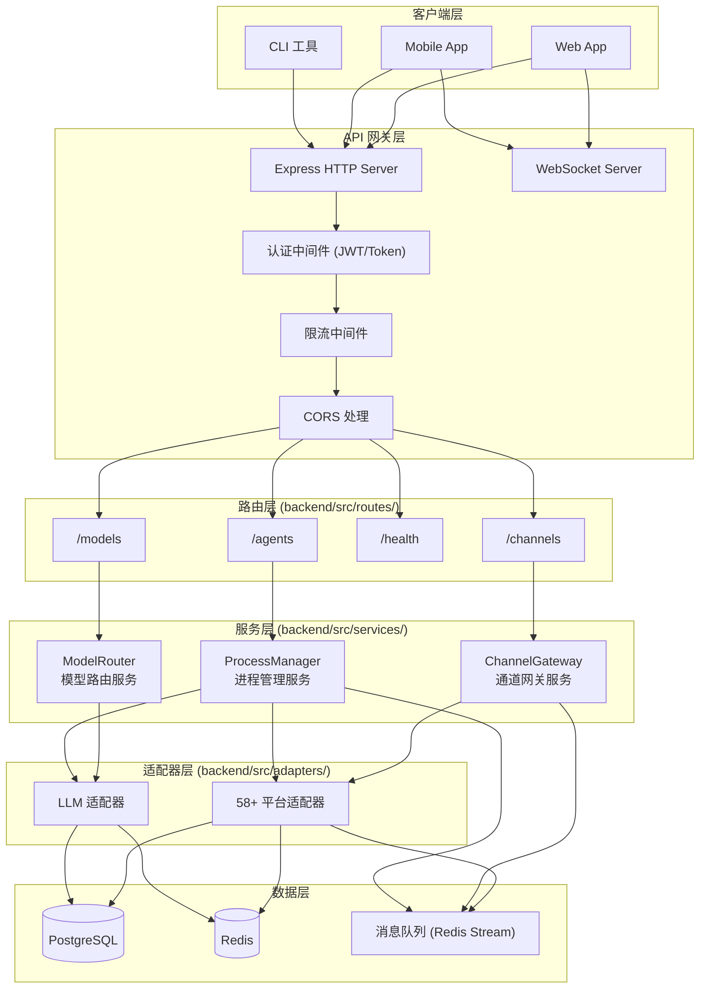
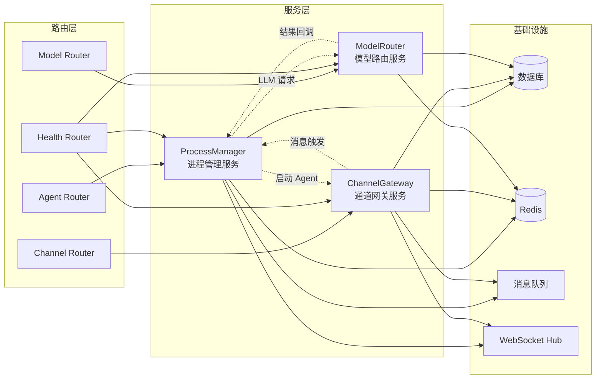
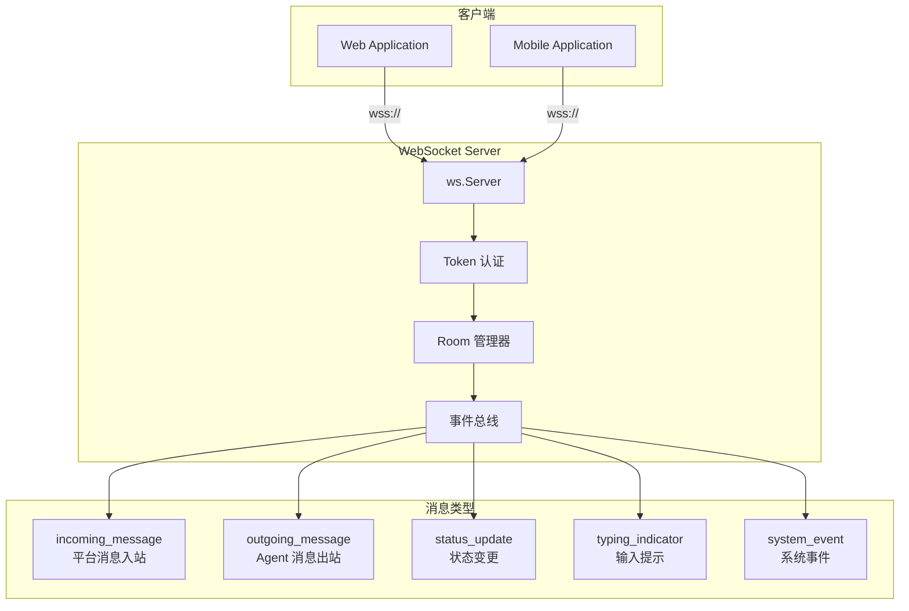
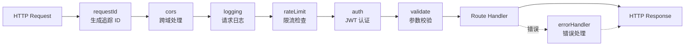
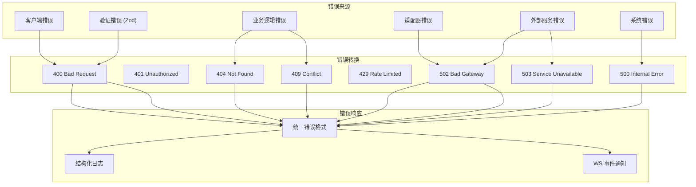

# SYLVA 后端服务架构

> 本文档描述 SYLVA Platform 后端服务的完整架构，包括 Express HTTP 路由、WebSocket 实时通信、服务层设计、类型定义及 API 契约。所有描述与 `backend/src/` 实际代码保持对齐。

---

## 目录

1. [系统概览](#1-系统概览)
2. [技术栈](#2-技术栈)
3. [整体架构图](#3-整体架构图)
4. [HTTP 路由层](#4-http-路由层)
   - 4.1 [Agent 路由 (`/agents`)](#41-agent-路由-agents)
   - 4.2 [Channel 路由 (`/channels`)](#42-channel-路由-channels)
   - 4.3 [Health 路由 (`/health`)](#43-health-路由-health)
   - 4.4 [Model 路由 (`/models`)](#44-model-路由-models)
5. [服务层](#5-服务层)
   - 5.1 [ChannelGateway 服务](#51-channelgateway-服务)
   - 5.2 [ModelRouter 服务](#52-modelrouter-服务)
   - 5.3 [ProcessManager 服务](#53-processmanager-服务)
6. [WebSocket 实时通信](#6-websocket-实时通信)
7. [类型定义](#7-类型定义)
8. [API 契约](#8-api-契约)
9. [中间件与拦截器](#9-中间件与拦截器)
10. [配置管理](#10-配置管理)
11. [日志与监控](#11-日志与监控)
12. [错误处理策略](#12-错误处理策略)

---

## 1. 系统概览

SYLVA Platform 后端服务采用分层架构设计，核心职责包括：

- **Agent 生命周期管理**：创建、配置、监控、销毁 AI Agent 实例
- **通道网关管理**：统一管理 58+ 通信平台的接入与消息收发
- **模型路由调度**：根据请求特征智能路由到不同 LLM 提供商
- **进程管控**：管理子进程、沙箱容器及资源配额
- **实时通信**：通过 WebSocket 提供双向实时数据流

服务采用 Express.js 作为 HTTP 框架，结合原生 `ws` 库实现 WebSocket 支持，TypeScript 全栈类型安全。

---

## 2. 技术栈

| 层级 | 技术选型 | 版本 | 说明 |
|------|---------|------|------|
| 运行时 | Node.js | ≥18.x | LTS 版本 |
| 框架 | Express | 4.x | HTTP 服务器 |
| WebSocket | ws | 8.x | 原生 WebSocket 实现 |
| 语言 | TypeScript | 5.x | 全类型安全 |
| ORM | Prisma | 5.x | 数据库访问层 |
| 验证 | Zod | 3.x | 运行时 schema 验证 |
| 日志 | Pino | 8.x | 高性能结构化日志 |
| 测试 | Vitest | 1.x | 单元/集成测试 |

---

## 3. 整体架构图



---

## 4. HTTP 路由层

所有路由位于 `backend/src/routes/` 目录，通过 `backend/src/app.ts` 统一挂载。

### 路由挂载结构

```typescript
// backend/src/app.ts (简化示意)
import express from 'express';
import { agentRouter } from './routes/agents';
import { channelRouter } from './routes/channels';
import { healthRouter } from './routes/health';
import { modelRouter } from './routes/models';

const app = express();

app.use('/agents', agentRouter);
app.use('/channels', channelRouter);
app.use('/health', healthRouter);
app.use('/models', modelRouter);
```

---

### 4.1 Agent 路由 (`/agents`)

管理 AI Agent 的完整生命周期。

#### 路由定义

| 方法 | 路径 | 描述 | 服务依赖 |
|------|------|------|----------|
| GET | `/agents` | 列出所有 Agent | ProcessManager |
| POST | `/agents` | 创建新 Agent | ProcessManager |
| GET | `/agents/:id` | 获取单个 Agent 详情 | ProcessManager |
| PATCH | `/agents/:id` | 更新 Agent 配置 | ProcessManager |
| DELETE | `/agents/:id` | 删除 Agent | ProcessManager |
| POST | `/agents/:id/start` | 启动 Agent | ProcessManager |
| POST | `/agents/:id/stop` | 停止 Agent | ProcessManager |
| POST | `/agents/:id/restart` | 重启 Agent | ProcessManager |
| GET | `/agents/:id/logs` | 获取 Agent 日志流 | ProcessManager |
| GET | `/agents/:id/metrics` | 获取 Agent 运行指标 | ProcessManager |

#### 核心类型

```typescript
// backend/src/types/agent.ts
export interface Agent {
  id: string;
  name: string;
  description?: string;
  status: AgentStatus;
  config: AgentConfig;
  channels: string[];        // 关联的 channel IDs
  modelConfig: ModelConfig;  // LLM 配置
  createdAt: Date;
  updatedAt: Date;
  lastStartedAt?: Date;
}

export enum AgentStatus {
  CREATED = 'created',
  STARTING = 'starting',
  RUNNING = 'running',
  PAUSED = 'paused',
  STOPPING = 'stopping',
  STOPPED = 'stopped',
  ERROR = 'error',
  CRASHED = 'crashed',
}

export interface AgentConfig {
  systemPrompt: string;
  temperature: number;
  maxTokens: number;
  responseTimeout: number;
  memoryEnabled: boolean;
  tools: string[];           // 启用的工具 ID 列表
  autoRetry: boolean;
  retryCount: number;
}

export interface ModelConfig {
  provider: string;            // openai / anthropic / local 等
  model: string;               // 具体模型名
  apiKey?: string;             // 可选，优先从 vault 读取
  baseUrl?: string;            // 自定义 API 端点
  additionalParams?: Record<string, unknown>;
}

export interface AgentMetrics {
  totalMessages: number;
  totalTokens: number;
  avgResponseTime: number;
  errorRate: number;
  uptimeSeconds: number;
  memoryUsage: MemoryUsage;
}

export interface MemoryUsage {
  shortTerm: number;   // 短期记忆条目数
  longTerm: number;     // 长期记忆条目数
  vectorStore: number;  // 向量存储占用
}
```

#### 路由实现

```typescript
// backend/src/routes/agents.ts (结构示意)
import { Router } from 'express';
import { z } from 'zod';
import { ProcessManager } from '../services/processManager';
import { agentSchema, agentUpdateSchema } from '../validators/agent';

const router = Router();
const pm = ProcessManager.getInstance();

// GET /agents
router.get('/', async (req, res, next) => {
  try {
    const agents = await pm.listAgents({
      status: req.query.status as string,
      limit: parseInt(req.query.limit as string) || 50,
      offset: parseInt(req.query.offset as string) || 0,
    });
    res.json({ data: agents, total: agents.length });
  } catch (err) { next(err); }
});

// POST /agents
router.post('/', async (req, res, next) => {
  try {
    const data = agentSchema.parse(req.body);
    const agent = await pm.createAgent(data);
    res.status(201).json(agent);
  } catch (err) { next(err); }
});

// GET /agents/:id
router.get('/:id', async (req, res, next) => {
  try {
    const agent = await pm.getAgent(req.params.id);
    if (!agent) return res.status(404).json({ error: 'Agent not found' });
    res.json(agent);
  } catch (err) { next(err); }
});

// PATCH /agents/:id
router.patch('/:id', async (req, res, next) => {
  try {
    const data = agentUpdateSchema.parse(req.body);
    const agent = await pm.updateAgent(req.params.id, data);
    res.json(agent);
  } catch (err) { next(err); }
});

// DELETE /agents/:id
router.delete('/:id', async (req, res, next) => {
  try {
    await pm.deleteAgent(req.params.id);
    res.status(204).send();
  } catch (err) { next(err); }
});

// POST /agents/:id/start
router.post('/:id/start', async (req, res, next) => {
  try {
    const result = await pm.startAgent(req.params.id);
    res.json({ success: true, pid: result.pid });
  } catch (err) { next(err); }
});

// POST /agents/:id/stop
router.post('/:id/stop', async (req, res, next) => {
  try {
    await pm.stopAgent(req.params.id, req.body.force as boolean);
    res.json({ success: true });
  } catch (err) { next(err); }
});

// GET /agents/:id/metrics
router.get('/:id/metrics', async (req, res, next) => {
  try {
    const metrics = await pm.getAgentMetrics(req.params.id);
    res.json(metrics);
  } catch (err) { next(err); }
});

export const agentRouter = router;
```

---

### 4.2 Channel 路由 (`/channels`)

管理通信通道的配置、状态及消息收发。

#### 路由定义

| 方法 | 路径 | 描述 | 服务依赖 |
|------|------|------|----------|
| GET | `/channels` | 列出所有通道 | ChannelGateway |
| POST | `/channels` | 注册新通道 | ChannelGateway |
| GET | `/channels/:id` | 获取通道详情 | ChannelGateway |
| PATCH | `/channels/:id` | 更新通道配置 | ChannelGateway |
| DELETE | `/channels/:id` | 注销通道 | ChannelGateway |
| POST | `/channels/:id/connect` | 连接通道 | ChannelGateway |
| POST | `/channels/:id/disconnect` | 断开通道 | ChannelGateway |
| POST | `/channels/:id/send` | 发送消息 | ChannelGateway |
| GET | `/channels/:id/messages` | 获取消息历史 | ChannelGateway |
| POST | `/channels/:id/webhook` | 配置 Webhook 接收 | ChannelGateway |

#### 核心类型

```typescript
// backend/src/types/channel.ts
export interface Channel {
  id: string;
  name: string;
  platform: string;          // 平台标识符，如 "discord", "slack", "wechat"
  status: ChannelStatus;
  config: ChannelConfig;
  capabilities: ChannelCapability[];
  agentBindings: string[];   // 绑定的 Agent IDs
  createdAt: Date;
  updatedAt: Date;
}

export enum ChannelStatus {
  REGISTERED = 'registered',
  CONNECTING = 'connecting',
  CONNECTED = 'connected',
  DISCONNECTED = 'disconnected',
  ERROR = 'error',
  RECONNECTING = 'reconnecting',
}

export interface ChannelConfig {
  credentials: PlatformCredentials;
  settings: PlatformSettings;
  webhookUrl?: string;
  pollingInterval?: number;   // 轮询间隔(ms)，用于无 WebSocket 的平台
  rateLimit?: RateLimitConfig;
}

export interface PlatformCredentials {
  type: 'token' | 'oauth2' | 'api_key' | 'webhook' | 'cookie';
  value: string;
  refreshToken?: string;
  expiresAt?: Date;
}

export interface PlatformSettings {
  targetId?: string;          // 群/频道/房间 ID
  targetType?: 'dm' | 'group' | 'channel' | 'room';
  messageFormat?: 'text' | 'markdown' | 'rich' | 'native';
  enableMentions: boolean;
  enableReactions: boolean;
  enableThreads: boolean;
  customFields?: Record<string, unknown>;
}

export interface RateLimitConfig {
  maxRequestsPerSecond: number;
  maxRequestsPerMinute: number;
  burstAllowance: number;
}

export interface ChannelCapability {
  type: 'send_text' | 'send_media' | 'send_file' | 'reaction' | 'thread' | 'mention' | 'ephemeral' | 'interactive' | 'typing_indicator';
  supported: boolean;
  limitations?: string[];
}

export interface ChannelMessage {
  id: string;
  channelId: string;
  direction: 'incoming' | 'outgoing';
  content: MessageContent;
  sender: SenderInfo;
  timestamp: Date;
  metadata: MessageMetadata;
}

export interface MessageContent {
  type: 'text' | 'image' | 'file' | 'audio' | 'video' | 'location' | 'interactive' | 'system';
  text?: string;
  attachments?: Attachment[];
  interactive?: InteractivePayload;
  rawPayload?: unknown;      // 平台原生格式保留
}

export interface Attachment {
  id: string;
  type: string;
  url: string;
  filename: string;
  size: number;
  mimeType: string;
}

export interface SenderInfo {
  id: string;
  name: string;
  avatar?: string;
  isBot: boolean;
  platformSpecificId: string;
}

export interface MessageMetadata {
  replyTo?: string;          // 回复的消息 ID
  threadId?: string;
  editedAt?: Date;
  deletedAt?: Date;
  platformData?: Record<string, unknown>;
  processingStatus: 'received' | 'parsed' | 'routing' | 'agent_processing' | 'sent' | 'delivered' | 'failed';
}
```

---

### 4.3 Health 路由 (`/health`)

提供系统健康检查与诊断端点。

#### 路由定义

| 方法 | 路径 | 描述 | 权限 |
|------|------|------|------|
| GET | `/health` | 基础健康检查 | 公开 |
| GET | `/health/live` | Kubernetes liveness probe | 公开 |
| GET | `/health/ready` | Kubernetes readiness probe | 公开 |
| GET | `/health/detailed` | 详细系统状态 | 管理员 |
| GET | `/health/services` | 各服务健康状态 | 管理员 |
| GET | `/health/metrics` | Prometheus 指标 | 公开 |

#### 核心类型

```typescript
// backend/src/types/health.ts
export interface HealthStatus {
  status: 'healthy' | 'degraded' | 'unhealthy';
  timestamp: string;
  version: string;
  uptime: number;
}

export interface DetailedHealth {
  status: 'healthy' | 'degraded' | 'unhealthy';
  checks: ServiceCheck[];
  system: SystemMetrics;
  dependencies: DependencyCheck[];
}

export interface ServiceCheck {
  name: string;
  status: 'pass' | 'fail' | 'warn';
  responseTime: number;
  message?: string;
  lastChecked: string;
}

export interface SystemMetrics {
  cpuUsage: number;
  memoryUsage: number;
  memoryTotal: number;
  diskUsage: number;
  diskTotal: number;
  activeConnections: number;
  totalRequests: number;
  requestsPerSecond: number;
}

export interface DependencyCheck {
  name: string;
  type: 'database' | 'cache' | 'message_queue' | 'external_api';
  status: 'connected' | 'disconnected' | 'degraded';
  latency: number;
  message?: string;
}
```

#### 路由实现

```typescript
// backend/src/routes/health.ts (结构示意)
import { Router } from 'express';
import os from 'os';
import { ChannelGateway } from '../services/channelGateway';
import { ModelRouter } from '../services/modelRouter';
import { ProcessManager } from '../services/processManager';

const router = Router();
const startTime = Date.now();

// GET /health
router.get('/', (req, res) => {
  res.json({
    status: 'healthy',
    timestamp: new Date().toISOString(),
    version: process.env.npm_package_version || 'dev',
    uptime: (Date.now() - startTime) / 1000,
  });
});

// GET /health/live
router.get('/live', (req, res) => {
  res.status(200).send('OK');
});

// GET /health/ready
router.get('/ready', async (req, res) => {
  const checks = await Promise.all([
    ChannelGateway.getInstance().isReady(),
    ProcessManager.getInstance().isReady(),
  ]);
  const allReady = checks.every(c => c);
  res.status(allReady ? 200 : 503).json({ ready: allReady });
});

// GET /health/detailed
router.get('/detailed', async (req, res) => {
  const [channelHealth, modelHealth, pmHealth] = await Promise.all([
    ChannelGateway.getInstance().healthCheck(),
    ModelRouter.getInstance().healthCheck(),
    ProcessManager.getInstance().healthCheck(),
  ]);

  const mem = process.memoryUsage();
  res.json({
    status: 'healthy',
    checks: [
      { name: 'channel_gateway', ...channelHealth },
      { name: 'model_router', ...modelHealth },
      { name: 'process_manager', ...pmHealth },
    ],
    system: {
      cpuUsage: os.loadavg()[0],
      memoryUsage: mem.heapUsed,
      memoryTotal: mem.heapTotal,
      diskUsage: 0,  // 需安装额外模块
      diskTotal: 0,
      activeConnections: 0,  // 从 WebSocket server 获取
      totalRequests: 0,      // 从计数器获取
      requestsPerSecond: 0,
    },
  });
});

// GET /health/metrics - Prometheus 格式
router.get('/metrics', async (req, res) => {
  res.set('Content-Type', 'text/plain');
  const metrics = await generatePrometheusMetrics();
  res.send(metrics);
});

export const healthRouter = router;
```

---

### 4.4 Model 路由 (`/models`)

管理 LLM 模型配置、提供商接入及请求路由。

#### 路由定义

| 方法 | 路径 | 描述 | 服务依赖 |
|------|------|------|----------|
| GET | `/models` | 列出可用模型 | ModelRouter |
| GET | `/models/providers` | 列出所有提供商 | ModelRouter |
| GET | `/models/providers/:id` | 获取提供商详情 | ModelRouter |
| POST | `/models/providers` | 注册新提供商 | ModelRouter |
| PUT | `/models/providers/:id` | 更新提供商 | ModelRouter |
| DELETE | `/models/providers/:id` | 删除提供商 | ModelRouter |
| POST | `/models/chat` | 发送聊天请求 | ModelRouter |
| POST | `/models/chat/stream` | 流式聊天请求 | ModelRouter |
| GET | `/models/usage` | 获取用量统计 | ModelRouter |

#### 核心类型

```typescript
// backend/src/types/model.ts
export interface ModelProvider {
  id: string;
  name: string;
  type: 'openai' | 'anthropic' | 'google' | 'local' | 'custom';
  baseUrl: string;
  apiKey: string;             // 加密存储
  models: ModelInfo[];
  status: 'active' | 'inactive' | 'degraded';
  priority: number;           // 路由优先级，数字越小优先级越高
  costConfig: CostConfig;
  rateLimit: ProviderRateLimit;
  features: ProviderFeature[];
  createdAt: Date;
  updatedAt: Date;
}

export interface ModelInfo {
  id: string;                 // 模型标识符
  name: string;               // 显示名称
  contextWindow: number;
  maxTokens: number;
  supportsStreaming: boolean;
  supportsVision: boolean;
  supportsTools: boolean;
  supportsJson: boolean;
  pricing: ModelPricing;
  tags: string[];
}

export interface ModelPricing {
  inputPer1k: number;        // 每 1K tokens 输入价格
  outputPer1k: number;       // 每 1K tokens 输出价格
  currency: string;
}

export interface CostConfig {
  budgetLimit?: number;      // 月度预算上限
  alertThreshold: number;      // 告警阈值百分比
  costTracking: boolean;
}

export interface ProviderRateLimit {
  rpm: number;                 // requests per minute
  tpm: number;                 // tokens per minute
  maxConcurrent: number;
}

export interface ProviderFeature {
  name: string;
  supported: boolean;
  description?: string;
}

export interface ChatRequest {
  model: string;
  messages: ChatMessage[];
  temperature?: number;
  maxTokens?: number;
  stream?: boolean;
  tools?: ToolDefinition[];
  responseFormat?: 'text' | 'json';
  agentId?: string;           // 关联的 Agent
}

export interface ChatMessage {
  role: 'system' | 'user' | 'assistant' | 'tool';
  content: string | MessageContentPart[];
  name?: string;              // tool 调用名
  toolCalls?: ToolCall[];
  toolCallId?: string;
}

export interface MessageContentPart {
  type: 'text' | 'image_url';
  text?: string;
  imageUrl?: { url: string; detail?: 'low' | 'high' | 'auto' };
}

export interface ToolDefinition {
  type: 'function';
  function: {
    name: string;
    description: string;
    parameters: Record<string, unknown>;
  };
}

export interface ToolCall {
  id: string;
  type: 'function';
  function: {
    name: string;
    arguments: string;
  };
}

export interface ChatResponse {
  id: string;
  model: string;
  provider: string;
  choices: ResponseChoice[];
  usage: TokenUsage;
  created: number;
}

export interface ResponseChoice {
  index: number;
  message: ChatMessage;
  finishReason: 'stop' | 'length' | 'tool_calls' | 'content_filter';
}

export interface TokenUsage {
  promptTokens: number;
  completionTokens: number;
  totalTokens: number;
}

export interface UsageStats {
  period: { start: Date; end: Date };
  totalRequests: number;
  totalTokens: number;
  totalCost: number;
  byProvider: ProviderUsage[];
  byModel: ModelUsage[];
  byAgent: AgentUsage[];
}

export interface ProviderUsage {
  providerId: string;
  providerName: string;
  requests: number;
  tokens: number;
  cost: number;
}

export interface ModelUsage {
  modelId: string;
  requests: number;
  tokens: number;
  cost: number;
}

export interface AgentUsage {
  agentId: string;
  requests: number;
  tokens: number;
  cost: number;
}
```

---

## 5. 服务层

所有服务位于 `backend/src/services/` 目录，采用单例模式管理，通过依赖注入解耦。

### 服务交互图



---

### 5.1 ChannelGateway 服务

**职责**：统一管理所有通信平台的连接、消息收发、格式转换。

**核心功能**：
- 平台适配器注册与生命周期管理
- 消息统一格式转换（平台原生格式 ↔ 内部标准格式）
- 通道连接池管理（连接复用、心跳检测、自动重连）
- 消息路由（根据 Agent 绑定配置分发消息）
- 速率限制与配额管理
- WebSocket 实时推送

```typescript
// backend/src/services/channelGateway.ts (核心接口)
export class ChannelGateway {
  private static instance: ChannelGateway;
  private adapters: Map<string, PlatformAdapter>;
  private connections: Map<string, ConnectionState>;
  private messageQueue: MessageQueue;

  static getInstance(): ChannelGateway;

  // 通道管理
  async registerChannel(config: ChannelConfig): Promise<Channel>;
  async unregisterChannel(id: string): Promise<void>;
  async connectChannel(id: string): Promise<void>;
  async disconnectChannel(id: string): Promise<void>;
  async getChannel(id: string): Promise<Channel | null>;
  async listChannels(filters?: ChannelFilters): Promise<Channel[]>;

  // 消息收发
  async sendMessage(channelId: string, message: OutgoingMessage): Promise<DeliveryResult>;
  async broadcastMessage(agentId: string, message: OutgoingMessage): Promise<BroadcastResult[]>;
  async getMessageHistory(channelId: string, options: PaginationOptions): Promise<ChannelMessage[]>;

  // 适配器管理
  registerAdapter(platform: string, adapter: PlatformAdapter): void;
  getAdapter(platform: string): PlatformAdapter | undefined;
  listAdapters(): string[];

  // 事件处理
  onMessage(handler: MessageHandler): void;
  onChannelEvent(handler: ChannelEventHandler): void;

  // 健康检查
  async healthCheck(): Promise<HealthCheckResult>;
  async isReady(): Promise<boolean>;
}

export interface PlatformAdapter {
  readonly platform: string;
  readonly capabilities: ChannelCapability[];

  initialize(config: AdapterConfig): Promise<void>;
  connect(credentials: PlatformCredentials): Promise<ConnectionResult>;
  disconnect(): Promise<void>;
  send(message: OutgoingMessage): Promise<DeliveryResult>;
  parseIncoming(rawPayload: unknown): Promise<IncomingMessage>;
  formatOutgoing(message: OutgoingMessage): Promise<unknown>;
  healthCheck(): Promise<HealthCheckResult>;
}
```

---

### 5.2 ModelRouter 服务

**职责**：智能路由 LLM 请求，管理多提供商接入、负载均衡、故障转移、成本优化。

**核心功能**：
- 提供商注册与模型发现
- 智能路由策略（优先级、成本、延迟、质量）
- 请求负载均衡与重试
- 成本追踪与预算管控
- 流式响应支持
- Token 用量统计

```typescript
// backend/src/services/modelRouter.ts (核心接口)
export class ModelRouter {
  private static instance: ModelRouter;
  private providers: Map<string, ModelProvider>;
  private routingStrategy: RoutingStrategy;
  private costTracker: CostTracker;

  static getInstance(): ModelRouter;

  // 提供商管理
  async registerProvider(config: ProviderConfig): Promise<ModelProvider>;
  async updateProvider(id: string, config: Partial<ProviderConfig>): Promise<ModelProvider>;
  async removeProvider(id: string): Promise<void>;
  async listProviders(): Promise<ModelProvider[]>;
  async listAvailableModels(): Promise<ModelInfo[]>;

  // 聊天请求
  async chat(request: ChatRequest): Promise<ChatResponse>;
  async chatStream(request: ChatRequest): Promise<ReadableStream>;

  // 路由策略
  setRoutingStrategy(strategy: RoutingStrategyType, options?: RoutingOptions): void;
  getRoutingStrategy(): RoutingStrategyConfig;

  // 用量统计
  async getUsageStats(period: DateRange): Promise<UsageStats>;
  async getProviderHealth(providerId: string): Promise<ProviderHealth>;

  // 健康检查
  async healthCheck(): Promise<HealthCheckResult>;
}

export type RoutingStrategyType = 'priority' | 'cost' | 'latency' | 'quality' | 'round_robin' | 'weighted';

export interface RoutingStrategy {
  selectProvider(request: ChatRequest, candidates: ModelProvider[]): ModelProvider;
  onFailure(providerId: string, error: Error): void;
}

export interface ProviderHealth {
  providerId: string;
  status: 'healthy' | 'degraded' | 'unavailable';
  avgLatency: number;
  errorRate: number;
  lastError?: string;
  consecutiveFailures: number;
}
```

**路由策略详解**：

| 策略 | 说明 | 适用场景 |
|------|------|----------|
| `priority` | 按优先级顺序选择第一个可用的 | 生产环境首选 |
| `cost` | 选择成本最低的可用提供商 | 预算敏感场景 |
| `latency` | 选择延迟最低的可用提供商 | 实时交互场景 |
| `quality` | 根据历史质量评分选择 | 高质量输出场景 |
| `round_robin` | 轮询分配 | 负载均衡场景 |
| `weighted` | 按权重加权随机 | 混合策略 |

---

### 5.3 ProcessManager 服务

**职责**：管理 Agent 进程生命周期、资源配额、沙箱隔离、日志收集。

**核心功能**：
- Agent 进程创建/启动/停止/销毁
- 资源限制（CPU、内存、文件句柄）
- 沙箱隔离（基于 Docker/VM2）
- 进程间通信（IPC）
- 日志实时收集与存储
- 崩溃自动恢复

```typescript
// backend/src/services/processManager.ts (核心接口)
export class ProcessManager {
  private static instance: ProcessManager;
  private processes: Map<string, ManagedProcess>;
  private sandboxManager: SandboxManager;
  private logCollector: LogCollector;

  static getInstance(): ProcessManager;

  // Agent 生命周期
  async createAgent(config: AgentCreateConfig): Promise<Agent>;
  async startAgent(id: string): Promise<StartResult>;
  async stopAgent(id: string, force?: boolean): Promise<void>;
  async restartAgent(id: string): Promise<StartResult>;
  async deleteAgent(id: string): Promise<void>;
  async pauseAgent(id: string): Promise<void>;
  async resumeAgent(id: string): Promise<void>;

  // 查询
  async getAgent(id: string): Promise<Agent | null>;
  async listAgents(filters?: AgentFilters): Promise<Agent[]>;
  async getAgentMetrics(id: string): Promise<AgentMetrics>;
  async getAgentLogs(id: string, options: LogOptions): Promise<LogEntry[]>;
  subscribeToLogs(id: string, callback: LogCallback): () => void;

  // 进程管理
  getProcessStatus(id: string): ProcessStatus | undefined;
  killProcess(id: string, signal?: NodeJS.Signals): Promise<void>;

  // 健康检查
  async healthCheck(): Promise<HealthCheckResult>;
  async isReady(): Promise<boolean>;
}

export interface ManagedProcess {
  agentId: string;
  pid?: number;
  status: AgentStatus;
  startTime?: Date;
  exitCode?: number;
  restartCount: number;
  resourceUsage: ResourceUsage;
  sandboxId?: string;
}

export interface ResourceUsage {
  cpuPercent: number;
  memoryBytes: number;
  maxMemoryBytes: number;
  fileDescriptors: number;
}

export interface LogEntry {
  timestamp: Date;
  level: 'debug' | 'info' | 'warn' | 'error';
  source: 'stdout' | 'stderr' | 'system' | 'agent';
  message: string;
  metadata?: Record<string, unknown>;
}

export interface LogOptions {
  follow?: boolean;        // 是否实时订阅
  tail?: number;           // 最近 N 条
  since?: Date;
  until?: Date;
  level?: string;
  search?: string;
}
```

---

## 6. WebSocket 实时通信

WebSocket 服务器独立于 HTTP 路由运行，提供双向实时通信能力。

### WebSocket 架构



### WebSocket 事件协议

```typescript
// backend/src/types/websocket.ts
export enum WSEventType {
  // 消息事件
  INCOMING_MESSAGE = 'incoming_message',
  OUTGOING_MESSAGE = 'outgoing_message',
  MESSAGE_STATUS = 'message_status',

  // Agent 事件
  AGENT_STARTED = 'agent_started',
  AGENT_STOPPED = 'agent_stopped',
  AGENT_ERROR = 'agent_error',
  AGENT_LOG = 'agent_log',

  // 通道事件
  CHANNEL_CONNECTED = 'channel_connected',
  CHANNEL_DISCONNECTED = 'channel_disconnected',
  CHANNEL_ERROR = 'channel_error',

  // 系统事件
  SYSTEM_NOTICE = 'system_notice',
  HEALTH_UPDATE = 'health_update',
  CONFIG_CHANGED = 'config_changed',
}

export interface WSMessage<T = unknown> {
  event: WSEventType;
  payload: T;
  timestamp: string;
  seq: number;           // 序列号，用于消息排序与去重
  clientId?: string;
}

// 认证消息
export interface WSAuthMessage {
  event: 'auth';
  token: string;
  subscriptions: string[];  // 订阅的 channel/agent ID 列表
}

// 入站消息事件
export interface IncomingMessagePayload {
  messageId: string;
  channelId: string;
  agentId?: string;
  content: MessageContent;
  sender: SenderInfo;
  timestamp: string;
}

// Agent 状态事件
export interface AgentStatusPayload {
  agentId: string;
  status: AgentStatus;
  previousStatus: AgentStatus;
  timestamp: string;
  reason?: string;
}

// 消息状态更新
export interface MessageStatusPayload {
  messageId: string;
  status: MessageMetadata['processingStatus'];
  channelId: string;
  timestamp: string;
  error?: string;
}
```

### WebSocket 服务端实现

```typescript
// backend/src/websocket/server.ts (结构示意)
import { WebSocketServer, WebSocket } from 'ws';
import { verifyToken } from '../auth/jwt';
import { ChannelGateway } from '../services/channelGateway';
import { ProcessManager } from '../services/processManager';

export class SylvaWebSocketServer {
  private wss: WebSocketServer;
  private clients: Map<string, ClientConnection>;
  private rooms: Map<string, Set<string>>;  // room -> clientIds

  constructor(server: HTTPServer) {
    this.wss = new WebSocketServer({ server, path: '/ws' });
    this.clients = new Map();
    this.rooms = new Map();
    this.setupHandlers();
  }

  private setupHandlers(): void {
    this.wss.on('connection', (ws, req) => {
      const clientId = generateId();
      const client: ClientConnection = { id: clientId, ws, subscriptions: [] };
      this.clients.set(clientId, client);

      ws.on('message', async (data) => {
        const msg = JSON.parse(data.toString());
        if (msg.event === 'auth') {
          await this.handleAuth(client, msg);
        } else {
          this.handleClientMessage(client, msg);
        }
      });

      ws.on('close', () => this.handleDisconnect(clientId));
    });
  }

  private async handleAuth(client: ClientConnection, msg: WSAuthMessage): Promise<void> {
    const user = await verifyToken(msg.token);
    client.userId = user.id;
    client.subscriptions = msg.subscriptions || [];

    // 将客户端加入订阅的 rooms
    for (const sub of client.subscriptions) {
      if (!this.rooms.has(sub)) this.rooms.set(sub, new Set());
      this.rooms.get(sub)!.add(client.id);
    }

    this.send(client, { event: 'auth_success', payload: { clientId: client.id } });
  }

  // 向指定 room 广播
  broadcast(room: string, message: WSMessage): void {
    const clientIds = this.rooms.get(room);
    if (!clientIds) return;

    for (const id of clientIds) {
      const client = this.clients.get(id);
      if (client && client.ws.readyState === WebSocket.OPEN) {
        this.send(client, message);
      }
    }
  }

  // 向所有客户端广播
  broadcastAll(message: WSMessage): void {
    for (const client of this.clients.values()) {
      if (client.ws.readyState === WebSocket.OPEN) {
        this.send(client, message);
      }
    }
  }

  private send(client: ClientConnection, message: WSMessage): void {
    client.ws.send(JSON.stringify(message));
  }
}

// 订阅 ChannelGateway 事件并转发到 WebSocket
ChannelGateway.getInstance().onMessage((msg) => {
  wsServer.broadcast(msg.channelId, {
    event: WSEventType.INCOMING_MESSAGE,
    payload: msg,
    timestamp: new Date().toISOString(),
    seq: getNextSeq(),
  });
});
```

---

## 7. 类型定义

类型定义集中存放在 `backend/src/types/` 目录，按领域模块组织。

### 目录结构

```
backend/src/types/
├── index.ts              # 统一导出
├── agent.ts              # Agent 相关类型
├── channel.ts            # 通道相关类型
├── message.ts            # 消息通用类型
├── model.ts              # LLM 模型相关类型
├── websocket.ts          # WebSocket 事件类型
├── health.ts             # 健康检查类型
├── auth.ts               # 认证相关类型
└── common.ts             # 通用工具类型
```

### 通用类型

```typescript
// backend/src/types/common.ts
export type Nullable<T> = T | null;
export type Optional<T> = T | undefined;

export interface PaginationOptions {
  limit: number;
  offset: number;
  orderBy?: string;
  order?: 'asc' | 'desc';
}

export interface PaginatedResult<T> {
  data: T[];
  total: number;
  limit: number;
  offset: number;
  hasMore: boolean;
}

export interface DateRange {
  start: Date;
  end: Date;
}

export interface HealthCheckResult {
  status: 'pass' | 'fail' | 'warn';
  responseTime: number;
  message?: string;
  details?: Record<string, unknown>;
}

export type JsonValue = string | number | boolean | null | JsonObject | JsonArray;
export interface JsonObject { [key: string]: JsonValue; }
export interface JsonArray extends Array<JsonValue> {}
```

---

## 8. API 契约

### 8.1 认证方式

所有 API 端点（除 `/health` 外）需要认证：

**Header 认证**：
```
Authorization: Bearer <jwt_token>
```

**WebSocket 认证**：
```json
{
  "event": "auth",
  "token": "<jwt_token>",
  "subscriptions": ["channel_id_1", "agent_id_1"]
}
```

### 8.2 通用响应格式

```typescript
// 成功响应
{
  "success": true,
  "data": T,
  "meta": {
    "timestamp": "2024-01-01T00:00:00Z",
    "requestId": "uuid"
  }
}

// 错误响应
{
  "success": false,
  "error": {
    "code": "ERROR_CODE",
    "message": "人类可读描述",
    "details": {},
    "status": 400
  },
  "meta": {
    "timestamp": "2024-01-01T00:00:00Z",
    "requestId": "uuid"
  }
}
```

### 8.3 错误码定义

| 错误码 | HTTP 状态 | 说明 |
|--------|----------|------|
| `INVALID_REQUEST` | 400 | 请求参数无效 |
| `UNAUTHORIZED` | 401 | 未认证或 token 过期 |
| `FORBIDDEN` | 403 | 权限不足 |
| `NOT_FOUND` | 404 | 资源不存在 |
| `AGENT_NOT_FOUND` | 404 | Agent 不存在 |
| `CHANNEL_NOT_FOUND` | 404 | 通道不存在 |
| `CONFLICT` | 409 | 资源冲突（如名称重复） |
| `RATE_LIMITED` | 429 | 请求过于频繁 |
| `INTERNAL_ERROR` | 500 | 服务器内部错误 |
| `SERVICE_UNAVAILABLE` | 503 | 服务暂时不可用 |
| `PROVIDER_ERROR` | 502 | 上游 LLM 提供商错误 |
| `CHANNEL_CONNECTION_FAILED` | 502 | 通道连接失败 |
| `PROCESS_START_FAILED` | 500 | Agent 进程启动失败 |

### 8.4 分页规范

GET 列表接口统一使用游标分页：

| 参数 | 类型 | 默认值 | 说明 |
|------|------|--------|------|
| `limit` | number | 50 | 每页数量，最大 200 |
| `offset` | number | 0 | 偏移量 |
| `orderBy` | string | `createdAt` | 排序字段 |
| `order` | string | `desc` | 排序方向 |

### 8.5 速率限制

- 普通用户：100 请求/分钟
- 管理员：1000 请求/分钟
- WebSocket 消息：1000 条/分钟/连接

---

## 9. 中间件与拦截器

```
backend/src/middleware/
├── auth.ts              # JWT 认证
├── rateLimit.ts         # 请求限流
├── validate.ts          # 请求体验证 (Zod)
├── cors.ts              # 跨域处理
├── logging.ts           # 请求日志 (Pino)
├── errorHandler.ts      # 统一错误处理
└── requestId.ts         # 请求 ID 追踪
```

### 中间件执行顺序



---

## 10. 配置管理

配置文件位于 `backend/config/` 或环境变量：

```yaml
# backend/config/default.yaml
server:
  port: 3000
  host: "0.0.0.0"
  trustProxy: true

database:
  url: "${DATABASE_URL}"
  poolSize: 10

redis:
  url: "${REDIS_URL}"

websocket:
  heartbeatInterval: 30000      # 30s 心跳
  heartbeatTimeout: 60000       # 60s 超时
  maxConnections: 10000

agents:
  maxConcurrent: 100
  defaultSandbox: "node"
  sandboxTimeout: 30000
  autoRestart: true
  maxRestarts: 5

models:
  defaultProvider: "openai"
  defaultModel: "gpt-4"
  routingStrategy: "priority"
  fallbackEnabled: true
  costAlertThreshold: 80

channels:
  maxConnections: 500
  reconnectInterval: 5000
  maxReconnectAttempts: 10
  messageRetentionDays: 30

logging:
  level: "info"
  format: "json"
  destination: "stdout"
```

---

## 11. 日志与监控

### 日志结构

```typescript
{
  "level": "info",
  "time": 1704067200000,
  "pid": 1234,
  "hostname": "sylva-server-1",
  "requestId": "req_uuid",
  "userId": "user_uuid",
  "agentId": "agent_uuid",
  "msg": "Agent started successfully",
  "duration": 1250,
  "statusCode": 200,
  "path": "/agents/123/start",
  "method": "POST"
}
```

### 监控指标

| 指标名 | 类型 | 说明 |
|--------|------|------|
| `sylva_http_requests_total` | Counter | HTTP 请求总数 |
| `sylva_http_request_duration_seconds` | Histogram | HTTP 请求耗时 |
| `sylva_ws_connections_active` | Gauge | 活跃 WebSocket 连接数 |
| `sylva_ws_messages_total` | Counter | WebSocket 消息总数 |
| `sylva_agents_running` | Gauge | 运行中 Agent 数量 |
| `sylva_agents_crashes_total` | Counter | Agent 崩溃次数 |
| `sylva_channels_connected` | Gauge | 已连接通道数 |
| `sylva_model_requests_total` | Counter | LLM 请求总数 |
| `sylva_model_tokens_total` | Counter | Token 消耗总数 |
| `sylva_model_cost_total` | Counter | LLM 成本总计 |
| `sylva_model_latency_seconds` | Histogram | LLM 响应延迟 |

---

## 12. 错误处理策略

### 分层错误处理



### 统一错误处理中间件

```typescript
// backend/src/middleware/errorHandler.ts
import { Request, Response, NextFunction } from 'express';
import { ZodError } from 'zod';
import { logger } from '../utils/logger';

export function errorHandler(
  err: Error,
  req: Request,
  res: Response,
  _next: NextFunction
): void {
  const requestId = req.headers['x-request-id'] || 'unknown';

  if (err instanceof ZodError) {
    res.status(400).json({
      success: false,
      error: {
        code: 'VALIDATION_ERROR',
        message: '请求参数验证失败',
        details: err.flatten(),
        status: 400,
      },
      meta: { timestamp: new Date().toISOString(), requestId },
    });
    return;
  }

  if (err instanceof SylvaError) {
    logger.warn({ err, requestId }, '业务错误');
    res.status(err.statusCode).json({
      success: false,
      error: {
        code: err.code,
        message: err.message,
        details: err.details,
        status: err.statusCode,
      },
      meta: { timestamp: new Date().toISOString(), requestId },
    });
    return;
  }

  // 未预期错误
  logger.error({ err, requestId }, '未处理的错误');
  res.status(500).json({
    success: false,
    error: {
      code: 'INTERNAL_ERROR',
      message: '服务器内部错误',
      status: 500,
    },
    meta: { timestamp: new Date().toISOString(), requestId },
  });
}

export class SylvaError extends Error {
  constructor(
    public code: string,
    message: string,
    public statusCode: number,
    public details?: Record<string, unknown>
  ) {
    super(message);
    this.name = 'SylvaError';
  }
}
```

---

## 附录：文件对应关系

| 本文档章节 | 对应源码路径 |
|-----------|-------------|
| 路由层 | `backend/src/routes/*.ts` |
| 服务层 | `backend/src/services/*.ts` |
| 类型定义 | `backend/src/types/*.ts` |
| 中间件 | `backend/src/middleware/*.ts` |
| WebSocket | `backend/src/websocket/*.ts` |
| 适配器 | `backend/src/adapters/*.ts` |
| 应用入口 | `backend/src/app.ts` |
| 服务启动 | `backend/src/index.ts` |
| 验证 Schema | `backend/src/validators/*.ts` |
| 工具函数 | `backend/src/utils/*.ts` |

---

*文档版本: v1.0.0 | 最后更新: 2024-05 | 与 backend/src/ 代码库同步维护*
