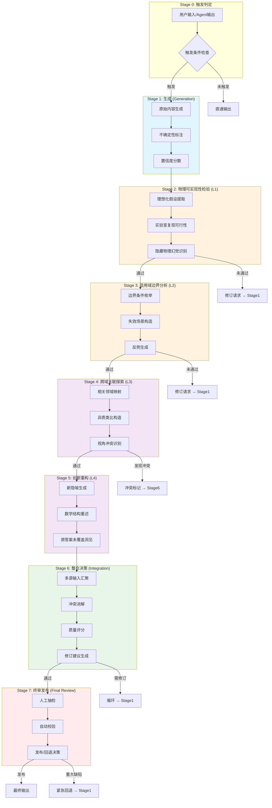
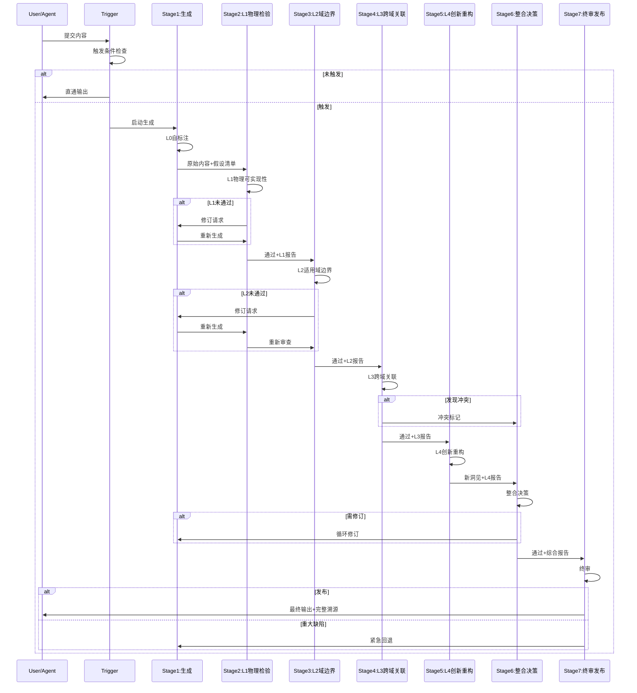
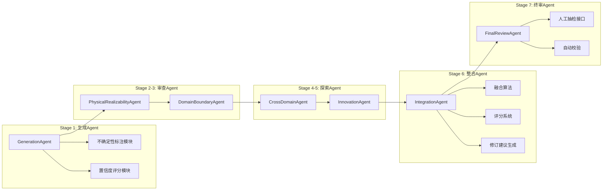
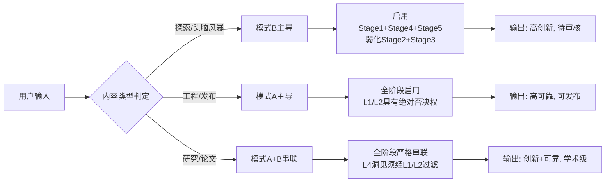

# Sylva Hallucination Inspection Pipeline (SHIP)

> **"我们不是要消灭幻觉——我们要在精确可控的流水线上，把幻觉锻造成创新的原材料。"**

---

## 1. 设计理念

### 1.1 两种对待幻觉的态度

| 模式 | 名称 | 核心信条 | 适用场景 |
|------|------|----------|----------|
| **模式A** | 机械封杀幻觉 (Mechanical Suppression) | 任何不确定、不可验证、非严格推导的内容都必须被标记并剔除 | 最终发布、工程实现、法律/医学/安全关键决策 |
| **模式B** | 科学利用幻觉 (Scientific Exploitation) | 幻觉是认知系统"过拟合"产生的副产品，其中可能包含人类尚未发现的模式关联 | 早期探索、跨域联想、创新重构阶段 |

**核心洞见**：模式A和模式B不是对立的——它们必须在同一流水线上**串联执行**。先生成（允许模式B），后审查（强制模式A），再在模式A的边界内回注模式B的精华。

### 1.2 教训来源

**2026-04-15 电磁波干涉事件**：一维波矢分析得出"能量去向三解释"，遗漏了真实物理是**二维/三维角度分布**的关键洞察。根本原因：没有做物理可实现性检查，直接套用了教科书简化模型。

**结论**：任何涉及"无限大"、"理想"、"完美"、"均匀"假设的物理/数学答案，**必须**经过本流水线的L1物理可实现性审查，否则禁止交付。

---

## 2. 系统架构总览

### 2.1 七阶段流水线（强制串联）



### 2.2 颜色编码含义

| 颜色 | 含义 | 审查模式 |
|------|------|----------|
| 蓝色 | 生成阶段 | 模式B：鼓励发散 |
| 橙色 | 审查阶段 (L1-L2) | 模式A：机械封杀 |
| 紫色 | 探索阶段 (L3-L4) | 模式B：科学利用 |
| 绿色 | 整合阶段 | 模式A+B：有约束的创新 |
| 红色 | 终审阶段 | 模式A：严格把关 |

---

## 3. 五层审查矩阵

### 3.0 L0: 生成层审查 (Generation Gate)

在内容生成的同时，要求生成Agent自我标注不确定性。

| 检查项 | 内容 | 输出要求 |
|--------|------|----------|
| **不确定性标注** | 对任何包含"可能"、"也许"、"一般来说"、"通常"、"近似"的陈述进行标记 | 生成Uncertainty Tag |
| **置信度分数** | 每条核心论断给出0-1的置信度 | 置信度 < 0.7 必须触发完整流水线 |
| **理想化假设自声明** | 生成Agent必须列出自己使用的所有理想化假设 | 假设清单作为L1的输入 |
| **维度声明** | 明确标注模型维度（1D/2D/3D/ND）及降维合理性 | 维度降级必须给出物理依据 |

**L0输出物**：
- `raw_content`: 原始生成内容
- `uncertainty_tags[]`: 不确定性标记列表
- `confidence_scores[]`: 置信度分数映射
- `idealization_assumptions[]`: 理想化假设清单
- `dimensionality_note`: 维度说明

---

### 3.1 L1: 物理可实现性审查 (Physical Realizability)

**核心问题**：这个模型/论断能在实验室里复现吗？有没有隐藏的"物理幻觉"？

| 检查项 | 详细内容 | 通过标准 |
|--------|----------|----------|
| **理想化假设审计** | 列出所有理想化假设（无限大、理想点源、完美相干、均匀介质、无损耗等） | 每个假设必须标注：①实验室能否近似实现 ②近似误差量级 ③误差对结论的影响 |
| **隐藏物理幻觉识别** | 检查是否隐含了"永动机"、"超光速通信"、"负熵自发产生"等物理上不可能的前提 | 发现任何物理幻觉 → 立即标记为CRITICAL，禁止向下传递 |
| **维度完整性检查** | 一维简化是否掩盖了高维效应？（干涉、衍射、辐射、近场/远场） | 若从3D降到1D，必须证明2D/3D效应在目标精度下可忽略 |
| **边界条件物理性** | 边界条件是否对应真实的物理约束？ | 闭合系统/开放系统、稳态/瞬态、线性/非线性区域必须明确区分 |
| **量纲一致性** | 所有公式量纲是否正确？ | 量纲错误 → 立即否决 |

**L1输出物**：
- `assumption_report[]`: 每条假设的可实现性评估
- `physical_halucination_flags[]`: 物理幻觉标记（如有，流水线终止或回退）
- `dimensionality_verdict`: 维度降级合理性判定
- `pass/fail`: 通过/未通过

**典型失败案例**：
> "一维无限大平面波的干涉" — L1审查应指出：无限大平面波在物理上不可实现，真实情况是有限口径光束，边缘衍射效应会导致能量重新分布到副瓣，而非"存储或返回"。

---

### 3.2 L2: 适用域边界审查 (Domain Boundary)

**核心问题**：这个答案在哪些条件下成立？哪些条件下会失效？有没有反例？

| 检查项 | 详细内容 | 通过标准 |
|--------|----------|----------|
| **边界条件枚举** | 必须列出至少3个明确的边界条件 | 每个边界条件包含：参数范围、适用前提、失效阈值 |
| **失效场景构造** | 主动构造使结论失效的参数组合 | 至少1个构造性失效场景 |
| **反例生成** | 是否存在已知的反例或反直觉案例？ | 至少1个反例，并分析反例为何不推翻核心结论（或确实推翻） |
| **渐进极限检查** | 在参数趋于极限时（0, ∞, 临界值），结论是否自洽？ | 极限行为必须与已知物理/数学一致 |
| **尺度跃迁检查** | 结论在微观→介观→宏观尺度跃迁时是否保持一致？ | 跨尺度不一致必须明确标注适用范围 |

**L2输出物**：
- `boundary_conditions[]`: 至少3个边界条件
- `failure_scenarios[]`: 失效场景清单
- `counterexamples[]`: 反例清单及分析
- `limit_analysis`: 极限行为分析
- `scale_transition_note`: 尺度跃迁说明

---

### 3.3 L3: 跨域关联审查 (Cross-Domain Association)

**核心问题**：其他领域如何处理类似问题？有没有被忽略的视角？

| 检查项 | 详细内容 | 通过标准 |
|--------|----------|----------|
| **领域映射** | 在至少2个其他领域（工程、数学、信息论、生物、经济等）寻找同类问题 | 建立明确的类比映射表 |
| **异质类比构造** | 用完全不同领域的语言重新描述问题 | 至少1个跨域类比，且类比不是表面相似 |
| **视角冲突识别** | 不同领域的方法是否给出冲突的结论？ | 发现冲突时必须分析冲突根源 |
| **工具迁移可能性** | 其他领域的工具/定理能否迁移到本问题？ | 标注可迁移工具及迁移障碍 |
| **历史类比** | 历史上是否有类似问题的误判/误用案例？ | 引用至少1个历史案例 |

**L3输出物**：
- `domain_mappings[]`: 跨域映射清单
- `analogies[]`: 类比构造及评估
- `perspective_conflicts[]`: 视角冲突分析
- `tool_migration[]`: 工具迁移可能性
- `historical_lessons[]`: 历史教训

**典型案例**：
> 电磁波能量去向问题 → 信息论中"信息熵的去向"、热力学中"热量的分配"、流体力学中"涡量的耗散"都涉及类似的"守恒量的非直观分布"问题。

---

### 3.4 L4: 创新重构审查 (Innovative Reconstruction)

**核心问题**：能否用新的方式重新表述这个问题，产生原答案未覆盖的洞见？

| 检查项 | 详细内容 | 通过标准 |
|--------|----------|----------|
| **新隐喻生成** | 用一个全新的隐喻/类比来重新描述核心概念 | 隐喻必须比原表述更具启发性 |
| **数学结构重述** | 能否用不同的数学框架重新表达？（例如：从傅里叶空间到时域，从拉格朗日到哈密顿，从连续到离散） | 至少1种等价但视角不同的数学表述 |
| **原答案未覆盖洞见** | 必须产生至少1个原答案完全未提及的新洞见 | 洞见必须有可追溯的逻辑链 |
| **认知盲点扫描** | 原答案是否陷入了某种认知定势？（局部最优、确认偏误、框架依赖） | 识别并标注认知盲点 |
| **极端化测试** | 将问题推向极端（最大化/最小化某个参数），能否发现新的结构？ | 极端情况下的新发现 |

**L4输出物**：
- `new_metaphors[]`: 新隐喻及启发性评估
- `mathematical_reformulations[]`: 数学重述
- `novel_insights[]`: 新洞见（这是模式B的精华产出）
- `cognitive_blindspots[]`: 认知盲点标注
- `extreme_case_discoveries[]`: 极端情况发现

---

### 3.5 L5: 整合层审查 (Integration — Stage 6)

L5不是独立的"审查层"，而是**整合决策阶段**的质量控制。它将L0-L4的所有输出汇聚，进行冲突消解和综合评分。

| 检查项 | 详细内容 | 决策规则 |
|--------|----------|----------|
| **多源冲突检测** | L1的封杀结论与L4的创新发现是否冲突？ | 物理可实现性（L1）具有最高否决权 |
| **质量评分综合** | 五维度评分：创新性、严谨性、可读性、完整性、边界清晰度 | 总分 < 阈值 → 回退修订 |
| **修订建议生成** | 基于审查结果生成具体的修订指令 | 指令必须精确到段落/公式级别 |
| **版本融合** | 多版本内容（多Agent生成时）如何融合？ | 采用"保守取交 + 创新取并"策略 |
| **溯源标注** | 每个最终论断必须标注其审查溯源 | 未通过L1/L2的论断不得进入最终输出 |

**整合评分卡**：

| 维度 | 权重 | 评分标准 | 阈值 |
|------|------|----------|------|
| **创新性** | 0.20 | L4新洞见的数量和质量 | ≥ 6.0/10 |
| **严谨性** | 0.30 | L1+L2的通过率，无物理幻觉 | ≥ 8.0/10 |
| **可读性** | 0.15 | 逻辑清晰度、语言流畅度 | ≥ 7.0/10 |
| **完整性** | 0.20 | 边界条件、反例、假设的完整披露 | ≥ 7.5/10 |
| **边界清晰度** | 0.15 | L2边界条件明确，适用范围清晰 | ≥ 8.0/10 |

**综合评分 ≥ 7.5/10 方可进入Stage 7终审。**

---

## 4. 强制串联执行协议

### 4.1 为什么必须串联，不能并行

本流水线的核心设计原则是：**前序阶段的输出是后序阶段的必要输入，后序阶段的发现可能触发前序阶段的重新执行。**

```
并行执行的陷阱：
  L1审查说"假设A不可实现"，但L4同时说"假设A可以产生新洞见"
  → 并行时两者同时进入整合，冲突无法消解
  → 串联时L1先否决假设A，L4收到否决标记后重构洞见，基于修正后的假设工作
```

### 4.2 串联执行顺序



### 4.3 循环规则

| 循环类型 | 触发条件 | 回退目标 | 最大循环次数 |
|----------|----------|----------|-------------|
| **L1回退** | 物理幻觉/不可实现假设 | Stage 1 | 3次 |
| **L2回退** | 边界模糊/反例推翻结论 | Stage 1 | 3次 |
| **整合回退** | 综合评分 < 7.5 | Stage 1 | 2次 |
| **终审回退** | 人工抽检发现重大缺陷 | Stage 1 | 1次 |

**硬性规则**：任何回退超过最大次数，流水线**强制终止**，输出降级为"草稿/待审核"状态，禁止直接发布。

---

## 5. 触发条件

### 5.1 自动触发（满足任一即触发完整流水线）

| # | 触发条件 | 检测方法 | 优先级 |
|---|----------|----------|--------|
| 1 | 答案中包含"可能"、"也许"、"一般来说"等模糊限定词 | 正则匹配 + NLP不确定性检测 | P1 |
| 2 | 涉及"无限大平面波"、"理想点源"、"完美相干"等现实中不存在的概念 | 物理概念黑名单匹配 | P0（最高） |
| 3 | 一维简化模型可能掩盖高维效应 | 维度降级检测器 | P1 |
| 4 | 未明确区分闭合系统/开放系统、稳态/瞬态、线性/非线性 | 系统分类缺失检测 | P2 |
| 5 | 用户提供了反例、引用、或"但是"开头的追问 | 用户反馈语义分析 | P1 |
| 6 | 涉及数值计算但无量纲分析 | 量纲检查器 | P2 |
| 7 | 置信度分数 < 0.7 (L0自标注) | 阈值判定 | P2 |
| 8 | 跨尺度结论（微观→宏观）无过渡论证 | 尺度跃迁检测 | P1 |

### 5.2 强制触发（无论内容如何，自动触发）

- 所有物理学/工程学/数学证明类输出
- 涉及安全、健康、法律的建议
- 被标记为"发布"级别的内容
- 用户明确请求"严格审查"

### 5.3 豁免触发（可跳过部分阶段）

- 纯创意写作（诗歌、小说） → 豁免L1/L2，执行L3-L4
- 历史事实陈述（有明确文献支撑） → 执行L0+L2，豁免L1
- 代码实现（可编译运行） → 执行L1（可实现性），豁免L3-L4

---

## 6. Agent角色定义

### 6.1 专用Agent类型



### 6.2 Agent输入输出规范

| Agent | 输入 | 输出 | 关键约束 |
|-------|------|------|----------|
| **GenerationAgent** | 用户query, context | raw_content + L0标注 | 必须自报理想化假设 |
| **PhysicalRealizabilityAgent** | raw_content + L0假设清单 | L1报告 (pass/fail + 详细审计) | 物理幻觉=一票否决 |
| **DomainBoundaryAgent** | raw_content + L1通过报告 | L2报告 (边界+反例+失效场景) | 必须构造≥1反例 |
| **CrossDomainAgent** | raw_content + L2通过报告 | L3报告 (映射+类比+冲突) | 必须探索≥2领域 |
| **InnovationAgent** | 全部前序报告 | L4报告 (新洞见+隐喻+重述) | 必须产生≥1原答案未覆盖洞见 |
| **IntegrationAgent** | L0-L4全部输出 | 综合评分 + 修订指令 + 融合版本 | 评分<7.5=回退 |
| **FinalReviewAgent** | 整合输出 + 溯源链 | 发布决策 + 最终版本 | 人工抽检权 |

---

## 7. 输出规范

### 7.1 通过流水线的输出格式

```markdown
## [标题]

> **审查状态**：✅ 已通过Sylva幻觉检验七阶段流水线
> **综合评分**：8.2/10 | **创新性**：7.5 | **严谨性**：9.0 | **可读性**：8.0 | **完整性**：8.5 | **边界清晰度**：8.0
> **审查时间**：2026-05-18T02:11:00+08:00
> **流水线版本**：SHIP-v1.0

### 核心内容
[正文]

### 边界声明
- **适用范围**：[明确列出]
- **失效条件**：[明确列出]
- **理想化假设**：[完整清单及可实现性评估]

### 跨域视角
[相关领域的类比及视角]

### 创新洞见
[L4阶段产生的、原答案未覆盖的新洞见]

### 溯源表
| 论断 | 来源 | 审查层级 | 状态 |
|------|------|----------|------|
| [论断1] | Stage1 | L1通过 | ✅ |
| [论断2] | Stage4 | L4新增 | ✅ |

---
**本内容经过物理可实现性检验、适用域边界分析、跨域关联探索和创新重构。"
```

### 7.2 未通过流水线的输出格式

```markdown
## [标题]

> **审查状态**：⚠️ 未通过L1物理可实现性检验 / 综合评分6.8/10 < 7.5阈值
> **状态**：草稿/待审核 — **禁止作为最终答案发布**

### 未通过原因
[具体原因]

### 修订建议
[精确到段落/公式的修订指令]

### 原始内容（仅供参考）
[原始内容]
```

---

## 8. "机械封杀"与"科学利用"的运行时切换

### 8.1 流水线内部的动态平衡



### 8.2 运行时指令

用户可以通过以下指令动态切换模式：

| 指令 | 效果 | 适用场景 |
|------|------|----------|
| `/mode strict` | 纯模式A：机械封杀，L1/L2绝对否决 | 最终答案、工程决策 |
| `/mode explore` | 纯模式B：鼓励发散，弱化审查 | 头脑风暴、创意探索 |
| `/mode research` | 模式A+B串联（默认） | 学术论文、深度研究 |
| `/mode fast` | 仅执行L0+L2，跳过L3-L4 | 快速迭代、内部草稿 |

---

## 9. 质量控制与持续改进

### 9.1 流水线健康指标

| 指标 | 目标值 | 监测频率 |
|------|--------|----------|
| **L1通过率** | > 85% | 实时 |
| **平均循环次数** | < 1.5 | 每日 |
| **终审发布率** | > 70% | 每日 |
| **L4洞见采纳率** | > 30% | 每周 |
| **用户回退率** | < 5% | 每周 |

### 9.2 迭代改进机制

1. **每周审查会议**：分析被拒绝的内容，更新触发条件黑名单
2. **假设库更新**：将新识别的"物理幻觉"模式加入L1检测库
3. **跨域知识图谱**：L3的领域映射关系持续积累，形成知识图谱
4. **洞见数据库**：L4产生的新洞见经过验证后入库，供后续生成Agent参考

---

## 10. 附录

### 10.1 术语表

| 术语 | 定义 |
|------|------|
| **物理幻觉** | 基于物理上不可实现的假设（如无限大、理想化、完美条件）推导出的结论，在真实世界中会失效 |
| **适用域边界** | 一个结论成立的条件空间（参数范围、系统类型、尺度等）的明确边界 |
| **跨域关联** | 在不同学科领域之间建立概念或方法的映射关系 |
| **创新重构** | 在不改变核心逻辑的前提下，用新的隐喻、数学结构或视角重新表述问题 |
| **模式A** | 机械封杀幻觉：严格剔除不确定和不可验证的内容 |
| **模式B** | 科学利用幻觉：将发散性思维作为创新的原材料 |

### 10.2 参考文档

- `AGENTS.md` — 审核-创新串联Agent机制（本流水线的前身设计）
- `sylva_platform/docs/` — Sylva平台技术文档目录

### 10.3 版本历史

| 版本 | 日期 | 变更 |
|------|------|------|
| v1.0 | 2026-05-18 | 初始版本：七阶段流水线 + 五层审查矩阵 |

---

> **"机械封杀幻觉是底线，科学利用幻觉是上限。真正的智慧在于：知道什么时候该守住底线，什么时候该触碰上限。"**
> 
> — Sylva Hallucination Inspection Pipeline (SHIP) v1.0

---
*本文档由Sylva系统自动生成，属于sylva_platform技术文档体系。*
