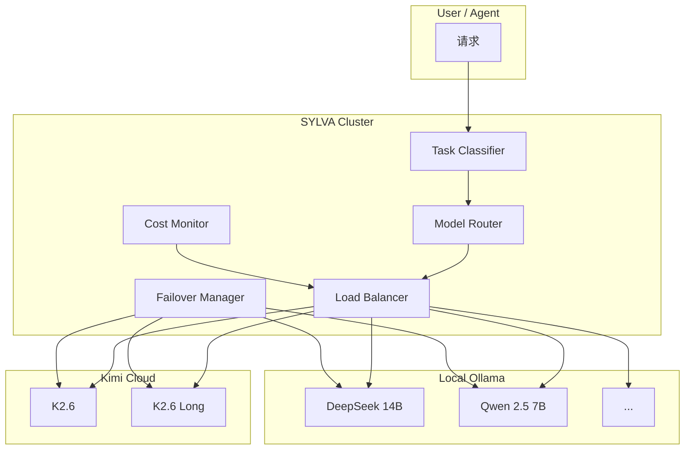
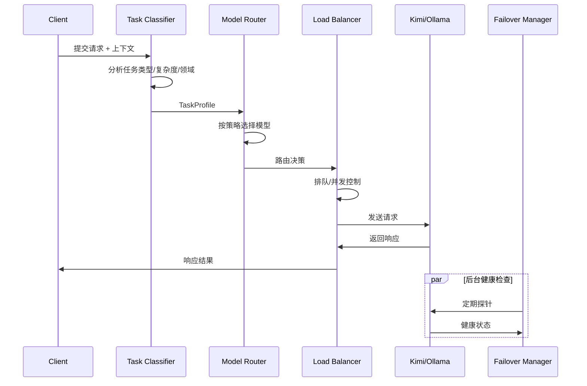

# SYLVA Kimi 集群集成（Kimi Cluster Integration）

> **核心原则**：将 Kimi API 作为 SYLVA Agent 集群的中央协调器，实现多模型负载均衡、故障转移和智能路由。
>
> **文档定位**：本文档属于 [SYLVA Software 架构](./architecture.md) 的**AI 协调子系统**，与 [Unified Wrapper Architecture](./unified_wrapper_architecture.md) 的平台适配层和 [Backend Service Architecture](./backend_service_architecture.md) 的后端服务层形成完整的三层智能调度体系。

---

## 1. 设计背景

### 1.1 问题空间

SYLVA 平台依赖大语言模型（LLM）完成以下任务：
- **代码生成**：Lean 4 形式化证明、TypeScript/React 前端代码
- **文档撰写**：学术论文、技术文档、架构设计
- **代码审查**：错误分类、修复策略选择、截肢级别推荐
- **智能问答**：用户咨询、概念解释、跨域关联

单一模型存在以下局限：
- **上下文长度限制**：长文档生成时丢失前文
- **领域专长差异**：数学证明 vs 前端代码 vs 创意写作
- **速率限制**：高频调用时触发 API 限流
- **单点故障**：模型服务宕机时整个系统停滞

### 1.2 设计目标

| 目标 | 指标 | 实现方式 |
|------|------|---------|
| **负载均衡** | 请求均匀分布到多个模型 | Round-Robin + 权重调度 |
| **故障转移** | 模型故障时自动切换 | Health Check + 降级策略 |
| **智能路由** | 根据任务类型选择最优模型 | Task Classifier + 模型匹配 |
| **速率控制** | 避免触发 API 限流 | Token Bucket + 队列缓冲 |
| **成本优化** | 优先使用高性价比模型 | Cost-Aware Routing |

---

## 2. 架构概述

### 2.1 核心组件

```
Kimi Cluster Integration
├── Task Classifier（任务分类器）
│   ├── 代码生成识别
│   ├── 文档撰写识别
│   ├── 审查分析识别
│   └── 通用问答识别
├── Model Router（模型路由器）
│   ├── 策略：Round-Robin
│   ├── 策略：Least-Loaded
│   ├── 策略：Cost-Optimized
│   └── 策略：Capability-Matched
├── Load Balancer（负载均衡器）
│   ├── 请求队列
│   ├── 并发控制
│   └── 优先级调度
├── Failover Manager（故障转移管理器）
│   ├── 健康检查
│   ├── 自动降级
│   └── 恢复检测
└── Cost Monitor（成本监控器）
    ├── Token 计数
    ├── 费用估算
    └── 预算告警
```

### 2.2 数据流

```
用户请求 / Agent 任务
    ↓
Task Classifier
    ↓
┌─────────────────┬─────────────────┬─────────────────┐
│ 代码生成          │ 文档撰写          │ 审查分析          │
│ → k2.6-coding   │ → k2.6-long     │ → k2.6-mini     │
│ → deepseek:14b  │ → claude-3.5    │ → qwen2.5:7b    │
└─────────────────┴─────────────────┴─────────────────┘
    ↓
Model Router
    ↓
Load Balancer
    ↓
Kimi API / Ollama Local
    ↓
响应返回
```

---

## 3. Task Classifier（任务分类器）

### 3.1 分类维度

| 维度 | 取值 | 识别方式 |
|------|------|---------|
| **任务类型** | code_gen / doc_write / review / qa / creative | 关键词 + 内容长度 |
| **复杂度** | simple / medium / complex / expert | Token 预估 + 上下文长度 |
| **领域** | math / frontend / backend / devops / academic | 内容关键词 |
| **时效性** | realtime / batch / async | 用户/Agent 标记 |
| **成本敏感度** | low / medium / high | 配置或默认 |

### 3.2 分类算法

```typescript
interface TaskProfile {
  type: TaskType
  complexity: Complexity
  domain: Domain
  urgency: Urgency
  costSensitivity: CostSensitivity
  estimatedTokens: number
}

class TaskClassifier {
  private keywords: Map<TaskType, string[]> = new Map([
    ['code_gen', ['代码', '函数', '类', '组件', '实现', '编写', 'lean', 'typescript']],
    ['doc_write', ['文档', '论文', '报告', '撰写', '总结', '分析']],
    ['review', ['审查', '检查', '修复', '错误', '问题', '优化']],
    ['qa', ['问答', '解释', '什么是', '为什么', '如何']],
    ['creative', ['创意', '设计', '想法', '头脑风暴', 'brainstorm']],
  ])
  
  classify(prompt: string, context?: TaskContext): TaskProfile {
    const promptLower = prompt.toLowerCase()
    
    // 1. 类型识别
    let scores = new Map<TaskType, number>()
    for (const [type, words] of this.keywords) {
      const score = words.filter((w) => promptLower.includes(w)).length
      scores.set(type, score)
    }
    const type = Array.from(scores.entries()).sort((a, b) => b[1] - a[1])[0][0]
    
    // 2. 复杂度评估
    const estimatedTokens = this.estimateTokens(prompt)
    const complexity: Complexity =
      estimatedTokens > 4000 ? 'expert' :
      estimatedTokens > 2000 ? 'complex' :
      estimatedTokens > 500 ? 'medium' : 'simple'
    
    // 3. 领域识别
    const domain = this.recognizeDomain(prompt)
    
    // 4. 组装结果
    return {
      type,
      complexity,
      domain,
      urgency: context?.urgency || 'batch',
      costSensitivity: context?.costSensitivity || 'medium',
      estimatedTokens,
    }
  }
  
  private estimateTokens(text: string): number {
    // 中文 ≈ 1 token/字，英文 ≈ 0.3 token/字
    const chinese = (text.match(/[\u4e00-\u9fa5]/g) || []).length
    const english = text.length - chinese
    return Math.ceil(chinese + english * 0.3)
  }
  
  private recognizeDomain(text: string): Domain {
    if (/lean|theorem|proof|mathlib|形式化/.test(text)) return 'math'
    if (/react|vue|frontend|css|tailwind|tsx/.test(text)) return 'frontend'
    if (/express|api|backend|database|docker/.test(text)) return 'backend'
    if (/docker|kubernetes|ci|cd|deploy/.test(text)) return 'devops'
    if (/论文|学术|研究|证明|猜想/.test(text)) return 'academic'
    return 'general'
  }
}
```

---

## 4. Model Router（模型路由器）

### 4.1 模型注册表

```typescript
interface ModelEndpoint {
  id: string
  name: string
  provider: 'kimi' | 'ollama' | 'openai' | 'anthropic'
  modelId: string          // API 模型 ID
  capabilities: ModelCapability[]
  contextWindow: number    // 最大上下文长度
  costPer1KTokens: number // 每 1K Token 成本（USD）
  priority: number         // 优先级（越高越优先）
  health: HealthStatus
  currentLoad: number      // 当前负载（并发数）
  maxConcurrency: number  // 最大并发
}

const MODEL_REGISTRY: ModelEndpoint[] = [
  {
    id: 'kimi-k2-6',
    name: 'Kimi K2.6',
    provider: 'kimi',
    modelId: 'kimi-coding/k2.6',
    capabilities: ['code_gen', 'doc_write', 'review', 'qa'],
    contextWindow: 256000,
    costPer1KTokens: 0.003,
    priority: 10,
    health: { status: 'healthy', latency: 200 },
    currentLoad: 0,
    maxConcurrency: 10,
  },
  {
    id: 'kimi-k2-6-long',
    name: 'Kimi K2.6 Long',
    provider: 'kimi',
    modelId: 'kimi-coding/k2.6',
    capabilities: ['doc_write', 'qa', 'creative'],
    contextWindow: 2000000,
    costPer1KTokens: 0.006,
    priority: 8,
    health: { status: 'healthy', latency: 300 },
    currentLoad: 0,
    maxConcurrency: 5,
  },
  {
    id: 'deepseek-14b',
    name: 'DeepSeek R1 14B',
    provider: 'ollama',
    modelId: 'deepseek-r1:14b',
    capabilities: ['code_gen', 'qa'],
    contextWindow: 128000,
    costPer1KTokens: 0,
    priority: 7,
    health: { status: 'healthy', latency: 500 },
    currentLoad: 0,
    maxConcurrency: 3,
  },
  {
    id: 'qwen-7b',
    name: 'Qwen 2.5 7B',
    provider: 'ollama',
    modelId: 'qwen2.5:7b',
    capabilities: ['qa', 'review'],
    contextWindow: 128000,
    costPer1KTokens: 0,
    priority: 5,
    health: { status: 'healthy', latency: 300 },
    currentLoad: 0,
    maxConcurrency: 5,
  },
]
```

### 4.2 路由策略

```typescript
type RoutingStrategy = 'round-robin' | 'least-loaded' | 'cost-optimized' | 'capability-matched'

class ModelRouter {
  private registry: ModelEndpoint[]
  private strategy: RoutingStrategy
  private roundRobinIndex = 0
  
  constructor(registry: ModelEndpoint[], strategy: RoutingStrategy = 'capability-matched') {
    this.registry = registry
    this.strategy = strategy
  }
  
  route(task: TaskProfile): ModelEndpoint | null {
    // 1. 过滤：满足能力要求 + 健康 + 未超载
    const candidates = this.registry.filter((m) =>
      m.health.status === 'healthy' &&
      m.currentLoad < m.maxConcurrency &&
      m.capabilities.includes(task.type) &&
      m.contextWindow >= task.estimatedTokens * 2  // 预留空间
    )
    
    if (candidates.length === 0) {
      // 无可用模型 → 触发降级
      return this.fallbackRoute(task)
    }
    
    // 2. 按策略选择
    switch (this.strategy) {
      case 'round-robin':
        return this.roundRobin(candidates)
      case 'least-loaded':
        return this.leastLoaded(candidates)
      case 'cost-optimized':
        return this.costOptimized(candidates, task.costSensitivity)
      case 'capability-matched':
      default:
        return this.capabilityMatched(candidates, task)
    }
  }
  
  private roundRobin(candidates: ModelEndpoint[]): ModelEndpoint {
    const selected = candidates[this.roundRobinIndex % candidates.length]
    this.roundRobinIndex++
    return selected
  }
  
  private leastLoaded(candidates: ModelEndpoint[]): ModelEndpoint {
    return candidates.reduce((a, b) =>
      a.currentLoad / a.maxConcurrency < b.currentLoad / b.maxConcurrency ? a : b
    )
  }
  
  private costOptimized(
    candidates: ModelEndpoint[],
    sensitivity: CostSensitivity
  ): ModelEndpoint {
    if (sensitivity === 'high') {
      // 优先免费/低成本模型
      return candidates.sort((a, b) => a.costPer1KTokens - b.costPer1KTokens)[0]
    }
    // 平衡成本与性能
    return candidates.sort((a, b) => {
      const scoreA = a.priority * 10 - a.costPer1KTokens * 100
      const scoreB = b.priority * 10 - b.costPer1KTokens * 100
      return scoreB - scoreA
    })[0]
  }
  
  private capabilityMatched(candidates: ModelEndpoint[], task: TaskProfile): ModelEndpoint {
    // 复杂度匹配 + 优先级加权
    return candidates.sort((a, b) => {
      const aScore = this.matchScore(a, task)
      const bScore = this.matchScore(b, task)
      return bScore - aScore
    })[0]
  }
  
  private matchScore(model: ModelEndpoint, task: TaskProfile): number {
    let score = model.priority
    
    // 上下文窗口匹配度
    if (model.contextWindow >= task.estimatedTokens * 3) score += 10
    else if (model.contextWindow >= task.estimatedTokens * 2) score += 5
    
    // 成本优势（本地模型加分）
    if (model.provider === 'ollama') score += 8
    
    // 负载惩罚
    const loadRatio = model.currentLoad / model.maxConcurrency
    score -= loadRatio * 10
    
    return score
  }
  
  private fallbackRoute(task: TaskProfile): ModelEndpoint | null {
    // 降级策略：降低要求重新匹配
    const fallback = this.registry
      .filter((m) => m.health.status !== 'unhealthy')
      .sort((a, b) => b.contextWindow - a.contextWindow)[0]
    
    if (fallback) {
      console.warn(`[Router] 降级到 ${fallback.name}（不完全匹配能力要求）`)
    }
    return fallback || null
  }
}
```

---

## 5. Load Balancer（负载均衡器）

### 5.1 请求队列

```typescript
interface QueuedRequest {
  id: string
  task: TaskProfile
  payload: LLMPayload
  resolve: (value: LLMResponse) => void
  reject: (reason: Error) => void
  enqueueTime: number
  priority: number
}

class LoadBalancer {
  private queue: QueuedRequest[] = []
  private processing = new Set<string>()
  private maxConcurrent = 20
  private maxQueueSize = 100
  
  enqueue(request: Omit<QueuedRequest, 'enqueueTime' | 'priority'>): Promise<LLMResponse> {
    return new Promise((resolve, reject) => {
      if (this.queue.length >= this.maxQueueSize) {
        reject(new Error('请求队列已满，请稍后重试'))
        return
      }
      
      const priority = this.calculatePriority(request.task)
      
      const queued: QueuedRequest = {
        ...request,
        enqueueTime: Date.now(),
        priority,
        resolve,
        reject,
      }
      
      // 按优先级插入队列
      const insertIndex = this.queue.findIndex((r) => r.priority < priority)
      if (insertIndex === -1) {
        this.queue.push(queued)
      } else {
        this.queue.splice(insertIndex, 0, queued)
      }
      
      this.processQueue()
    })
  }
  
  private calculatePriority(task: TaskProfile): number {
    let priority = 0
    
    // 紧急度
    if (task.urgency === 'realtime') priority += 100
    else if (task.urgency === 'batch') priority += 10
    else priority += 50
    
    // 复杂度（简单任务优先，减少队列阻塞）
    if (task.complexity === 'simple') priority += 20
    else if (task.complexity === 'expert') priority -= 10
    
    return priority
  }
  
  private async processQueue(): Promise<void> {
    if (this.processing.size >= this.maxConcurrent) return
    if (this.queue.length === 0) return
    
    const request = this.queue.shift()!
    this.processing.add(request.id)
    
    try {
      const response = await this.executeRequest(request)
      request.resolve(response)
    } catch (err) {
      request.reject(err instanceof Error ? err : new Error('执行失败'))
    } finally {
      this.processing.delete(request.id)
      // 继续处理队列
      setImmediate(() => this.processQueue())
    }
  }
  
  private async executeRequest(request: QueuedRequest): Promise<LLMResponse> {
    const router = new ModelRouter(MODEL_REGISTRY)
    const model = router.route(request.task)
    
    if (!model) {
      throw new Error('无可用模型')
    }
    
    // 更新负载
    model.currentLoad++
    
    try {
      const response = await this.callModel(model, request.payload)
      return response
    } finally {
      model.currentLoad--
    }
  }
  
  private async callModel(model: ModelEndpoint, payload: LLMPayload): Promise<LLMResponse> {
    switch (model.provider) {
      case 'kimi':
        return this.callKimiAPI(model, payload)
      case 'ollama':
        return this.callOllamaAPI(model, payload)
      default:
        throw new Error(`未知提供商: ${model.provider}`)
    }
  }
  
  private async callKimiAPI(model: ModelEndpoint, payload: LLMPayload): Promise<LLMResponse> {
    const response = await fetch('https://api.moonshot.cn/v1/chat/completions', {
      method: 'POST',
      headers: {
        'Content-Type': 'application/json',
        'Authorization': `Bearer ${process.env.KIMI_API_KEY}`,
      },
      body: JSON.stringify({
        model: model.modelId,
        messages: payload.messages,
        temperature: payload.temperature || 0.7,
        max_tokens: payload.maxTokens || 4096,
      }),
    })
    
    if (!response.ok) {
      throw new Error(`Kimi API 错误: ${response.status}`)
    }
    
    const data = await response.json()
    return {
      content: data.choices[0].message.content,
      usage: data.usage,
      model: model.id,
    }
  }
  
  private async callOllamaAPI(model: ModelEndpoint, payload: LLMPayload): Promise<LLMResponse> {
    const response = await fetch(`${process.env.OLLAMA_HOST}/api/generate`, {
      method: 'POST',
      headers: { 'Content-Type': 'application/json' },
      body: JSON.stringify({
        model: model.modelId,
        prompt: payload.messages.map((m) => m.content).join('\n'),
        stream: false,
      }),
    })
    
    if (!response.ok) {
      throw new Error(`Ollama API 错误: ${response.status}`)
    }
    
    const data = await response.json()
    return {
      content: data.response,
      usage: { prompt_tokens: data.prompt_eval_count, completion_tokens: data.eval_count },
      model: model.id,
    }
  }
}
```

---

## 6. Failover Manager（故障转移）

### 6.1 健康检查

```typescript
class FailoverManager {
  private models: ModelEndpoint[]
  private healthInterval = 30000  // 30 秒
  private failureThreshold = 3    // 连续失败 3 次视为故障
  private failureCounts = new Map<string, number>()
  
  constructor(models: ModelEndpoint[]) {
    this.models = models
    this.startHealthChecks()
  }
  
  private startHealthChecks(): void {
    setInterval(() => {
      this.models.forEach((model) => this.checkHealth(model))
    }, this.healthInterval)
  }
  
  private async checkHealth(model: ModelEndpoint): Promise<void> {
    const start = Date.now()
    try {
      // 发送健康检查探针
      const response = await this.sendHealthProbe(model)
      const latency = Date.now() - start
      
      model.health = {
        status: latency > 5000 ? 'degraded' : 'healthy',
        latency,
      }
      
      // 重置失败计数
      this.failureCounts.set(model.id, 0)
      
      // 如果之前是故障状态，现在恢复了
      if (model.health.status === 'healthy' && this.failureCounts.get(model.id)! >= this.failureThreshold) {
        console.log(`[Failover] ${model.name} 已恢复`)
      }
      
    } catch {
      const failures = (this.failureCounts.get(model.id) || 0) + 1
      this.failureCounts.set(model.id, failures)
      
      if (failures >= this.failureThreshold) {
        model.health = { status: 'unhealthy', latency: -1 }
        console.error(`[Failover] ${model.name} 已标记为故障（连续 ${failures} 次失败）`)
      } else {
        model.health = { status: 'degraded', latency: -1 }
      }
    }
  }
  
  private async sendHealthProbe(model: ModelEndpoint): Promise<void> {
    const probePayload: LLMPayload = {
      messages: [{ role: 'user', content: 'Hello' }],
      maxTokens: 10,
    }
    
    // 使用 3 秒超时
    const controller = new AbortController()
    const timeout = setTimeout(() => controller.abort(), 3000)
    
    try {
      if (model.provider === 'kimi') {
        await fetch('https://api.moonshot.cn/v1/chat/completions', {
          method: 'POST',
          headers: {
            'Authorization': `Bearer ${process.env.KIMI_API_KEY}`,
            'Content-Type': 'application/json',
          },
          body: JSON.stringify({ model: model.modelId, messages: probePayload.messages, max_tokens: 10 }),
          signal: controller.signal,
        })
      } else if (model.provider === 'ollama') {
        await fetch(`${process.env.OLLAMA_HOST}/api/generate`, {
          method: 'POST',
          headers: { 'Content-Type': 'application/json' },
          body: JSON.stringify({ model: model.modelId, prompt: 'hi', stream: false }),
          signal: controller.signal,
        })
      }
    } finally {
      clearTimeout(timeout)
    }
  }
}
```

---

## 7. Cost Monitor（成本监控）

### 7.1 计费追踪

```typescript
interface UsageRecord {
  timestamp: string
  modelId: string
  taskType: TaskType
  promptTokens: number
  completionTokens: number
  cost: number
  requestId: string
}

class CostMonitor {
  private records: UsageRecord[] = []
  private dailyBudget = 50  // USD
  private warningThreshold = 0.8
  
  record(response: LLMResponse, task: TaskProfile, requestId: string): void {
    const model = MODEL_REGISTRY.find((m) => m.id === response.model)
    if (!model) return
    
    const totalTokens = (response.usage?.prompt_tokens || 0) + (response.usage?.completion_tokens || 0)
    const cost = (totalTokens / 1000) * model.costPer1KTokens
    
    const record: UsageRecord = {
      timestamp: new Date().toISOString(),
      modelId: model.id,
      taskType: task.type,
      promptTokens: response.usage?.prompt_tokens || 0,
      completionTokens: response.usage?.completion_tokens || 0,
      cost,
      requestId,
    }
    
    this.records.push(record)
    
    // 检查预算
    const todayCost = this.getTodayCost()
    if (todayCost >= this.dailyBudget * this.warningThreshold) {
      console.warn(`[CostMonitor] 今日费用 ${todayCost.toFixed(2)} USD，接近预算 ${this.dailyBudget} USD`)
    }
    if (todayCost >= this.dailyBudget) {
      console.error(`[CostMonitor] 今日费用已超预算！`)
    }
  }
  
  getTodayCost(): number {
    const today = new Date().toISOString().slice(0, 10)
    return this.records
      .filter((r) => r.timestamp.startsWith(today))
      .reduce((sum, r) => sum + r.cost, 0)
  }
  
  getStats(): CostStats {
    const today = new Date().toISOString().slice(0, 10)
    const todayRecords = this.records.filter((r) => r.timestamp.startsWith(today))
    
    return {
      todayCost: this.getTodayCost(),
      todayRequests: todayRecords.length,
      todayTokens: todayRecords.reduce((sum, r) => sum + r.promptTokens + r.completionTokens, 0),
      byModel: this.aggregateByModel(todayRecords),
      byTaskType: this.aggregateByTaskType(todayRecords),
    }
  }
  
  private aggregateByModel(records: UsageRecord[]): Record<string, { cost: number; requests: number }> {
    const result: Record<string, { cost: number; requests: number }> = {}
    for (const r of records) {
      if (!result[r.modelId]) result[r.modelId] = { cost: 0, requests: 0 }
      result[r.modelId].cost += r.cost
      result[r.modelId].requests++
    }
    return result
  }
  
  private aggregateByTaskType(records: UsageRecord[]): Record<string, { cost: number; requests: number }> {
    const result: Record<string, { cost: number; requests: number }> = {}
    for (const r of records) {
      if (!result[r.taskType]) result[r.taskType] = { cost: 0, requests: 0 }
      result[r.taskType].cost += r.cost
      result[r.taskType].requests++
    }
    return result
  }
}
```

---

## 8. 与 OpenClaw Runtime 的对接

### 8.1 会话上下文传递

```typescript
interface OpenClawContext {
  sessionKey: string
  channel: string
  model: string
  history: Message[]
}

class OpenClawBridge {
  /** 将 OpenClaw 会话上下文转为 SYLVA 任务 */
  static contextToTask(context: OpenClawContext): TaskProfile {
    const prompt = context.history.map((m) => m.content).join('\n')
    
    return {
      type: 'qa',
      complexity: 'medium',
      domain: 'general',
      urgency: 'realtime',
      costSensitivity: 'medium',
      estimatedTokens: prompt.length * 0.5,
    }
  }
  
  /** 将 SYLVA 响应转为 OpenClaw 消息 */
  static responseToMessage(response: LLMResponse): Message {
    return {
      role: 'assistant',
      content: response.content,
      metadata: {
        model: response.model,
        usage: response.usage,
      },
    }
  }
}
```

### 8.2 消息发送桥接

```
OpenClaw 消息工具
    ↓
sessions_send / message.send
    ↓
OpenClawBridge 转换
    ↓
LoadBalancer.enqueue
    ↓
ModelRouter.route
    ↓
Kimi API / Ollama
    ↓
响应
    ↓
OpenClawBridge 转换
    ↓
返回给用户
```

---

## 9. 架构图

### 9.1 整体架构



### 9.2 请求生命周期



---

## 10. 配置与部署

### 10.1 环境变量

```bash
# Kimi 集群配置
KIMI_API_KEY=sk-xxxxxxxxxxxxxxxx
KIMI_BASE_URL=https://api.moonshot.cn
KIMI_MODEL_DEFAULT=kimi-coding/k2.6

# Ollama 本地配置
OLLAMA_HOST=http://localhost:11434
OLLAMA_MODELS=deepseek-r1:14b,qwen2.5:7b

# 路由策略
ROUTING_STRATEGY=capability-matched
MAX_CONCURRENT=20
MAX_QUEUE_SIZE=100

# 成本监控
DAILY_BUDGET_USD=50
COST_WARNING_THRESHOLD=0.8

# 健康检查
HEALTH_CHECK_INTERVAL=30000
FAILURE_THRESHOLD=3
```

### 10.2 Docker Compose 扩展

```yaml
# docker-compose.yml 扩展
services:
  kimi-proxy:
    image: sylva/kimi-proxy:latest
    environment:
      - KIMI_API_KEY=${KIMI_API_KEY}
      - ROUTING_STRATEGY=${ROUTING_STRATEGY}
      - OLLAMA_HOST=http://ollama:11434
    ports:
      - "3001:3001"
    depends_on:
      - ollama
    restart: unless-stopped
```

---

## 相关文档

- [[unified_wrapper_architecture.md]] — 统一封装架构
- [[backend_service_architecture.md]] — 后端服务架构
- [[PLATFORM_REGISTRY.md]] — 58 平台清单
- [[architecture.md]] — SYLVA Software 架构总览

---

## 版本记录

| 版本 | 日期 | 变更 |
|------|------|------|
| v1.0 | 2026-05-19 | 初始版本，定义 Kimi 集群集成架构 |

---

## 关键词

#Kimi集群 #负载均衡 #故障转移 #智能路由 #任务分类 #成本监控 #多模型调度 #OpenClaw对接 #LLM编排 #Token管理
