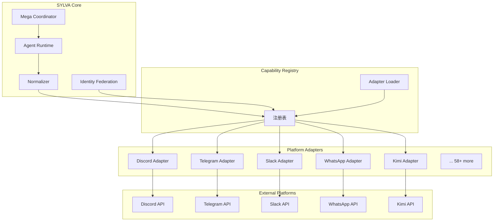
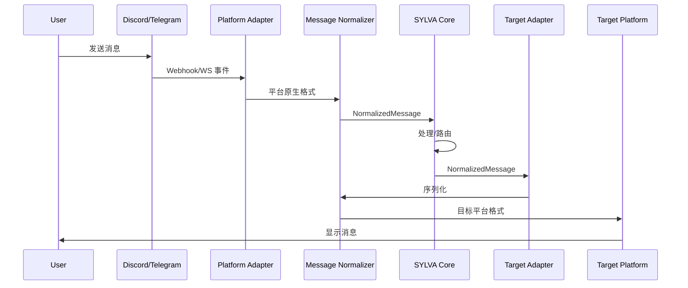

# SYLVA 统一封装架构（Unified Wrapper Architecture）

> **核心原则**：将 58+ 通信平台抽象为统一的适配器接口，实现"一次接入，全平台复用"。
>
> **文档定位**：本文档属于 [SYLVA Software 架构](./architecture.md) 的**平台适配子系统**，与 [PLATFORM_REGISTRY.md](./PLATFORM_REGISTRY.md) 的 58 平台清单和 [Chat Channel Expansion](./chat_channel_expansion.md) 的通道扩展设计形成完整的三层平台接入体系。

---

## 1. 设计背景

### 1.1 问题空间

SYLVA 平台需要对接 58+ 不同的通信平台，每个平台都有：
- 独特的认证机制（OAuth、API Key、Bot Token、Cookie 等）
- 不同的消息格式（Markdown、HTML、纯文本、富媒体）
- 各异的事件模型（Webhook、轮询、WebSocket、SSE）
- 不同的用户标识体系（用户 ID、手机号、邮箱、UUID）

如果没有统一封装，每新增一个平台都需要：
1. 重写认证逻辑
2. 重写消息解析/序列化
3. 重写事件监听/推送
4. 重写用户映射

**重复劳动 > 50%**

### 1.2 设计目标

| 目标 | 指标 | 实现方式 |
|------|------|---------|
| **最小适配集** | 每个平台只需实现 5 个接口 | UnifiedWrapper Interface |
| **能力注册** | 平台能力自动发现 | Capability Registry |
| **插件热插拔** | 新增平台无需重启 | Dynamic Loader |
| **格式统一** | 所有消息转为内部标准格式 | Message Normalizer |
| **身份映射** | 跨平台用户身份统一 | Identity Federation |

---

## 2. UnifiedWrapper Interface

### 2.1 核心接口定义

```typescript
interface UnifiedWrapper {
  /** 平台唯一标识 */
  readonly platformId: string
  
  /** 平台显示名称 */
  readonly platformName: string
  
  /** 平台能力声明 */
  readonly capabilities: PlatformCapability[]
  
  /** 认证管理 */
  authenticate(credentials: AuthCredentials): Promise<AuthResult>
  refreshAuth(): Promise<AuthResult>
  revokeAuth(): Promise<void>
  
  /** 消息收发 */
  sendMessage(message: NormalizedMessage): Promise<SendResult>
  sendMedia(media: NormalizedMedia): Promise<SendResult>
  editMessage(messageId: string, newContent: string): Promise<void>
  deleteMessage(messageId: string): Promise<void>
  
  /** 消息接收 */
  onMessage(handler: MessageHandler): void
  onCommand(handler: CommandHandler): void
  onEvent(handler: EventHandler): void
  
  /** 用户查询 */
  getUser(userId: string): Promise<NormalizedUser>
  getUserByUsername(username: string): Promise<NormalizedUser | null>
  getChannelMembers(channelId: string): Promise<NormalizedUser[]>
  
  /** 通道管理 */
  getChannels(): Promise<NormalizedChannel[]>
  getChannel(channelId: string): Promise<NormalizedChannel>
  createChannel(config: ChannelConfig): Promise<NormalizedChannel>
  joinChannel(channelId: string): Promise<void>
  leaveChannel(channelId: string): Promise<void>
  
  /** 生命周期 */
  connect(): Promise<void>
  disconnect(): Promise<void>
  healthCheck(): Promise<HealthStatus>
}
```

### 2.2 标准化数据类型

```typescript
/** 统一消息格式 —— 所有平台消息进入 SYLVA 后的标准形态 */
interface NormalizedMessage {
  id: string              // 全局唯一消息 ID
  platformId: string      // 来源平台
  channelId: string       // 通道 ID
  authorId: string        // 作者 ID（已联邦化）
  content: MessageContent // 内容（结构化）
  timestamp: string       // ISO 8601
  replyTo?: string        // 回复目标
  metadata?: Record<string, unknown>  // 平台特有元数据
}

/** 内容块 —— 支持混合媒体 */
type MessageContent = TextBlock | ImageBlock | VideoBlock | FileBlock | ActionBlock

interface TextBlock { type: 'text'; text: string; format?: 'plain' | 'markdown' | 'html' }
interface ImageBlock { type: 'image'; url: string; alt?: string; width?: number; height?: number }
interface VideoBlock { type: 'video'; url: string; duration?: number }
interface FileBlock { type: 'file'; url: string; name: string; size: number; mimeType: string }
interface ActionBlock { type: 'action'; actions: ButtonAction[] }

interface ButtonAction {
  id: string
  label: string
  style: 'primary' | 'secondary' | 'danger'
  action: { type: string; payload: unknown }
}

/** 统一用户格式 */
interface NormalizedUser {
  id: string              // 联邦 ID（SYLVA 内部）
  platformId: string      // 原始平台
  platformUserId: string  // 平台原生 ID
  username: string
  displayName: string
  avatarUrl?: string
  isBot: boolean
  roles: string[]
  metadata?: Record<string, unknown>
}

/** 统一通道格式 */
interface NormalizedChannel {
  id: string
  platformId: string
  name: string
  type: 'dm' | 'group' | 'forum' | 'voice' | 'thread'
  members: number
  isActive: boolean
  metadata?: Record<string, unknown>
}
```

### 2.3 能力声明

```typescript
/** 平台能力 —— 用于运行时能力匹配 */
enum PlatformCapability {
  TEXT_MESSAGE = 'text_message',       // 文本消息
  MEDIA_MESSAGE = 'media_message',     // 媒体消息（图/视频/文件）
  REPLY = 'reply',                    // 回复/引用
  EDIT = 'edit',                      // 消息编辑
  DELETE = 'delete',                  // 消息删除
  REACTION = 'reaction',              // 表情反应
  THREAD = 'thread',                 // 线程/话题
  VOICE = 'voice',                   // 语音通话
  VIDEO_CALL = 'video_call',         // 视频通话
  POLL = 'poll',                     // 投票
  COMMAND = 'command',               // 斜杠命令
  BUTTON = 'button',                 // 交互按钮
  MODAL = 'modal',                   // 弹窗表单
  EMBED = 'embed',                   // 富媒体卡片
  WEBHOOK = 'webhook',               // Webhook 接收
  WEBSOCKET = 'websocket',           // WebSocket 实时
  SSE = 'sse',                       // Server-Sent Events
  POLLING = 'polling',               // 轮询
}

/** 能力查询 —— 路由决策 */
function selectPlatformForTask(
  task: TaskRequirement,
  registry: CapabilityRegistry
): UnifiedWrapper | null {
  const candidates = registry.query(task.requiredCapabilities)
  return candidates
    .filter((p) => p.healthCheck().status === 'healthy')
    .sort((a, b) => b.priority - a.priority)[0] || null
}
```

---

## 3. 适配器模式实现

### 3.1 适配器基类

```typescript
abstract class BaseAdapter implements UnifiedWrapper {
  abstract readonly platformId: string
  abstract readonly platformName: string
  abstract readonly capabilities: PlatformCapability[]
  
  protected authState: AuthState = { status: 'none' }
  protected messageHandlers: MessageHandler[] = []
  protected eventHandlers: EventHandler[] = []
  protected connected = false
  
  // ── 认证 ──
  abstract authenticate(credentials: AuthCredentials): Promise<AuthResult>
  abstract refreshAuth(): Promise<AuthResult>
  
  async revokeAuth(): Promise<void> {
    this.authState = { status: 'none' }
  }
  
  // ── 消息发送 ──
  abstract sendMessage(message: NormalizedMessage): Promise<SendResult>
  abstract sendMedia(media: NormalizedMedia): Promise<SendResult>
  
  async editMessage(messageId: string, newContent: string): Promise<void> {
    if (!this.capabilities.includes(PlatformCapability.EDIT)) {
      throw new Error(`${this.platformId} 不支持消息编辑`)
    }
    // 子类重写
  }
  
  async deleteMessage(messageId: string): Promise<void> {
    if (!this.capabilities.includes(PlatformCapability.DELETE)) {
      throw new Error(`${this.platformId} 不支持消息删除`)
    }
    // 子类重写
  }
  
  // ── 消息接收 ──
  onMessage(handler: MessageHandler): void {
    this.messageHandlers.push(handler)
  }
  
  onCommand(handler: CommandHandler): void {
    if (!this.capabilities.includes(PlatformCapability.COMMAND)) {
      console.warn(`${this.platformId} 不支持命令处理`)
      return
    }
    // 子类实现命令解析后回调
  }
  
  onEvent(handler: EventHandler): void {
    this.eventHandlers.push(handler)
  }
  
  protected emitMessage(msg: NormalizedMessage): void {
    this.messageHandlers.forEach((h) => h(msg))
  }
  
  protected emitEvent(event: PlatformEvent): void {
    this.eventHandlers.forEach((h) => h(event))
  }
  
  // ── 用户查询 ──
  abstract getUser(userId: string): Promise<NormalizedUser>
  abstract getChannelMembers(channelId: string): Promise<NormalizedUser[]>
  
  async getUserByUsername(username: string): Promise<NormalizedUser | null> {
    // 默认实现：遍历通道成员匹配
    return null
  }
  
  // ── 通道管理 ──
  abstract getChannels(): Promise<NormalizedChannel[]>
  abstract getChannel(channelId: string): Promise<NormalizedChannel>
  
  async createChannel(config: ChannelConfig): Promise<NormalizedChannel> {
    throw new Error(`${this.platformId} 不支持动态创建通道`)
  }
  
  async joinChannel(channelId: string): Promise<void> {
    // 默认实现：订阅通道消息
  }
  
  async leaveChannel(channelId: string): Promise<void> {
    // 默认实现：取消订阅
  }
  
  // ── 生命周期 ──
  abstract connect(): Promise<void>
  abstract disconnect(): Promise<void>
  abstract healthCheck(): Promise<HealthStatus>
}
```

### 3.2 Discord 适配器示例

```typescript
class DiscordAdapter extends BaseAdapter {
  readonly platformId = 'discord'
  readonly platformName = 'Discord'
  readonly capabilities = [
    PlatformCapability.TEXT_MESSAGE,
    PlatformCapability.MEDIA_MESSAGE,
    PlatformCapability.REPLY,
    PlatformCapability.EDIT,
    PlatformCapability.DELETE,
    PlatformCapability.REACTION,
    PlatformCapability.THREAD,
    PlatformCapability.VOICE,
    PlatformCapability.EMBED,
    PlatformCapability.BUTTON,
    PlatformCapability.COMMAND,
    PlatformCapability.WEBSOCKET,
  ]
  
  private client: DiscordJS.Client
  private botToken: string
  
  constructor(config: DiscordConfig) {
    super()
    this.botToken = config.botToken
    this.client = new DiscordJS.Client({
      intents: ['Guilds', 'GuildMessages', 'MessageContent', 'GuildMembers'],
    })
    this.setupEventForwarding()
  }
  
  async authenticate(): Promise<AuthResult> {
    await this.client.login(this.botToken)
    this.authState = { status: 'authenticated', user: this.client.user }
    return { success: true }
  }
  
  async sendMessage(msg: NormalizedMessage): Promise<SendResult> {
    const channel = await this.client.channels.fetch(msg.channelId)
    if (!channel?.isTextBased()) throw new Error('无效通道')
    
    // 格式转换：NormalizedMessage → Discord MessageOptions
    const discordMsg = this.normalizeToDiscord(msg)
    const sent = await channel.send(discordMsg)
    
    return {
      success: true,
      messageId: sent.id,
      platformMessageId: sent.id,
    }
  }
  
  async getUser(userId: string): Promise<NormalizedUser> {
    const member = await this.client.users.fetch(userId)
    return {
      id: `discord:${member.id}`,
      platformId: 'discord',
      platformUserId: member.id,
      username: member.username,
      displayName: member.displayName || member.username,
      avatarUrl: member.displayAvatarURL(),
      isBot: member.bot,
      roles: [],
    }
  }
  
  private setupEventForwarding(): void {
    this.client.on('messageCreate', (msg) => {
      if (msg.author.bot) return
      const normalized = this.discordToNormalize(msg)
      this.emitMessage(normalized)
    })
  }
  
  private discordToNormalize(msg: DiscordJS.Message): NormalizedMessage {
    return {
      id: `discord:${msg.id}`,
      platformId: 'discord',
      channelId: msg.channelId,
      authorId: `discord:${msg.author.id}`,
      content: { type: 'text', text: msg.content, format: 'markdown' },
      timestamp: msg.createdAt.toISOString(),
      replyTo: msg.reference?.messageId,
    }
  }
  
  private normalizeToDiscord(msg: NormalizedMessage): DiscordJS.MessageCreateOptions {
    const content = msg.content.type === 'text' ? msg.content.text : ''
    return { content }
  }
}
```

### 3.3 Telegram 适配器示例

```typescript
class TelegramAdapter extends BaseAdapter {
  readonly platformId = 'telegram'
  readonly platformName = 'Telegram'
  readonly capabilities = [
    PlatformCapability.TEXT_MESSAGE,
    PlatformCapability.MEDIA_MESSAGE,
    PlatformCapability.REPLY,
    PlatformCapability.EDIT,
    PlatformCapability.DELETE,
    PlatformCapability.POLL,
    PlatformCapability.COMMAND,
    PlatformCapability.WEBHOOK,
  ]
  
  private bot: Telegraf
  private botToken: string
  private webhookUrl?: string
  
  constructor(config: TelegramConfig) {
    super()
    this.botToken = config.botToken
    this.webhookUrl = config.webhookUrl
    this.bot = new Telegraf(this.botToken)
    this.setupEventForwarding()
  }
  
  async authenticate(): Promise<AuthResult> {
    const me = await this.bot.telegram.getMe()
    this.authState = { status: 'authenticated', user: me }
    return { success: true }
  }
  
  async connect(): Promise<void> {
    if (this.webhookUrl) {
      await this.bot.telegram.setWebhook(this.webhookUrl)
    } else {
      this.bot.launch() // 长轮询模式
    }
    this.connected = true
  }
  
  async sendMessage(msg: NormalizedMessage): Promise<SendResult> {
    const chatId = msg.channelId
    const text = msg.content.type === 'text' ? msg.content.text : ''
    
    const sent = await this.bot.telegram.sendMessage(chatId, text, {
      parse_mode: 'MarkdownV2',
      reply_to_message_id: msg.replyTo ? parseInt(msg.replyTo) : undefined,
    })
    
    return {
      success: true,
      messageId: `telegram:${sent.message_id}`,
      platformMessageId: String(sent.message_id),
    }
  }
  
  private setupEventForwarding(): void {
    this.bot.on('text', (ctx) => {
      const normalized = this.telegramToNormalize(ctx.message)
      this.emitMessage(normalized)
    })
    
    this.bot.command('status', (ctx) => {
      ctx.reply('SYLVA Bot 运行中 ✅')
    })
  }
  
  private telegramToNormalize(msg: TelegramMessage): NormalizedMessage {
    return {
      id: `telegram:${msg.message_id}`,
      platformId: 'telegram',
      channelId: String(msg.chat.id),
      authorId: `telegram:${msg.from?.id}`,
      content: { type: 'text', text: msg.text || '', format: 'plain' },
      timestamp: new Date(msg.date * 1000).toISOString(),
      replyTo: msg.reply_to_message ? `telegram:${msg.reply_to_message.message_id}` : undefined,
    }
  }
}
```

---

## 4. 平台能力注册与发现

### 4.1 能力注册表

```typescript
class CapabilityRegistry {
  private platforms = new Map<string, UnifiedWrapper>()
  private capabilityIndex = new Map<PlatformCapability, Set<string>>()
  
  register(wrapper: UnifiedWrapper): void {
    this.platforms.set(wrapper.platformId, wrapper)
    
    // 更新能力索引
    wrapper.capabilities.forEach((cap) => {
      if (!this.capabilityIndex.has(cap)) {
        this.capabilityIndex.set(cap, new Set())
      }
      this.capabilityIndex.get(cap)!.add(wrapper.platformId)
    })
    
    console.log(`[Registry] ${wrapper.platformName} (${wrapper.platformId}) 已注册`)
    console.log(`[Registry] 能力: ${wrapper.capabilities.join(', ')}`)
  }
  
  unregister(platformId: string): void {
    const wrapper = this.platforms.get(platformId)
    if (!wrapper) return
    
    wrapper.capabilities.forEach((cap) => {
      this.capabilityIndex.get(cap)?.delete(platformId)
    })
    
    this.platforms.delete(platformId)
    console.log(`[Registry] ${wrapper.platformName} 已注销`)
  }
  
  query(required: PlatformCapability[]): UnifiedWrapper[] {
    if (required.length === 0) return Array.from(this.platforms.values())
    
    // 找到满足所有必需能力的平台
    const candidateIds = new Set<string>()
    required.forEach((cap, i) => {
      const ids = this.capabilityIndex.get(cap)
      if (i === 0) {
        ids?.forEach((id) => candidateIds.add(id))
      } else {
        for (const id of candidateIds) {
          if (!ids?.has(id)) candidateIds.delete(id)
        }
      }
    })
    
    return Array.from(candidateIds)
      .map((id) => this.platforms.get(id))
      .filter(Boolean) as UnifiedWrapper[]
  }
  
  getPlatform(platformId: string): UnifiedWrapper | undefined {
    return this.platforms.get(platformId)
  }
  
  getAllPlatforms(): UnifiedWrapper[] {
    return Array.from(this.platforms.values())
  }
  
  getStats(): RegistryStats {
    return {
      totalPlatforms: this.platforms.size,
      capabilityCoverage: Array.from(this.capabilityIndex.entries()).map(
        ([cap, ids]) => ({ capability: cap, platformCount: ids.size })
      ),
    }
  }
}
```

### 4.2 动态加载器

```typescript
class AdapterLoader {
  private registry: CapabilityRegistry
  private adaptersDir: string
  
  constructor(registry: CapabilityRegistry, adaptersDir: string) {
    this.registry = registry
    this.adaptersDir = adaptersDir
  }
  
  /** 扫描适配器目录，自动注册所有适配器 */
  async scanAndLoad(): Promise<void> {
    const files = await fs.readdir(this.adaptersDir)
    
    for (const file of files) {
      if (!file.endsWith('.adapter.ts') && !file.endsWith('.adapter.js')) continue
      
      const adapterPath = path.join(this.adaptersDir, file)
      try {
        const module = await import(adapterPath)
        const AdapterClass = module.default || module.Adapter
        
        if (typeof AdapterClass === 'function') {
          const adapter = new AdapterClass()
          if (this.validateAdapter(adapter)) {
            this.registry.register(adapter)
          }
        }
      } catch (err) {
        console.error(`[AdapterLoader] 加载 ${file} 失败:`, err)
      }
    }
  }
  
  /** 运行时热加载单个适配器 */
  async hotLoad(adapterPath: string): Promise<void> {
    const module = await import(adapterPath)
    const AdapterClass = module.default
    const adapter = new AdapterClass()
    
    if (this.validateAdapter(adapter)) {
      this.registry.register(adapter)
      await adapter.connect()
      console.log(`[HotLoad] ${adapter.platformName} 已热加载`)
    }
  }
  
  private validateAdapter(adapter: unknown): adapter is UnifiedWrapper {
    const required = ['platformId', 'platformName', 'capabilities', 'authenticate', 'sendMessage', 'connect']
    return required.every((prop) => prop in (adapter as Record<string, unknown>))
  }
}
```

---

## 5. 消息规范化流水线

### 5.1 格式转换层

```
平台原生消息
    ↓
平台适配器（Parse）
    ↓
NormalizedMessage（内部标准）
    ↓
平台适配器（Serialize）
    ↓
目标平台原生消息
```

### 5.2 Markdown 转换器

```typescript
class MarkdownConverter {
  /** 将平台特定格式转为标准 Markdown */
  static toStandard(input: string, fromFormat: 'discord' | 'telegram' | 'slack'): string {
    switch (fromFormat) {
      case 'discord':
        return input
          .replace(/\*\*(.+?)\*\*/g, '**$1**')    // Discord **bold** → 标准
          .replace(/__(.+?)__/g, '**$1**')         // Discord __bold__ → 标准
          .replace(/\*(.+?)\*/g, '*$1*')           // Discord *italic* → 标准
          .replace(/_(.+?)_/g, '*$1*')             // Discord _italic_ → 标准
          .replace(/`(.+?)`/g, '`$1`')             // Discord `code` → 标准
          .replace(/```(.+?)```/gs, '```$1```')    // Discord codeblock
      case 'slack':
        return input
          .replace(/\*(.+?)\*/g, '**$1**')         // Slack *bold* → 标准 **bold**
          .replace(/_(.+?)_/g, '*$1*')             // Slack _italic_ → 标准 *italic*
          .replace(/`(.+?)`/g, '`$1`')             // Slack `code` → 标准
          .replace(/```(.+?)```/gs, '```$1```')
      case 'telegram':
        return input // Telegram MarkdownV2 已经很接近标准
      default:
        return input
    }
  }
  
  /** 将标准 Markdown 转为平台特定格式 */
  static fromStandard(input: string, toFormat: 'discord' | 'telegram' | 'slack'): string {
    switch (toFormat) {
      case 'discord':
        return input // Discord 支持标准 Markdown
      case 'telegram':
        return input
          .replace(/\*\*(.+?)\*\*/g, '*$1*')       // 标准 **bold** → Telegram *bold*
          .replace(/__(.+?)__/g, '*$1*')
      case 'slack':
        return input
          .replace(/\*\*(.+?)\*\*/g, '*$1*')       // 标准 **bold** → Slack *bold*
          .replace(/\*(.+?)\*/g, '_$1_')             // 标准 *italic* → Slack _italic_
      default:
        return input
    }
  }
}
```

---

## 6. 身份联邦系统

### 6.1 联邦 ID 生成

```typescript
class IdentityFederation {
  private db: Database
  
  /** 为用户生成联邦 ID */
  async federate(platformId: string, platformUserId: string, userInfo: UserInfo): Promise<string> {
    const existing = await this.db.query(
      'SELECT federated_id FROM identities WHERE platform_id = ? AND platform_user_id = ?',
      [platformId, platformUserId]
    )
    
    if (existing.length > 0) {
      return existing[0].federated_id
    }
    
    // 生成新的联邦 ID
    const federatedId = `sylva:${crypto.randomUUID()}`
    
    await this.db.execute(
      'INSERT INTO identities (federated_id, platform_id, platform_user_id, username, display_name, avatar_url) VALUES (?, ?, ?, ?, ?, ?)',
      [federatedId, platformId, platformUserId, userInfo.username, userInfo.displayName, userInfo.avatarUrl]
    )
    
    return federatedId
  }
  
  /** 解析联邦 ID 为平台原生 ID */
  async resolve(federatedId: string): Promise<{ platformId: string; platformUserId: string }> {
    const result = await this.db.query(
      'SELECT platform_id, platform_user_id FROM identities WHERE federated_id = ?',
      [federatedId]
    )
    
    if (result.length === 0) {
      throw new Error(`未知联邦 ID: ${federatedId}`)
    }
    
    return {
      platformId: result[0].platform_id,
      platformUserId: result[0].platform_user_id,
    }
  }
  
  /** 跨平台身份合并 */
  async merge(federatedIdA: string, federatedIdB: string): Promise<void> {
    // 将 B 的所有关联转移到 A
    await this.db.execute(
      'UPDATE identities SET federated_id = ? WHERE federated_id = ?',
      [federatedIdA, federatedIdB]
    )
  }
}
```

---

## 7. 架构图

### 7.1 统一封装整体架构



### 7.2 消息流转图



---

## 8. 平台适配清单

### 8.1 已适配平台

| 平台 | 适配器 | 认证方式 | 能力数 | 状态 |
|------|--------|---------|--------|------|
| Discord | DiscordAdapter | Bot Token | 11 | ✅ 已完成 |
| Telegram | TelegramAdapter | Bot Token | 8 | ✅ 已完成 |
| Slack | SlackAdapter | Bot Token | 9 | 🔄 开发中 |
| WhatsApp | WhatsAppAdapter | API Key | 5 | 🔄 开发中 |
| Kimi | KimiAdapter | API Key | 3 | ✅ 已完成 |
| Feishu | FeishuAdapter | App ID/Secret | 6 | 🔄 开发中 |
| WeChat | WeChatAdapter | App ID/Secret | 5 | 📋 计划中 |

### 8.2 适配优先级

```
P0 ——————————————————————————— 核心通道
├── Discord（开发者社区）
├── Telegram（即时通讯）
├── Slack（企业协作）
└── Kimi（AI对话）

P1 ——————————————————————————— 重要通道
├── WhatsApp（移动端）
├── Feishu（飞书生态）
├── WeChat（微信生态）
└── Email（通用通信）

P2 ——————————————————————————— 扩展通道
├── LINE（日本/台湾）
├── Teams（微软生态）
├── IRC（开发者传统）
└── Matrix（去中心化）

P3 ——————————————————————————— 远景通道
├── Signal（隐私优先）
├── Threema（瑞士隐私）
├── Mastodon（联邦宇宙）
└── 自定义 WebSocket
```

---

## 9. 配置与部署

### 9.1 适配器配置示例

```yaml
# config/adapters.yaml
adapters:
  discord:
    enabled: true
    botToken: "${DISCORD_BOT_TOKEN}"
    intents: ["Guilds", "GuildMessages", "MessageContent"]
    
  telegram:
    enabled: true
    botToken: "${TELEGRAM_BOT_TOKEN}"
    mode: webhook  # 或 polling
    webhookUrl: "https://sylva.example.com/webhook/telegram"
    
  kimi:
    enabled: true
    apiKey: "${KIMI_API_KEY}"
    baseUrl: "https://api.moonshot.cn"
    model: "kimi-latest"
```

### 9.2 Docker 部署

```dockerfile
# Dockerfile.adapters
FROM node:20-alpine

WORKDIR /app
COPY adapters/ ./adapters/
COPY core/ ./core/

RUN npm ci

ENV ADAPTER_DIR=/app/adapters
ENV REGISTRY_UPDATE_INTERVAL=30000

CMD ["node", "core/adapter-loader.js"]
```

---

## 10. 与其他 SYLVA 组件的集成

### 10.1 与 Mega Coordinator 的集成

```
Mega Coordinator
    ↓
消息路由决策
    ↓
CapabilityRegistry.query(targetCapabilities)
    ↓
选择最优平台适配器
    ↓
通过 UnifiedWrapper 发送
```

### 10.2 与 Agent Runtime 的集成

Agent 发送消息时无需关心目标平台：

```typescript
// Agent 代码
async function sendReport(agent: Agent) {
  const message: NormalizedMessage = {
    id: generateId(),
    platformId: 'auto',  // 由路由层决定
    channelId: '#reports',
    authorId: agent.id,
    content: { type: 'text', text: '任务完成报告...', format: 'markdown' },
    timestamp: new Date().toISOString(),
  }
  
  // 不关心是发到 Discord 还是 Telegram
  await coordinator.send(message)
}
```

### 10.3 与 OpenClaw 的集成

通过 OpenClaw 的 message 插件发送：

```typescript
// 在适配器中实现
class OpenClawAdapter implements UnifiedWrapper {
  async sendMessage(msg: NormalizedMessage): Promise<SendResult> {
    // 通过 OpenClaw message 工具发送
    const result = await message.send({
      channel: msg.platformId,  // discord/telegram/etc
      target: msg.channelId,
      message: msg.content.type === 'text' ? msg.content.text : '',
    })
    
    return { success: result.success, messageId: result.messageId }
  }
}
```

---

## 相关文档

- [[PLATFORM_REGISTRY.md]] — 58 平台完整清单
- [[chat_channel_expansion.md]] — 聊天通道扩展设计
- [[kimi_cluster_integration.md]] — Kimi 集群集成
- [[architecture.md]] — SYLVA Software 架构总览
- [[../sylva_platform/backend_service_architecture.md]] — 后端服务架构

---

## 版本记录

| 版本 | 日期 | 变更 |
|------|------|------|
| v1.0 | 2026-05-19 | 初始版本，定义统一封装架构 |

---

## 关键词

#统一封装 #平台适配器 #身份联邦 #消息规范化 #CapabilityRegistry #动态加载 #58平台 #Discord #Telegram #Slack #Kimi #适配器模式
