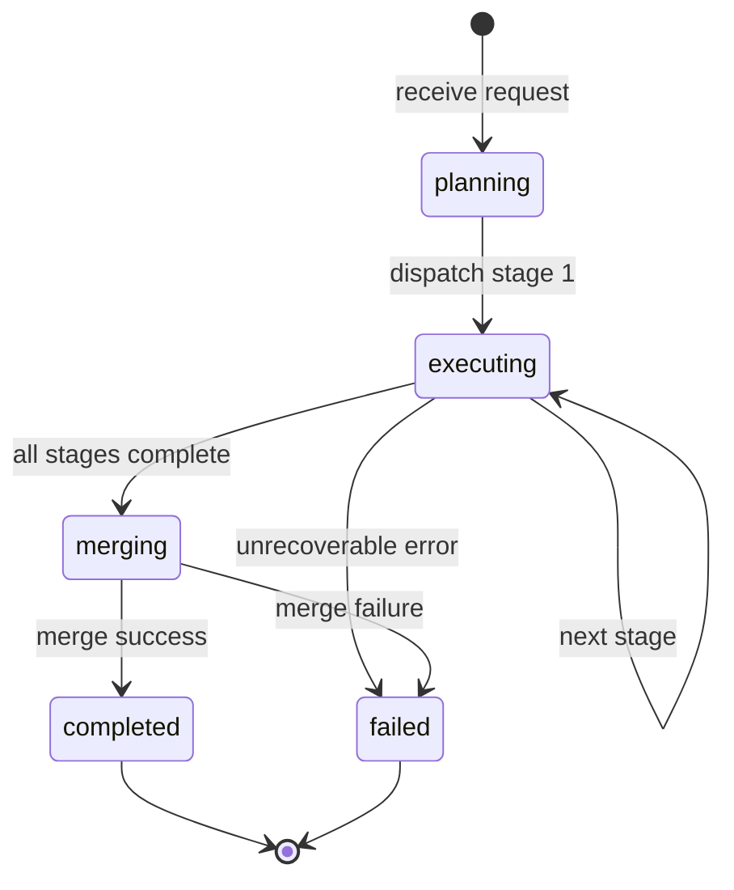

# Cross-Platform Agent Swarm — Design Document

## 1. Overview

The **Cross-Platform Agent Swarm** is a TypeScript framework that enables multiple AI agents running on different platforms (OpenClaw, Hermes, Claude, etc.) to collaboratively complete complex user requests. The system handles task decomposition, agent capability matching, cross-platform messaging, error recovery, timeout degradation, and result merging — all with concrete algorithms, thresholds, and policies.

---

## 2. Architecture

```
┌─────────────────────────────────────────────────────────────────┐
│                      User Request                                │
└────────────────────┬────────────────────────────────────────────┘
                     │
                     ▼
┌─────────────────────────────────────────────────────────────────┐
│              Phase 1: TaskDecomposer                             │
│  Input:  "Write a paper on quantum computing"                   │
│  Output: SubTask[] + DependencyGraph + ExecutionPlan            │
└────────────────────┬────────────────────────────────────────────┘
                     │
                     ▼
┌─────────────────────────────────────────────────────────────────┐
│              Phase 2: CapabilityMatcher                          │
│  Score every (Agent × SubTask) pair                           │
│  Threshold: score ≥ 0.70 → allocate                             │
└────────────────────┬────────────────────────────────────────────┘
                     │
                     ▼
┌─────────────────────────────────────────────────────────────────┐
│              Phase 3: MessageRouter                                │
│  Inbox per platform + Bridges for cross-platform                │
│  Messages: { taskId, from, to, payload, deadline }              │
└────────────────────┬────────────────────────────────────────────┘
                     │
                     ▼
┌─────────────────────────────────────────────────────────────────┐
│              Phase 4: Agent Execution (parallel stages)            │
│  Stage 1: [Researcher-OC] ──┐                                   │
│  Stage 2: [Writer-CL]  ←────┘                                   │
│  Stage 3: [Reviewer-HM]                                        │
└────────────────────┬────────────────────────────────────────────┘
                     │
                     ▼
┌─────────────────────────────────────────────────────────────────┐
│              Phase 5: ErrorRecovery + TimeoutDegradation         │
│  Circuit breaker: 3 failures → pause 30s                         │
│  Degradation chain: full → simplified → placeholder → skip      │
└────────────────────┬────────────────────────────────────────────┘
                     │
                     ▼
┌─────────────────────────────────────────────────────────────────┐
│              Phase 6: ResultMerger                                 │
│  Strategy: sequential_append / voting_dedup /                   │
│            expert_review / hierarchical_synthesis               │
└────────────────────┬────────────────────────────────────────────┘
                     │
                     ▼
┌─────────────────────────────────────────────────────────────────┐
│                      Final Output                                │
└─────────────────────────────────────────────────────────────────┘
```

---

## 3. Task Decomposition

### 3.1 Algorithm

```
decompose(request):
  1. template = keyword_match(request)
  2. complexity = estimate_complexity(request)
  3. stages = template.stages
  4. subtasks = []
  5. for each stage in stages:
       subtask = build(stage, complexity)
       subtask.input_dependencies = previous_id
       subtasks.push(subtask)
  6. if complexity >= 7:
       inject_parallel_research_branch(subtasks)
  7. graph = build_dependency_graph(subtasks)
  8. plan = compute_execution_stages(graph)
  9. return {subtasks, graph, plan}
```

### 3.2 Complexity Scoring

| Factor | Weight | Rule |
|--------|--------|------|
| Length | +1 per tier | >200 chars: +1, >500: +1 |
| Domain keywords | +1 each | quantum, relativity, cryptography, formal proof |
| Multi-part | +0.5 each | "and", "plus", "also" |
| Baseline | 5 | Starting score |
| Cap | 10 | Maximum |

### 3.3 Timeout by Role × Complexity

```
timeout(role, complexity):
  base = { researcher: 60s, writer: 45s, reviewer: 30s, coder: 60s, tester: 90s, analyst: 45s }
  multiplier = 1 + max(0, (complexity - 5) * 0.2)
  return base[role] * multiplier
```

### 3.4 Degradation Chain

| Complexity | Chain |
|------------|-------|
| ≤ 3 | full → simplified |
| 4–7 | full → simplified → placeholder |
| ≥ 8 | full → simplified → placeholder → skip |

---

## 4. Capability Matching

### 4.1 Score Formula

```
score(agent, subtask) = 
  0.30 × role_fit(agent.role, subtask.role)
+ 0.25 × skill_overlap(agent.skills, subtask.description)
+ 0.15 × skill_depth(agent.skills)
+ 0.15 × platform_affinity(agent.platform, subtask)
+ 0.10 × performance_score(agent.metrics)
+ 0.05 × token_budget(agent, subtask)
− circuit_penalty(agent)
```

### 4.2 Role Adjacency (Near-Miss Scoring)

```
researcher ↔ analyst, writer
writer ↔ researcher, reviewer
reviewer ↔ writer, analyst
coder ↔ tester, security_scanner
tester ↔ coder, security_scanner
analyst ↔ researcher, visualizer
visualizer ↔ analyst
security_scanner ↔ coder, tester
```

### 4.3 Thresholds

| Parameter | Value |
|-----------|-------|
| Minimum match score | 0.70 |
| Exact role match | 1.0 |
| Adjacent role match | 0.55 |
| Distant role match | 0.15 |
| Circuit penalty (1 fail) | −0.10 |
| Circuit penalty (2 fails) | −0.25 |
| Circuit penalty (3+ fails) | −0.50 |

---

## 5. Cross-Platform Messaging

### 5.1 Message Envelope

```typescript
{
  id: string,           // "msg-{counter}-{timestamp}"
  taskId: string,
  from: { agentId, platform, endpoint? },
  to:   { agentId, platform, endpoint? },
  type: "task_request" | "task_result" | "heartbeat" | "error" | "retry",
  payload: <varies by type>,
  timestamp: number,    // epoch ms
  deadline: number,     // timestamp + timeout
  retryCount: number,
  priority: 1–10        // 10 = highest
}
```

### 5.2 Payload Types

| Type | Payload Fields |
|------|----------------|
| task_request | `{ subtask, context, dependencies }` |
| task_result | `{ result: TaskResult }` |
| heartbeat | `{ agentStatus, queueDepth, loadFactor }` |
| error | `{ code, message, recoverable, suggestedAction, context }` |
| retry | `{ originalMessageId, reason, delayMs }` |

### 5.3 Inbox Design

Each platform maintains a priority queue:
- Sort key: `(priority DESC, timestamp ASC)`
- Expired messages purged on every `dequeue()`
- Batch dequeue: default 10 messages

### 5.4 Routing Rules

```
route(msg):
  if local_inbox exists for msg.to.platform:
    inbox.enqueue(msg)
  else if bridge exists for msg.to.platform:
    bridge.send(msg)
  else:
    throw "No delivery path"
```

---

## 6. Result Merging

### 6.1 Strategy 1: Sequential Append

Use when: document has ordered sections (chapters, pipeline stages)

```
merge(results):
  sorted = sort_by_subtask_index(results)
  output = join(sorted, "\n\n---\n\n")
  score = average(qualityScores)
```

### 6.2 Strategy 2: Voting Dedup

Use when: multiple agents answer the same question

```
merge(results):
  claims = extract_sentences(results)
  vote_map = group_normalize(claims)
  threshold = 0.5 × num_agents
  winners = filter(vote_map, count >= threshold)
  output = join(winners, ". ")
  score = consensus_score(vote_map)
```

### 6.3 Strategy 3: Expert Review

Use when: one agent is clearly highest quality

```
merge(results):
  expert = argmax(qualityScore)
  for each other in results:
    sim = text_similarity(expert, other)
    if sim >= 0.8: accept
    if sim >= 0.5: interleave(expert, other)
    if sim < 0.5: reject(other) // expert wins
```

### 6.4 Strategy 4: Hierarchical Synthesis

Use when: outputs form a data→analysis→conclusion pipeline

```
merge(results):
  layers = categorize(results):
    data: contains "data", "sample", "measurement"
    analysis: contains "analysis", "suggests", "because"
    conclusion: contains "conclusion", "therefore", "summary"
  output = "## Data\n" + merge_by_quality(data)
         + "## Analysis\n" + merge_by_quality(analysis)
         + "## Conclusion\n" + merge_by_quality(conclusion)
```

### 6.5 Conflict Resolution

| Policy | Rule |
|--------|------|
| latest | Most recent timestamp wins |
| highest_score | Highest qualityScore wins |
| expert_arbitration | Pre-selected expert wins |
| merge_all | Concatenate both with labels |

---

## 7. Error Recovery

### 7.1 Failure Classification

| Condition | Type |
|-----------|------|
| `now > deadline` | timeout |
| errorCode starts with `ERR_` | agent_error |
| qualityScore < 0.3 | low_quality |
| Any other | unknown |

### 7.2 Recovery Decision Tree

```
handle_failure(msg, platform):
  classify_failure(msg) → type
  record_failure(platform) → update circuit

  if retryCount < maxRetries AND circuit != open:
    action = retry
    delay = min(1000 × 2^retryCount, 30000)

  else if retryCount < maxRetries AND circuit == open:
    action = reassign
    target = pick_fallback(platform)

  else if retryCount >= maxRetries:
    action = degrade
    apply_degradation_chain(subtask)

  else:
    action = escalate
    notify_human()
```

### 7.3 Circuit Breaker States

| State | Condition | Behavior |
|-------|-----------|----------|
| CLOSED | failures < 3 | Normal operation |
| OPEN | failures ≥ 3 | Block for 30s, then → HALF_OPEN |
| HALF_OPEN | After 30s | Allow 1 probe; success → CLOSED, fail → OPEN |

---

## 8. Timeout & Degradation

### 8.1 Default Timeouts

| Task Class | Duration |
|------------|----------|
| Simple (complexity ≤ 4, non-research) | 30s |
| Complex (complexity 5–7) | 5min |
| Research (role = researcher or complexity ≥ 8) | 10min |

### 8.2 Degradation Chain

| Level | Effect | Notification |
|-------|--------|-------------|
| full | Original task spec | — |
| simplified | Complexity −3, timeout × 0.6 | "Switching to simplified mode" |
| placeholder | Complexity = 1, text-only output | "Generating placeholder" |
| skip | Output = `[SKIPPED]`, quality = 0 | "Skipping this section" |

---

## 9. Swarm Coordinator Lifecycle

```
execute(request):
  1. DECOMPOSE  → subtasks, graph, stages
  2. PLAN       → state = executing
  3. for each stage:
       DISPATCH  → match + route for each subtask
       WAIT      → poll inboxes until all done
  4. MERGE      → ResultMerger.synthesize()
  5. RETURN     → merged output
```

### 9.1 State Machine



---

## 10. Implementation Files

| File | Responsibility |
|------|----------------|
| `src/types.ts` | All interfaces and type aliases |
| `src/TaskDecomposer.ts` | Request → subtasks + dependency graph |
| `src/CapabilityMatcher.ts` | Score agent↔subtask matches |
| `src/CrossPlatformMessage.ts` | Message envelope, factory, inbox |
| `src/MessageRouter.ts` | Route messages to inboxes or bridges |
| `src/ResultMerger.ts` | 4 merge strategies + conflict resolution |
| `src/ErrorRecovery.ts` | Retry logic + circuit breaker |
| `src/TimeoutDegradation.ts` | Timeout registration + degradation |
| `src/CrossPlatformBridge.ts` | In-memory and HTTP bridge implementations |
| `src/SwarmCoordinator.ts` | Main orchestrator |
| `src/index.ts` | Public API exports |

---

## 11. Class Diagram

```mermaid
classDiagram
    class SwarmCoordinator {
        +execute(request): Promise~string~
        +onProgress: callback
        +onDegradation: callback
        -decomposer: TaskDecomposer
        -matcher: CapabilityMatcher
        -router: MessageRouter
        -merger: ResultMerger
        -recovery: ErrorRecovery
        -degradation: TimeoutDegradation
    }
    class TaskDecomposer {
        +decompose(request, id): DecompositionResult
        -detectTemplate(request): string
        -estimateComplexity(request): number
        -buildDependencyGraph(subtasks, edges): DependencyGraph
    }
    class CapabilityMatcher {
        +findMatches(agents, subtask): MatchResult[]
        +bestMatch(agents, subtask): MatchResult
        -computeScore(agent, subtask): number
    }
    class MessageRouter {
        +route(msg): Promise~void~
        +pollAll(): Map~string, Message[]~
        +broadcast(...): Promise~void~
    }
    class ResultMerger {
        +merge(results): MergeResult
        -mergeSequential(results): MergeResult
        -mergeVoting(results): MergeResult
        -mergeExpertReview(results): MergeResult
        -mergeHierarchical(results): MergeResult
    }
    class ErrorRecovery {
        +handleFailure(msg, platform): FailureDecision
        +isPlatformAvailable(platform): boolean
        -recordFailure(platform)
        -decideRecovery(type, platform, msg): FailureDecision
    }
    class TimeoutDegradation {
        +register(subtask)
        +complete(subtaskId)
        +degrade(subtask, reason): DegradationPlan
        +resolveTimeout(subtask): number
    }
    class CrossPlatformBridge {
        +send(msg): Promise~void~
        +poll(): Promise~Message[]~
        +healthCheck(): Promise~boolean~
    }

    SwarmCoordinator --> TaskDecomposer
    SwarmCoordinator --> CapabilityMatcher
    SwarmCoordinator --> MessageRouter
    SwarmCoordinator --> ResultMerger
    SwarmCoordinator --> ErrorRecovery
    SwarmCoordinator --> TimeoutDegradation
    SwarmCoordinator --> CrossPlatformBridge
```



---

## 12. Testing Strategy

| Test File | Coverage |
|-----------|----------|
| `TaskDecomposer.test.ts` | Template detection, complexity scoring, dependency edges |
| `CapabilityMatcher.test.ts` | Exact match, threshold filtering, circuit penalty |
| `ResultMerger.test.ts` | All 4 strategies, conflict detection |
| `ErrorRecovery.test.ts` | Timeout classification, circuit breaker, escalation |
| `TimeoutDegradation.test.ts` | Timeout resolution, degradation chain progression |
| `SwarmCoordinator.test.ts` | Integration: config → agent stats |

---

## 13. Glossary

| Term | Definition |
|------|------------|
| **SubTask** | Atomic unit of work produced by decomposition |
| **CapabilityManifest** | Agent self-description: role, skills, limits, metrics |
| **MatchScore** | 0–1 fitness score for (Agent, SubTask) allocation |
| **CircuitBreaker** | Fault-tolerance pattern: pause platform after N failures |
| **DegradationChain** | Ordered fallback levels for a subtask |
| **ExecutionStage** | Set of subtasks that can run in parallel |
| **Inbox** | Priority queue holding inbound messages for one platform |

---

## Appendix: Constants & Thresholds Summary

| Constant | Value | Location |
|----------|-------|----------|
| MIN_MATCH_SCORE | 0.70 | `CapabilityMatcher` |
| CB_THRESHOLD | 3 failures | `ErrorRecovery` |
| CB_RESET_MS | 30,000 ms | `ErrorRecovery` |
| MAX_RETRIES | 2 | `ErrorConfig` |
| RETRY_DELAY_MS | 1,000 ms (×2^retry) | `ErrorConfig` |
| SIMPLE_TIMEOUT | 30,000 ms | `TimeoutConfig` |
| COMPLEX_TIMEOUT | 300,000 ms | `TimeoutConfig` |
| RESEARCH_TIMEOUT | 600,000 ms | `TimeoutConfig` |
| QUALITY_THRESHOLD | 0.30 (low) | `ErrorRecovery` |
| POLL_INTERVAL | 500 ms | `SwarmCoordinator` |
| ROUTER_BATCH | 10 messages | `MessageRouter` |
