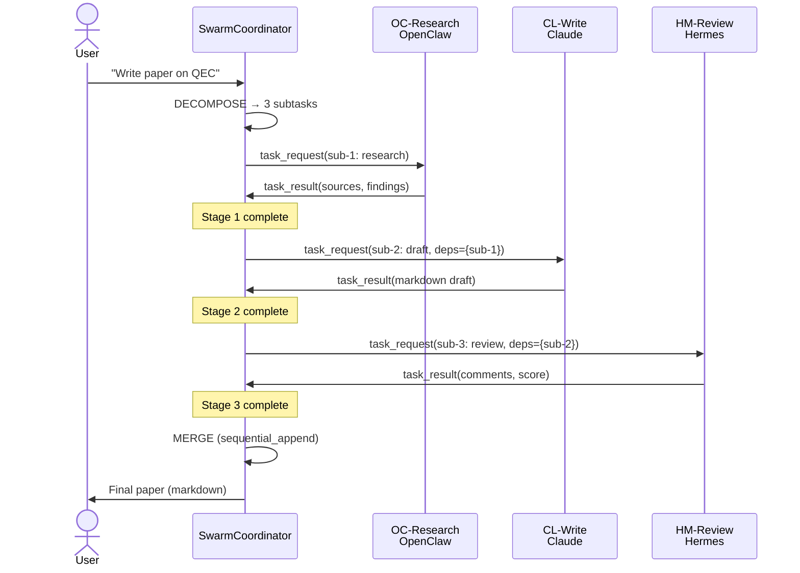

# Example A: Writing a Paper

## Scenario

**User request:** "Write a paper on quantum computing error correction for arXiv"

## Agents Assigned

| Agent | Platform | Role | Specialty |
|-------|----------|------|-----------|
| OC-Research | OpenClaw | researcher | Physics, quantum information |
| CL-Write | Claude | writer | Academic prose, LaTeX |
| HM-Review | Hermes | reviewer | Fact-checking, style |

## Sequence Diagram



## Message Flow

### 1. Coordinator → OC-Research (task_request)

```json
{
  "id": "msg-1-1715678901000",
  "taskId": "task-1715678901000",
  "from": { "agentId": "coordinator", "platform": "openclaw" },
  "to": { "agentId": "OC-Research", "platform": "openclaw" },
  "type": "task_request",
  "payload": {
    "subtask": {
      "id": "task-1715678901000-sub-1",
      "description": "Research and gather sources for: \"Write a paper on quantum computing error correction\"",
      "role": "researcher",
      "timeoutMs": 60000,
      "outputFormat": { "type": "structured", "schema": { "sources": "array", "summary": "string" } }
    },
    "context": "Academic paper for arXiv. Need recent advances in surface codes, LDPC codes, and experimental progress.",
    "dependencies": {}
  },
  "timestamp": 1715678901000,
  "deadline": 1715678961000,
  "priority": 7
}
```

### 2. OC-Research → Coordinator (task_result)

```json
{
  "id": "msg-2-1715678915000",
  "taskId": "task-1715678901000",
  "from": { "agentId": "OC-Research", "platform": "openclaw" },
  "to": { "agentId": "coordinator", "platform": "openclaw" },
  "type": "task_result",
  "payload": {
    "result": {
      "taskId": "task-1715678901000-sub-1",
      "agentId": "OC-Research",
      "status": "completed",
      "output": "{\"sources\":[{\"title\":\"Surface codes: Towards practical...\",\"authors\":[\"Fowler et al.\"]}],\"summary\":\"Recent progress includes...\"}",
      "metadata": { "tokensUsed": 2500, "latencyMs": 4200, "toolCalls": ["search_arxiv"] },
      "qualityScore": 0.92,
      "timestamp": 1715678915000
    }
  }
}
```

### 3. Coordinator → CL-Write (task_request with dependency)

```json
{
  "id": "msg-3-1715678916000",
  "taskId": "task-1715678901000",
  "from": { "agentId": "coordinator", "platform": "openclaw" },
  "to": { "agentId": "CL-Write", "platform": "claude" },
  "type": "task_request",
  "payload": {
    "subtask": {
      "id": "task-1715678901000-sub-2",
      "description": "Draft content sections for: \"Write a paper on quantum computing error correction\"",
      "role": "writer",
      "timeoutMs": 45000,
      "inputDependencies": ["task-1715678901000-sub-1"]
    },
    "context": "Draft academic paper sections using research findings.",
    "dependencies": {
      "task-1715678901000-sub-1": {
        "taskId": "task-1715678901000-sub-1",
        "agentId": "OC-Research",
        "output": "...",
        "qualityScore": 0.92
      }
    }
  }
}
```

## Result Merge

**Strategy:** `sequential_append`

**Contributions:**

| Section | Agent | Score |
|---------|-------|-------|
| Research findings | OC-Research | 0.92 |
| Draft paper | CL-Write | 0.88 |
| Review comments | HM-Review | 0.85 |

**Final Output:**

```markdown
# Quantum Computing Error Correction: A Survey

## 1. Introduction
[Draft from CL-Write incorporating OC-Research findings]

## 2. Background
[...]

## 7. Conclusion
[...]

---

**Review Notes** (HM-Review, score: 0.85)
- Fix citation format in §3
- Clarify threshold definition in §4.2
```

## Conflict Resolution

None in this scenario — all agents worked on sequential, non-overlapping sections.
