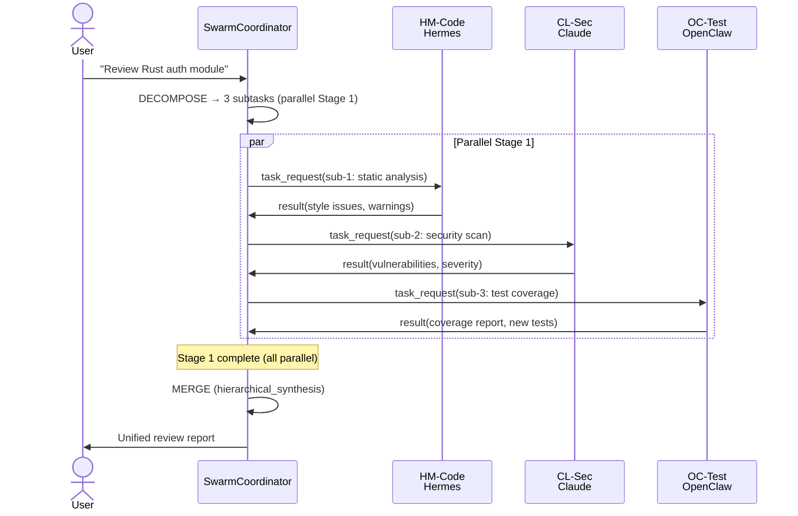

# Example B: Code Review

## Scenario

**User request:** "Review my Rust auth module for security and style issues"

## Agents Assigned

| Agent | Platform | Role | Specialty |
|-------|----------|------|-----------|
| HM-Code | Hermes | coder | Rust, systems, clippy |
| CL-Sec | Claude | security_scanner | CWE mapping, exploit paths |
| OC-Test | OpenClaw | tester | Test generation, coverage |

## Sequence Diagram



## Message Flow

### Stage 1: Parallel Dispatch

All three subtasks have **no input dependencies** — they all analyze the same source code independently.

```json
{
  "taskId": "task-1715680000000",
  "from": { "agentId": "coordinator", "platform": "openclaw" },
  "to": { "agentId": "HM-Code", "platform": "hermes" },
  "type": "task_request",
  "payload": {
    "subtask": {
      "id": "task-1715680000000-sub-1",
      "description": "Static analysis and style check for: \"Review my Rust auth module\"",
      "role": "coder",
      "timeoutMs": 60000
    },
    "context": "auth.rs — handles JWT validation, password hashing with argon2, session management",
    "dependencies": {}
  }
}
```

Same structure sent to CL-Sec (security_scanner) and OC-Test (tester) with respective roles.

### Results Received

| SubTask | Agent | Output | Quality |
|---------|-------|--------|---------|
| Static analysis | HM-Code | 12 clippy warnings, 2 style nits | 0.89 |
| Security scan | CL-Sec | 1 CWE-287 (auth bypass), 2 info leaks | 0.94 |
| Test coverage | OC-Test | 47% coverage, 3 missing edge cases | 0.82 |

## Result Merge

**Strategy:** `hierarchical_synthesis`

**Layer assignment:**

| Agent | Output | Layer |
|-------|--------|-------|
| HM-Code | Clippy warnings, style issues | data |
| CL-Sec | CWE findings, severity ratings | analysis |
| OC-Test | Coverage metrics, test gaps | data |

**Merged Output:**

```markdown
# Code Review Report: auth.rs

## Data Layer

### Static Analysis (HM-Code, score 0.89)
- warning: unused import `std::time::Duration`
- warning: `unwrap()` in `validate_token()` line 84
- style: function `hash_password` exceeds 50 lines

### Test Coverage (OC-Test, score 0.82)
- Current: 47% line coverage
- Missing: token expiry edge case, malformed JWT handling

## Analysis Layer

### Security Assessment (CL-Sec, score 0.94)
- **CRITICAL** CWE-287: Improper Authentication
  - Location: `validate_token()` ignores signature check on line 42
  - Exploit path: Forge token with algorithm=none
- **MEDIUM** CWE-200: Information Exposure
  - Location: Error messages leak user existence (line 118)

## Conclusion Layer

**Recommended Actions:**
1. Fix CWE-287 immediately (signature validation)
2. Add tests for token expiry + malformed JWT
3. Address 12 clippy warnings before merge
```

## Conflict Detection

No cross-layer conflicts detected. However, if CL-Sec had flagged `hash_password` as vulnerable while HM-Code only noted style issues, the system would record:

```
Conflict: {
  agents: ["HM-Code", "CL-Sec"],
  topic: "hash_password risk assessment",
  resolutions: ["data_priority", "analysis_priority"],
  chosenResolution: "data_priority" // data layer wins per policy
}
```
