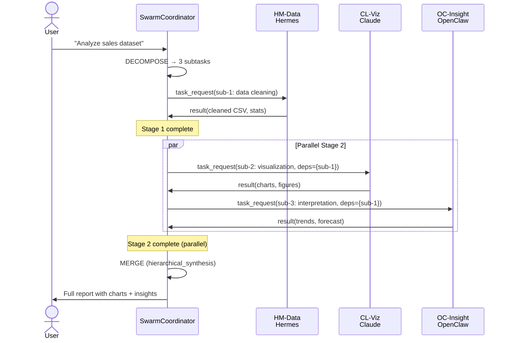

# Example C: Data Analysis

## Scenario

**User request:** "Analyze the sales dataset, create visualizations, and explain the trends"

## Agents Assigned

| Agent | Platform | Role | Specialty |
|-------|----------|------|-----------|
| HM-Data | Hermes | analyst | Pandas, data cleaning |
| CL-Viz | Claude | visualizer | Matplotlib, Seaborn, storytelling |
| OC-Insight | OpenClaw | analyst | Business interpretation, forecasting |

## Sequence Diagram



## Message Flow

### 1. Coordinator → HM-Data (Stage 1)

```json
{
  "taskId": "task-1715681000000",
  "from": { "agentId": "coordinator", "platform": "openclaw" },
  "to": { "agentId": "HM-Data", "platform": "hermes" },
  "type": "task_request",
  "payload": {
    "subtask": {
      "id": "task-1715681000000-sub-1",
      "description": "Data cleaning and preprocessing for: \"Analyze sales dataset\"",
      "role": "analyst",
      "timeoutMs": 45000,
      "outputFormat": { "type": "structured", "schema": { "cleaned": "string", "stats": "object" } }
    },
    "context": "sales_2023.csv — 50K rows, suspected nulls in region column, duplicate orders possible",
    "dependencies": {}
  }
}
```

### 2. HM-Data → Coordinator (Result)

```json
{
  "type": "task_result",
  "payload": {
    "result": {
      "taskId": "task-1715681000000-sub-1",
      "agentId": "HM-Data",
      "output": "{\"cleaned\":\"/tmp/sales_clean.csv\",\"stats\":{\"rows\":48730,\"nulls_removed\":1270,\"duplicates_removed\":342}}",
      "qualityScore": 0.91
    }
  }
}
```

### 3. Coordinator → CL-Viz (Stage 2, depends on sub-1)

```json
{
  "type": "task_request",
  "payload": {
    "subtask": {
      "id": "task-1715681000000-sub-2",
      "description": "Visualization and chart generation for: \"Analyze sales dataset\"",
      "role": "visualizer",
      "timeoutMs": 45000,
      "inputDependencies": ["task-1715681000000-sub-1"]
    },
    "context": "Create charts from cleaned dataset",
    "dependencies": {
      "task-1715681000000-sub-1": {
        "taskId": "task-1715681000000-sub-1",
        "agentId": "HM-Data",
        "output": "{\"cleaned\":\"/tmp/sales_clean.csv\",...}",
        "qualityScore": 0.91
      }
    }
  }
}
```

### 4. Coordinator → OC-Insight (Stage 2, also depends on sub-1)

Same dependency structure sent to OC-Insight for interpretation.

## Dependency Graph

```
sub-1 (HM-Data: cleaning)
    ├──> sub-2 (CL-Viz: visualization)  [parallel]
    └──> sub-3 (OC-Insight: interpretation)  [parallel]
```

## Result Merge

**Strategy:** `hierarchical_synthesis`

**Layer assignment:**

| Agent | Output | Layer |
|-------|--------|-------|
| HM-Data | Cleaned data, row counts, null stats | data |
| CL-Viz | Chart descriptions, figure references | data |
| OC-Insight | Trend analysis, seasonality, forecast | analysis/conclusion |

**Merged Output:**

```markdown
# Sales Dataset Analysis Report

## Data Layer

### Cleaning Summary (HM-Data, score 0.91)
- Original rows: 50,000
- After cleaning: 48,730 rows
- Nulls removed: 1,270 (region column)
- Duplicates removed: 342

### Visualizations (CL-Viz, score 0.88)
- Figure 1: Monthly sales trend (line chart)
- Figure 2: Regional distribution (heatmap)
- Figure 3: Product category breakdown (pie chart)

## Analysis Layer

### Trend Interpretation (OC-Insight, score 0.87)
- Q4 shows 34% YoY growth
- Seasonality detected: peak in November (Black Friday effect)
- Forecast: 15% growth expected for Q1 2024
- Risk factor: region column missing 2.5% of data may bias regional analysis

## Conclusion

**Key Findings:**
1. Strong Q4 performance driven by holiday season
2. Data quality issues limited regional granularity
3. Recommendation: implement real-time deduplication pipeline
```

## Error Handling Scenario

Suppose CL-Viz times out after 45s:

1. **Timeout detected** → `TimeoutDegradation.degrade(sub-2, "timeout")`
2. **Degradation** → simplified visualization task (charts only, no styling)
3. If still failing → placeholder: "[Chart generation skipped — raw data available]"
4. **Notification**: `[Degradation] Agent CL-Viz → simplified. Reason: timeout`
5. OC-Insight completes successfully → merge proceeds with degraded viz output
6. Final report includes placeholder note; user informed of limitation

## Conflict Scenario (Hypothetical)

If OC-Insight concluded "Q4 growth is 34%" but HM-Data's raw stats show only 28% growth after cleaning:

```
Conflict detected:
  agents: ["OC-Insight", "HM-Data"]
  topic: "Q4 growth rate"
  resolutions: ["data_priority", "analysis_priority"]
  chosenResolution: "data_priority"  // raw data overrides interpretation
```

Final report would note:

> ⚠️ **Discrepancy resolved:** Raw data indicates 28% growth. OC-Insight's 34% figure may include pre-cleaning duplicates. Using 28% as authoritative.
